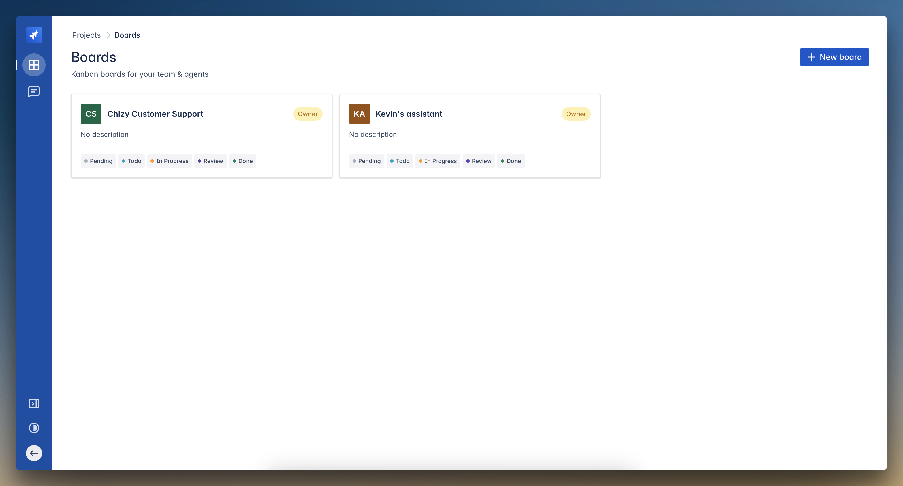
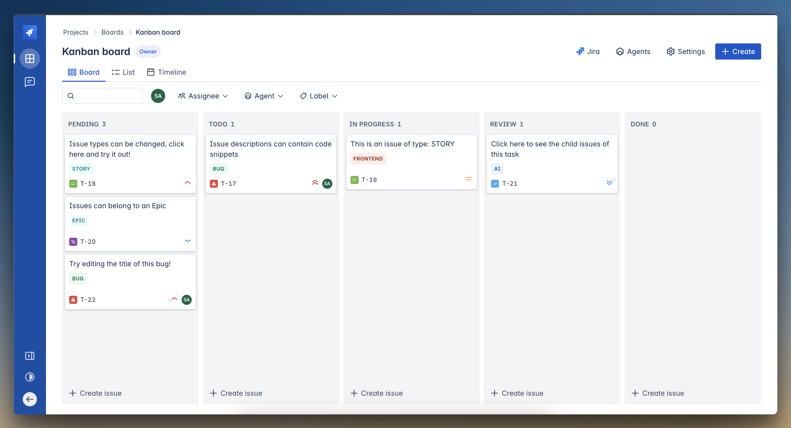
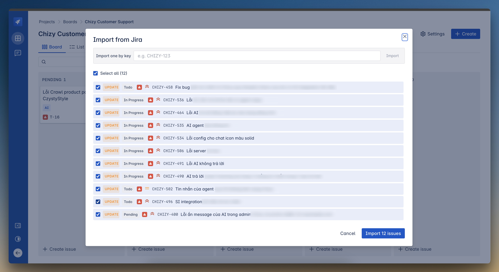
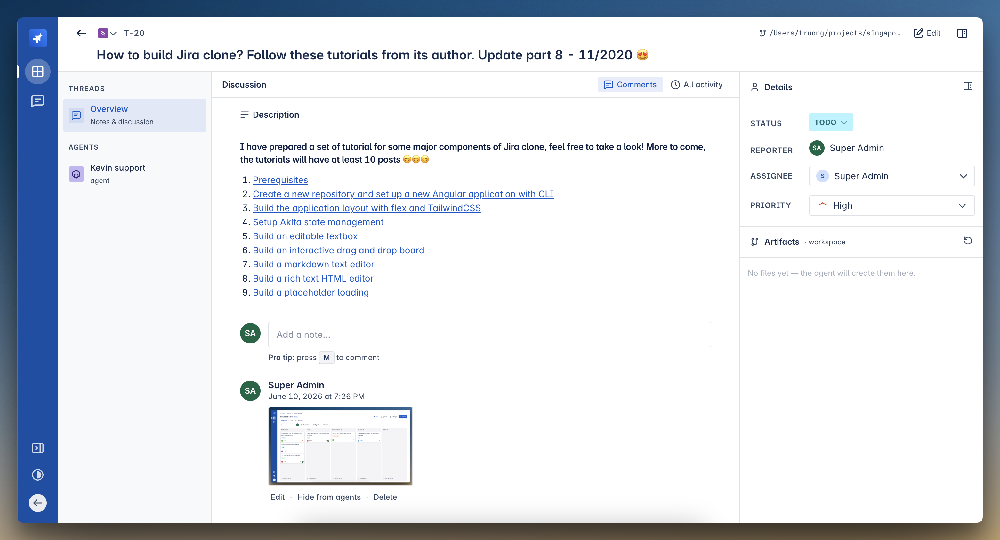
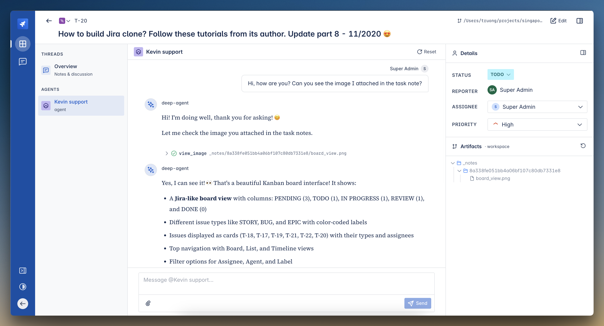

# Agent Team

A Jira-style task board for **agent-manager** where **people and AI agents collaborate on the same work**. Plan work on a Kanban board, `@mention` an agent to pick up a task, and watch it run in a per-task shared workspace — with optional two-way Jira import.

> Agent Team is an agent-manager **community plugin**. When the plugin is enabled it adds a task-board UI, a REST API, and a set of agent tools; when disabled, its routes are blocked and nothing else is affected.

---

## Highlights

- **Kanban board** with configurable columns and Board / List / Timeline views.
- **Rich tasks** — issue types (story, bug, epic, task, subtask, agent), priority, assignee, labels, a Markdown description, and a threaded discussion.
- **Humans + agents together** — assign multiple agents per board, `@mention` an agent to run it on a task, and keep a separate conversation thread per `(task, agent)`.
- **Per-task shared workspace** — every task gets its own folder ("Artifacts") that agents read and write with their file/shell tools and that you can browse, preview, and edit from the UI.
- **Notes & attachments** — leave notes for agents (with file attachments), and toggle each note's visibility so some stay people-only.
- **Vision for agents** — a `view_image` tool lets a vision-capable agent actually *see* images in the workspace (e.g. screenshots or Jira attachments).
- **Jira integration** — configure Jira per board, import issues by project key (with a preview/select step), and sync fields, comments, and attachments.
- **Real-time UI** — the board and task views update live over Server-Sent Events.

---

## Screenshots

### Boards
All your Kanban boards in one place — one board per team or per agent.



### Kanban board
Tasks as cards across your columns, with color-coded issue types, assignees, and quick filters. The header gives one-click access to **Jira import**, **Agents**, and board **Settings**.



### Import tasks from Jira


### Task detail
The task "cockpit": a Markdown description, a discussion thread with notes/comments and attachments, an editable **Details** panel (status, reporter, assignee, priority), and the task's **Artifacts** workspace.



### Chatting with an agent
`@mention` an agent and it runs against the task in its shared workspace. Here the agent uses the **`view_image`** tool to open an image attached to the task and describe it back to you.



---

## How it works

A **board** holds **tasks**; each task has a shared **workspace** folder. When you mention an agent on a task, the plugin opens (or reuses) a **conversation** thread for that `(task, agent)` pair and starts a **run**:

1. The run builds the agent graph through the core runtime, so the agent keeps its full configured capability set (model, tools, MCP, middleware).
2. The agent's standard **file/shell tools are rooted at the task workspace**, so collaborators share one directory instead of each agent's private workspace.
3. The run streams its output to an event store, which the UI tails live over SSE.
4. Follow-up turns reuse the same thread, so prior context stays in history — the per-turn message only carries the **delta** (new notes / changed description), keeping the prompt prefix cache-friendly.

### Agent context

Each run feeds the agent a task header, description, the workspace path, and any **agent-visible** notes (with workspace-relative pointers to attached files). Notes marked people-only are never sent to the agent.

---

## Jira integration

Configure Jira per board (base URL, account email, API token, project key) from the board's **Jira** dialog, then **Import from Jira**:

- Preview the project's issues with Jira-native filters (issue type, status category, updated-within), tick the ones to import, and watch progress as they land in the first column.
- A quick "import by key" field pulls a single issue without scanning the list.
- Imported issues map their summary, description, status, priority, type, and labels onto the task; **comments** and **issue attachments** are imported too.
- Inline image markup in a description/comment (`!image.png!`) is rewritten to point at the downloaded workspace file so it renders in place.
- Re-importing updates linked tasks (and edited comments) and refreshes attachments.

> The API token is stored on the board record; treat your database as sensitive.

---

## Project layout

```
agent_team/
├── plugin.py                  # Plugin entry: routers, models, menu, tool factories
├── router.py                  # Top-level platform router
├── web.py                     # Shared web helpers (auth)
├── spa.py                     # Serves the built single-page app
├── db_migrations/             # SQL migrations (auto-applied by core)
├── static/                    # Built web UI bundle
└── features/
    └── board/
        ├── models.py          # SQLAlchemy models (board, task, run, comment, …)
        ├── router.py          # Board/task/run/comment/file REST API
        ├── schemas.py         # Pydantic DTOs
        ├── repositories/      # Data-access functions
        ├── runtime/           # Run backend, context build, graph builder, tools
        ├── jira/              # Jira client, field mapping, import service
        ├── attachments.py     # Workspace-backed attachment storage
        └── workspace.py       # Per-task workspace resolution
```

---

## Installation

1. Place this folder under your agent-manager `community_plugins/` directory.
2. Start agent-manager — the core migration runner applies `db_migrations/*.sql` automatically.
3. Enable **Agent Team** from the admin **Plugins** page. An "Agent Team" entry appears in the sidebar.
4. Create a board, add agents to it, and mention an agent on a task.

The plugin reuses the core session cookie for auth; unauthenticated API calls get a JSON `401`.

---

## Agent tools

When the plugin is enabled, agents gain a **View Image** tool (`view_image`) that returns a workspace image as a multimodal content block so a vision-capable model can see it (the standard text file tools cannot). The tool is on by default per agent and can be toggled in the agent's tool config. It only does something useful for vision-capable models (OpenAI / Anthropic / Gemini).

---

## Development

Run the plugin's tests:

```bash
PYTHONPATH=community_plugins uv run pytest community_plugins/agent_team/tests/test_agent_team.py -q
```

Lint:

```bash
uv run ruff check community_plugins/agent_team
```

The web UI is built separately and copied into `static/`; see the web project's `build:agent-team` script.
