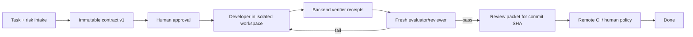

# Agent Team Improvement Backlog — Anthropic Engineering Review

Status: **Research note / proposed backlog. Nothing in this document is approved
for implementation yet.**

Reviewed against: `agent_team` on `master` at `ad48252`, July 2026.

Scope: consolidate the earlier `agent_team` workflow review with ideas from the
Anthropic Engineering catalog. Each accepted item should be promoted into its
own implementation plan before code changes begin.

---

## 1. Executive summary

`agent_team` already has more of the right foundations than a typical
"multi-persona" agent demo:

- a Jira-style task/board model and per-task workspaces;
- persistent conversations, runs, append-only events, and journals;
- strict planning artifacts (`SPEC.md`, `PLAN.md`, `TASKS.json`, review,
  evidence, intake, questions, and plan-change artifacts);
- planner/generator/evaluator loops with budgets and human approval;
- canonical repositories plus task branches/clones;
- OpenSandbox, ACP sidecars, egress controls, schedules, and autopilot.

The next step should **not** be adding many permanent personas such as PO,
developer, tester, security reviewer, and release manager to every task. The
largest gains now come from making the existing loop durable, independently
verifiable, permission-scoped, observable, and measurable.

The recommended north star is:

> A task is a durable workflow over an immutable contract. Agents may propose
> and implement work, but only backend-owned evidence and completion policies
> can certify it as done.

In simple terms, imagine `agent_team` as a small software factory:

- the **task contract** is the signed work order;
- the **workflow run** is the tracking record that survives a power outage;
- the **agent roles** are badges that open only the rooms required for a job;
- **verification receipts** are test-machine printouts, not a worker saying
  "I tested it";
- the **review packet** is the delivery dossier attached to the exact commit;
- the **eval lab** measures whether a factory change actually improves output.

### Recommended order

1. **Trust and durability first:** workflow persistence, writer leases,
   immutable contracts, trusted verification receipts, and completion gates.
2. **Make unattended work safe:** verified autopilot, real reviewer identity,
   role permissions, failure-aware retry, and review packets.
3. **Measure before optimizing:** run manifests, an eval lab, prompt/model
   versioning, and controlled rollout.
4. **Improve efficiency:** context handoffs, deferred tools, code-mode tool
   orchestration, skill lifecycle, and retrieval.
5. **Scale last:** parallel workers only for independent graph nodes in isolated
   worktrees with ownership and merge coordination.

---

## 2. What Anthropic's design approach gets right

Across the Engineering catalog, the recurring pattern is not a specific set of
agent names. It is a set of system boundaries:

1. **Separate deterministic workflow from model autonomy.** Use code paths for
   known lifecycle and policy; use agents where the route is genuinely open.
2. **Separate the brain from the hands.** Session state, harness state, and the
   execution sandbox should have explicit interfaces and independent lifetimes.
3. **Treat context as a finite resource.** Retrieve details just in time and
   hand off compact structured state instead of carrying every transcript.
4. **Give agents environmental ground truth.** Tests, tools, and backend
   receipts are more reliable than model assertions.
5. **Scale ceremony to risk.** A one-line label change should not pay the same
   cost as an authentication migration.
6. **Evaluate the whole harness.** Model, prompt, tool descriptions, runtime,
   resources, and orchestration all affect the result.
7. **Contain capability structurally.** Sandboxes, credentials, filesystem,
   network, and role policy define blast radius; prompts only add defense in
   depth.
8. **Add complexity only after an eval proves value.** Multi-agent systems can
   improve breadth, but they consume far more tokens and create coordination
   failures when tasks are tightly coupled.

These principles fit the current `agent_team` direction well. Most proposals
below strengthen an existing subsystem rather than replace it.

---

## 3. Running example used below

Use this task to make the proposals concrete:

> **Task:** "After a user's session expires, refresh the access token and retry
> the original API request once. Do not retry invalid credentials. Add tests and
> preserve the existing public API."

This is more useful than an abstract example because it touches planning,
security, code, tests, evidence, and review without being enormous.

The intended lifecycle after the high-priority work is complete:



Every phase is recorded in a durable `WorkflowRun`. A process restart resumes
from the last checkpoint rather than declaring the whole task lost.

---

## 4. Current strengths to preserve

The following should be treated as assets, not rewritten:

- **File-first planning contract.** `.agent-team/` artifacts work for graph and
  CLI workers and are inspectable by humans.
- **Independent evaluator loop.** The generator/evaluator split is the correct
  shape for work with explicit acceptance criteria.
- **One public lifecycle.** `task.loop_state` avoids exposing internal phase
  machinery as several competing state machines.
- **Append-only run events and journal.** These are good raw inputs for durable
  replay, observability, and post-task assimilation.
- **Risk lanes.** `quick`, `normal`, and `risk` are the right mechanism for
  adaptive ceremony; they should select recipes and policies rather than fork
  the product into three implementations.
- **Canonical repository ownership.** Task workspaces and branches create a
  path toward isolated parallel execution.
- **OpenSandbox and sidecar architecture.** This is a strong base for the
  "brain / hands" split and structural credential isolation.
- **Friction and journal records.** The raw material for a self-improving system
  already exists; it needs curation and provenance, not another memory silo.

---

## 5. P0 — Trust and durability

These items should precede more autonomy or parallelism.

### AT-01 — Durable `WorkflowRun`, phase checkpoints, and recovery

**Current observation.** The outer loop and planning launcher are process-local
`asyncio.create_task(...)` jobs, tracked by in-memory maps such as
`runtime/loop/service.py::_RUNNING_LOOPS`. Startup reconciliation can mark
orphaned agent runs as failed, but it cannot reconstruct and resume the outer
planning/execution workflow.

**Proposal.** Add backend-owned records such as:

- `workflow_run`: task, recipe, state, current phase, contract version, cursor,
  attempt, budget ledger, timestamps, and terminal outcome;
- `workflow_phase_run`: role, agent run, input/output artifact references,
  retry count, checkpoint, and failure classification;
- lease fields: `lease_owner`, `lease_until`, `heartbeat_at`;
- idempotency keys for phase start and completion transitions.

Workers should claim a workflow, renew its lease, execute one resumable unit,
persist the checkpoint, and release/advance it. On restart, an expired lease is
reclaimed and resumed from the last committed phase.

**Easy example.** The developer finishes editing the token-refresh code, then
the server restarts before evaluation. Today the outer loop is gone. With this
change, the new process sees `phase=verify`, reuses the task workspace and
contract v1, and starts verification without re-planning or redoing the edit.

**Done when.** A test can kill the process at every phase boundary, start a new
worker, and reach the same final outcome without duplicate runs or lost budget.

**Source influence.** Managed Agents; Multi-agent Research; effective
long-running harnesses.

### AT-02 — Exclusive task-workspace writer lease

**Current observation.** In-memory guards cannot prevent two HTTP workers, a
schedule, autopilot, and a manual action from starting overlapping writers for
the same task workspace.

**Proposal.** Introduce a database lease keyed by `(task_id, workspace_id)`.
Only one phase with write capability may hold it. Read-only reviewers may run
concurrently only from a pinned snapshot/commit. Make lease acquisition
idempotent and surface owner, expiry, and current phase in the UI/API.

**Easy example.** Autopilot starts the session-refresh task at 09:00 while the
owner clicks "Approve and run" at 09:00:01. One request acquires the lease; the
other attaches to the existing workflow instead of launching a second agent
that edits the same files.

**Done when.** Concurrency tests from separate processes cannot create two
write-capable phases for one task workspace.

**Dependency.** Implement with AT-01 so lease state has a durable owner.

### AT-03 — Immutable approved `ContractVersion`

**Current observation.** Approval records etags, but approved planning files
remain in an agent-writable workspace. Execution does not consistently prove
that the `SPEC.md`, `PLAN.md`, and `TASKS.json` it reads are the approved bytes.

**Proposal.** On approval, create a content-addressed immutable snapshot:

```text
ContractVersion
  id
  task_id
  version
  spec_sha256
  plan_sha256
  tasks_sha256
  intake_sha256
  approved_by / approved_at
  source_commit_sha
```

Execution references `contract_version_id`, not mutable file paths. The files
can still be materialized into the workspace for agents to read, but the
backend compares content or mounts an approved read-only copy. A change creates
v2 plus a visible diff and reapproval; it never mutates v1.

**Easy example.** Contract v1 says "retry exactly once." During implementation
an agent decides that three retries make tests easier and edits `SPEC.md`.
The backend still evaluates against v1 and blocks completion. If three retries
are truly required, the agent opens a plan-change request that becomes v2.

**Done when.** A test modifying every approved artifact after approval cannot
change the contract used by execution or verification.

### AT-04 — Structured acceptance criteria and trusted verification receipts

**Partial foundation shipped.** `TASKS.json` supports per-task verification
profiles, test impact, and focused/regression commands. Strict `EVIDENCE.json`
schema v2 maps criteria to command/scenario/artifact IDs, and the backend checks
planned commands, exit codes, profile-specific scenario requirements, and real
workspace artifact paths before accepting `pass`. The remaining work is
execution provenance: command rows are still evaluator-authored observations,
not backend-minted receipts tied to a commit/runtime.

**Original observation.** `runtime/loop/verdict.py::has_verification_evidence`
checks whether evidence-shaped fields are non-empty. A model-written
`EVIDENCE.json` can therefore claim that a command ran; the backend has no
cryptographic or execution provenance tying that claim to a repository state.

**Proposal.** Split **agent observations** from **trusted receipts**:

- acceptance criteria get stable IDs (`AC-1`, `AC-2`, ...);
- a backend `VerificationRunner` executes approved commands;
- each `VerificationReceipt` records command, exit code, duration, bounded
  stdout/stderr reference and hash, workspace tree/commit SHA, runtime image,
  environment fingerprint, actor, and timestamp;
- evidence maps each criterion to one or more receipt IDs;
- model evaluation may explain coverage and risk, but it cannot mint receipts;
- completion policy requires mandatory criteria to be covered by valid receipts.

**Easy example.** For the session-refresh task:

- `AC-1`: expired token refreshes and retries once → receipt from a focused test;
- `AC-2`: invalid credentials are not retried → second focused test receipt;
- `AC-3`: public API unchanged → type-check/API snapshot receipt;
- `AC-4`: regression suite passes → suite receipt.

The evaluator can say why the tests are insufficient, but "all tests passed"
without receipt IDs is never enough to mark the task complete.

**Done when.** Forged `EVIDENCE.json`, stale receipts from another commit, and
receipts from the wrong runtime all fail the gate.

**Source influence.** Harness Design for Long-running Apps; Building Effective
Agents; Claude Code Best Practices.

### AT-05 — Backend completion policy and verified autopilot

**Current observation.** Board autopilot starts one ordinary chat run and moves
the task to Done when that run emits `RUN_DONE`. The agent status tool can also
request arbitrary board status transitions. This bypasses strict planning,
independent evaluation, and backend evidence gates.

**Proposal.** Add an explicit board/task `completion_policy`:

- `run_finished`: current lightweight behavior, only for non-code/low-risk work;
- `verified`: contract plus trusted receipts and evaluator pass;
- `human_accepted`: verified plus explicit owner acceptance;
- `ci_merged`: verified plus remote CI for the same SHA and merge policy.

Autopilot should invoke a `WorkflowRecipe`, not a generic chat run. Under a
verified policy, an agent request for Done becomes Review/Ready; only the
completion gate can perform the final Done transition.

**Easy example.** The coding agent returns a polished answer but forgot the
invalid-credentials test. `RUN_DONE` ends only the developer phase. The task
stays in execution/review until `AC-2` has a valid receipt.

**Done when.** No agent-controlled run or status tool can move a verified task
to Done without satisfying the selected completion policy.

### AT-06 — Real roles, role-scoped tools, and independent review

**Current observation.** `runtime/local_backend.py` currently resolves ordinary
runs with `WorkerRole.CHAT`; role is not an effective authorization boundary.
The planning reviewer is recorded with the planner role, so an alias/session
can effectively review its own work. Broad tools such as status and Git actions
are available more widely than their lifecycle responsibilities require.

**Proposal.** Make role a backend-enforced capability profile:

| Role | Read | Write | High-value tools | Forbidden |
|---|---|---|---|---|
| planner | repo + task context | planning draft only | search, inspect | source edits, push |
| reviewer | approved draft + repo | review artifact only | inspect, compare | plan/source edits |
| developer | contract + source | task workspace | edit, test | approve, publish |
| verifier | pinned source | receipt store only | approved commands | source edits |
| evaluator | contract + receipts + diff | verdict only | inspect, test request | receipt minting, source edits |
| publisher | accepted commit | Git metadata | push/PR | code mutation |

Use a first-class `RUN_ROLE_REVIEWER`, a fresh session, and preferably a
different worker/alias from the planner. Enforce allowed paths, tool allowlists,
MCP allowlists, egress, and credential scopes in backend/sandbox policy.

**Easy example.** The developer can modify `src/auth/refresh.ts` and run tests,
but cannot approve its own plan or push to `main`. The verifier can run
`pytest tests/auth` but cannot edit the failing test. The publisher receives
only the already accepted commit.

**Done when.** Negative tests prove each role is denied a representative
forbidden file write, tool call, network destination, and lifecycle transition.

**Source influence.** Claude Code subagents; Sandboxing; Containment; Auto Mode.

### AT-07 — Failure taxonomy, retry policy, and checkpoint-aware recovery

**Current observation.** Product failures, provider failures, sandbox failures,
user decisions, and policy violations can all collapse into a generic failed
attempt. That wastes attempts and makes incident diagnosis difficult.

**Proposal.** Classify failures before deciding what consumes the product
attempt budget:

| Failure class | Default response | Consumes implementation attempt? |
|---|---|---:|
| provider transient / rate limit | exponential backoff + jitter | no |
| sandbox provisioning / OOM / egress outage | reprovision and resume checkpoint | no |
| code or test failure | evaluator feedback to developer | yes |
| user decision required | pause and ask | no |
| policy violation | stop and escalate | no |
| repeated unknown failure | bounded retry, then incident | configurable |

Persist the classification, original exception/tool result, retry decision, and
checkpoint in the workflow timeline.

**Easy example.** The auth test fails because the code is wrong: consume an
attempt. The next verifier container dies from OOM: resize/reprovision and rerun
the same verification without telling the developer its code failed twice.

**Done when.** Fault-injection tests produce the expected retry, budget, and
resume behavior for every class.

### AT-08 — Fix cumulative ACP token accounting

**Current observation.** ACP usage is documented as cumulative for a session in
`runtime/acp/usage.py`, while the loop ledger adds each run's reported usage.
For a resumed session, cumulative values can be counted more than once.

**Proposal.** Persist the previous cumulative counters per ACP session and
charge only the non-negative delta for each turn. Preserve raw cumulative
values in the run manifest for diagnosis. Treat a counter reset as a new usage
epoch rather than a negative delta.

**Easy example.** Turn 1 reports 10k total tokens; turn 2 reports 18k cumulative.
The task should be charged 18k total, not 28k.

**Done when.** Unit tests cover continuation, reset/reconnect, missing usage,
and parallel independent sessions.

---

## 6. P1 — Quality, observability, and controlled autonomy

### AT-09 — Declarative `WorkflowRecipe` selected by risk lane

**Current observation.** Planning, execution, evaluation, and autopilot have
separate hard-coded orchestration paths. Adding many named personas would make
those paths more complex and apply unnecessary cost to small tasks.

**Proposal.** Define a small recipe layer. A phase declares:

- role and permission profile;
- input/output artifact types;
- model/provider/reasoning effort;
- deterministic and model exit gates;
- human gate;
- retry/failure policy;
- context policy;
- allowed parallelism.

Example recipes:

```yaml
recipes:
  quick-fix:
    phases: [developer, deterministic-verifier]
  standard-code:
    phases: [planner, plan-reviewer, approval, developer, verifier, evaluator]
  risk-code:
    phases: [planner, plan-reviewer, approval, developer, verifier,
             security-reviewer, evaluator, publisher, ci, human-merge]
```

The existing `quick`, `normal`, and `risk` lanes select a recipe/profile. Roles
are temporary phase responsibilities, not always-running employees.

**Easy example.** A text-label task uses `quick-fix`. The session-refresh task
is `normal` or `risk` because it touches authentication, so it receives a plan,
fresh review, auth-focused verification, and possibly human merge.

**Done when.** One workflow engine executes all three profiles, and adding a
new recipe requires configuration plus validation rather than another custom
orchestrator.

**Source influence.** Building Effective Agents: prompt chaining, routing,
parallelization, orchestrator-workers, and evaluator-optimizer.

### AT-10 — Review packet bound to the exact commit

**Proposal.** Generate `REVIEW_PACKET.json` plus a human-readable
`REVIEW_PACKET.md` after verification. Include:

- task and immutable contract version;
- base/head commit and tree SHA;
- acceptance-criterion coverage with receipt IDs;
- changed files and diff summary;
- verification commands and outcomes;
- plan deviations and approved change requests;
- residual risks, migrations, and rollback notes;
- prompt/model/runtime manifest reference;
- PR URL and remote CI result for the same SHA.

**Easy example.** A reviewer sees one compact packet showing that AC-1 through
AC-4 pass on commit `abc123`, the refresh endpoint is the only external call,
and rollback is a single revert. They do not need to reconstruct the result
from a 200-message transcript.

**Done when.** Any source change invalidates the packet/receipts until
verification runs again, and `ci_merged` policy checks remote CI for the packet's
head SHA.

### AT-11 — Reproducible `RunManifest` and agent-native observability

**Proposal.** Persist a manifest for every phase/run:

- model, provider, reasoning effort, temperature/seed when applicable;
- prompt bundle version and hash;
- skill versions/hashes and loaded files;
- tool/MCP catalog version, deferred tools actually loaded, and tool examples;
- repo/base/head/tree SHA and contract version;
- runtime image digest, platform, CPU/memory guarantee and hard ceiling;
- network/egress and credential policy IDs;
- CLI/ACP package version;
- token/cost/latency totals and usage epochs.

Add traces for phase transitions, tool selection, tool errors, context size,
checkpoint/retry events, and subagent topology. Keep content-level telemetry
subject to privacy policy; high-level decision patterns can still be measured.

**Easy example.** Ten users report that agents became forgetful after idle
resume. The manifest reveals all failures used harness v42, stale-session
compaction policy v3, and a specific ACP version. A canary replay reproduces it
without guessing whether the model changed.

**Done when.** A failed run can be filtered and reproduced by its full
model/harness/runtime tuple, with clear warnings for any unavailable dependency.

**Source influence.** April 23 Quality Report; Postmortem; Infrastructure Noise;
Multi-agent Research.

### AT-12 — Harness eval lab for `agent_team` itself

**Current observation.** Backend tests validate deterministic code behavior,
but they do not measure whether an agent-team configuration produces better
software outcomes.

**Proposal.** Build an eval harness with the explicit concepts used in agent
evaluation:

- **task:** repository snapshot, request, constraints, hidden criteria;
- **trial:** one execution with a frozen manifest;
- **transcript:** append-only model/tool/workflow trace;
- **outcome:** final repository state and review packet;
- **graders:** deterministic tests first, then model rubrics and human sampling;
- **harness:** the complete agent-team recipe and runtime.

Start with 20–50 representative tasks taken from real work and friction records.
Maintain separate suites:

- capability: hard tasks that measure what the system can do;
- regression: previously fixed failures that must stay fixed;
- security/policy: forbidden actions and prompt-injection cases;
- recovery: crashes, timeouts, stale sessions, tool failure, and OOM;
- long-horizon: multi-phase work with context reset and resume.

Track at least:

- verified pass@1;
- pass^k consistency for unattended reliability;
- cost-to-pass and time-to-pass;
- human interventions and repeated correction count;
- tool errors and unnecessary tool calls;
- acceptance-criterion coverage and stale-evidence rejections;
- regressions by model/prompt/skill/runtime version.

Use private and rotating held-out tasks. Do not expose hidden tests, answer keys,
or golden patches to the agent sandbox. Add canary strings and audit suspicious
file/network access because agents can recognize public benchmarks or leave
traces that contaminate later trials.

**Easy example.** Before enabling a security-reviewer phase for all auth tasks,
run 30 frozen trials. If defects found improve by 2% but cost doubles and
pass^3 falls, keep it only in the risk recipe instead of assuming another role
is automatically better.

**Done when.** Every prompt, recipe, tool, model default, and context-policy
change has a before/after eval report with a reproducible manifest.

**Source influence.** Demystifying Evals; AI-resistant Technical Evaluations;
Eval Awareness; Multi-agent Research.

### AT-13 — Prompt/model/skill change management and quality rollout

**Proposal.** Treat behavioral configuration like production code:

- immutable/versioned prompt bundles and per-model overrides;
- line-level review and prompt ablation tooling;
- broad per-model evals, not one aggregate score;
- exact public-build dogfooding;
- shadow or canary trials, soak period, gradual rollout, and rollback;
- quality SLOs and anomaly alerts segmented by manifest dimensions;
- preserve user-selectable effort and make recipe defaults explicit.

**Easy example.** A new instruction to make agents terse saves 8% tokens but
causes the developer to skip edge-case reasoning. The auth eval suite detects a
drop before rollout. The change is limited to low-risk chat instead of silently
changing all coding runs.

**Done when.** No prompt, default reasoning effort, compaction rule, or skill
update can become the global default without an audit record, eval comparison,
and rollback target.

**Source influence.** April 23 Quality Report and Anthropic postmortems.

### AT-14 — Context budget, checkpoint reset, and structured handoff

**Current strengths.** Fresh evaluator context, file artifacts, journals, and
delta-oriented retry feedback already move in the right direction.

**Proposal.** Add an explicit `ContextPolicy` per phase:

- count prompt, tool-schema, retrieved, transcript, and tool-result tokens;
- warn at configurable thresholds and checkpoint before the context becomes
  degraded (for example around 70%, tuned by eval);
- reset at task-graph boundaries or after repeated failed approaches;
- write a structured `HANDOFF.json`/`HANDOFF.md` containing objective,
  contract version, completed nodes, changed files, receipts, decisions, failed
  approaches, blocker, and exact next action;
- keep the raw session/event log durable; a context assembler selects only the
  relevant slices for the next phase;
- pass paths, IDs, hashes, and compact summaries instead of copying large data.

Use extended reasoning/decision checkpoints for high-risk multi-tool actions:
check applicable rules, missing information, policy compliance, and tool-result
correctness before taking the action. This is a phase policy, not necessarily a
new `think` persona or tool.

**Easy example.** The developer has spent 80k tokens exploring auth code and
tried two wrong fixes. Instead of carrying all failed output into another turn,
the system checkpoints the useful facts and receipts, starts a clean developer
session, and says exactly: "AC-2 still fails because 401 is handled after the
generic retry branch; inspect `refresh.ts:handleError`."

**Done when.** Long-horizon evals show context resets preserve required state,
reduce repeated approaches, and do not lose modified-file or verification data.

**Source influence.** Context Engineering; Claude Code Best Practices; Agent
Skills; Harness Design for Long-running Apps.

### AT-15 — Deferred tool catalog, tool examples, and code-mode orchestration

**Current observation.** The graph builder tends to expose the enabled tool set
up front. With many MCP servers, definitions alone can consume a large fraction
of context, and intermediate tool results are copied through the model.

**Proposal.** Introduce a versioned `ToolCatalog`:

- a very small always-on core (`search_tools`, file search/read, approved shell,
  task state read, and artifact read/write for the role);
- deferred MCP/tool schemas discovered by semantic and keyword search;
- distinct, non-overlapping tool purposes and concise descriptions;
- tested usage examples for semantics that JSON Schema cannot teach;
- per-role tool and server allowlists;
- metrics for selection, error, retry, token footprint, and completion time;
- a sandboxed code-mode gateway that can call multiple MCP APIs, loop, join,
  filter, and aggregate data while returning only the compact result to model
  context.

**Easy example.** The planner needs the board wiki and repository history, not
20 Jira/Slack/GitHub write schemas. It loads two read-only tools. A code helper
fetches 200 matching issue records, filters to five auth incidents, and returns
the five IDs and summaries instead of placing all 200 records in context.

**Done when.** Tool-definition tokens and intermediate-result tokens fall
substantially without reducing held-out task success; tool-search misses and
wrong-tool choices are measured.

**Source influence.** Advanced Tool Use; Code Execution with MCP; Writing
Effective Tools; SWE-bench harness.

### AT-16 — Structural credential boundary and action policy

**Current strengths.** OpenSandbox, sidecar ACP, egress rules, and credential
planning provide the correct starting point.

**Proposal.** Complete the structural boundary:

- never mount a full host provider configuration directory into an untrusted
  execution sandbox;
- keep long-lived secrets in a vault/broker outside the sandbox;
- issue short-lived, role- and destination-scoped credentials through an MCP or
  network proxy;
- enforce filesystem and network isolation together;
- bind egress, MCP servers, credentials, and host mounts to the role profile;
- preflight actions with a deterministic policy engine: safe allowlist, blocked
  actions, and narrow consent for ambiguous/high-impact operations;
- use a model classifier only as defense in depth, with minimal context that
  excludes the acting agent's persuasive rationale;
- require human confirmation for high-stakes publication, destructive data
  operations, production credentials, or broad network access.

**Easy example.** The developer may call a staging auth API through a proxy
token that expires in 15 minutes and cannot access production. A prompt
injection inside a dependency cannot read the GitHub token because the token is
never present in the filesystem or environment. The publisher later receives a
different one-operation credential to create a PR.

**Done when.** Red-team tests fail to exfiltrate credentials through shell,
files, process inspection, MCP, DNS/HTTP, logs, or model-requested host fallback.

**Source influence.** How We Contain Claude; Claude Code Sandboxing; Auto Mode;
Managed Agents; Desktop Extensions.

### AT-17 — Runtime profiles and infrastructure-noise controls

**Proposal.** Separate **guaranteed allocation** from **hard ceiling** for CPU,
memory, disk, time, and concurrency. Version runtime profiles and bind them to
risk/recipe. Persist the full infrastructure fingerprint in the run manifest.

For eval comparisons, use identical images and resource profiles. Classify
resource starvation as infrastructure failure instead of model/product failure.
Maintain a small set of canary tasks that continuously measure runtime health.

**Easy example.** The same auth suite passes with 4 GB RAM and flakes with 1 GB.
Without a fingerprint it looks like model randomness. With runtime profiles the
OOM is identified, retried outside the product attempt budget, and excluded
from model-quality comparisons.

**Done when.** Repeated trials report and control resource variance, and quality
dashboards can segment by runtime profile/image.

**Source influence.** Quantifying Infrastructure Noise.

---

## 7. P2 — Safe scale and organizational learning

### AT-18 — Parallel task-graph execution only with isolation and ownership

**Proposal.** Parallelize only nodes that declare independence:

- each node has `depends_on`, `owns_paths` or domain ownership, output contract,
  verifier, and budget;
- each writer receives an isolated worktree/branch and DB claim/lease;
- compact node results are returned to the orchestrator;
- a merge queue orders integration, detects overlapping diffs, and runs an
  integration verifier after merge;
- conflicting or shared-state nodes fall back to sequential execution.

Do not let several agents edit one large shared workspace. Do not spawn many
roles merely to spend more tokens. Multi-agent is best for breadth and
independent work; tightly coupled coding tasks often coordinate poorly.

**Easy example.** For a larger auth epic, one worker updates backend token
refresh, another independently updates frontend session messaging, and a third
writes documentation. They own separate paths and branches. Database migration
and ORM model changes remain sequential because they share one contract.

**Done when.** Parallel integration tests prove no lost edits, no double claim,
deterministic merge ordering, and a measurable wall-clock improvement over the
single-worker baseline at acceptable cost.

**Source influence.** Building a C Compiler with Parallel Claudes; Multi-agent
Research; Building Effective Agents; Claude Code worktrees.

### AT-19 — Post-task knowledge assimilation with provenance

**Proposal.** After a task is accepted/merged, run a read-only assimilator that
proposes a Board Wiki patch containing only reusable knowledge:

- architectural decisions and their scope;
- stable setup/debugging procedures;
- new invariants and failure signatures;
- accepted tool/skill guidance;
- failed approaches worth avoiding.

Every statement links to task ID, contract version, commit/PR, and receipts.
The patch goes through the ordinary task branch and human review. It does not
silently rewrite shared memory.

**Easy example.** The session-refresh task discovers that all 401 handling must
go through `AuthRetryPolicy` and that raw HTTP clients bypass telemetry. The
assimilator proposes that invariant to the auth wiki, linked to the merged PR.
The next planner can retrieve it without reading the old transcript.

**Done when.** Accepted knowledge is searchable and attributable, rejected
proposals do not enter the wiki, and stale statements can be traced and retired.

### AT-20 — Contextual hybrid retrieval for wiki, journals, and decisions

**Proposal.** When knowledge exceeds the size where full-context loading is
cheap, build a retrieval layer using:

- document-aware chunks with 50–100 token contextual headers;
- hybrid lexical/BM25 and embedding retrieval;
- optional reranking before context assembly;
- filters for board, repository, path, artifact type, time, contract version,
  and accepted/proposed status;
- source IDs and quotes/snippets with provenance;
- retrieval evals built from real planner/developer questions.

Prefer simple full-context or filesystem discovery for small knowledge bases;
do not add RAG solely because it is fashionable.

**Easy example.** The chunk "retry once after refresh" is ambiguous alone. Its
context header says it comes from the auth architecture decision for API client
401 handling, accepted in PR 184. A future OAuth task retrieves the right rule
instead of a similarly worded payment retry rule.

**Done when.** Held-out retrieval recall and downstream task success beat the
current search/context approach at an acceptable latency and token cost.

**Source influence.** Contextual Retrieval; Context Engineering.

### AT-21 — Skill lifecycle: progressive disclosure, trust, and evals

**Current strength.** `agent_team` already materializes skill packs into task
workspaces, which aligns well with filesystem-based progressive disclosure.

**Proposal.** Treat a skill as a versioned capability package:

- small manifest metadata loaded up front: name, purpose, triggers, owner,
  version, compatibility, requested tools/egress/credentials, and trust source;
- `SKILL.md` loaded only when relevant, with deeper references discovered on
  demand;
- deterministic scripts for operations better performed by code;
- hashes/signatures and an install/review policy for untrusted skills;
- per-skill eval tasks, activation precision/recall, tool errors, and outcome
  deltas;
- canary rollout and rollback just like prompt changes;
- a proposal workflow that can turn repeated successful trajectories into a
  draft skill, never auto-publish it.

**Easy example.** The `auth-migration` skill exposes only its name and one-line
description at startup. It loads detailed refresh-token rules only for auth
tasks and runs a deterministic API compatibility script. Installing it requests
read access to auth docs and test execution, not Git push or production egress.

**Done when.** The platform can explain why a skill activated, which files and
scripts it loaded, what permissions it used, and whether it improved its evals.

**Source influence.** Agent Skills; Advanced Tool Use; Desktop Extensions.

### AT-22 — Friction triage into evidence-backed improvement work

**Current strength.** Friction records and journal artifacts already capture
many recurring problems.

**Proposal.** Add a curation loop:

- cluster only after human confirmation or strong deterministic identity;
- show recurrence count, affected recipes/models/tools, cost, and lost time;
- provide one-click "Create improvement task" with linked examples;
- after a fix, replay the linked cases in the eval lab;
- close the improvement only when the recurrence metric drops;
- do not let an agent silently mutate the backlog or shared methodology.

**Easy example.** Five tasks report "agent ran the full suite before focused
tests and timed out." The owner creates one tool-guidance improvement task,
updates the test skill, and verifies the five frozen cases now finish faster
without reducing pass rate.

**Done when.** Every promoted improvement links problem evidence, proposed
change, eval comparison, rollout, and post-rollout recurrence.

### AT-23 — Quality incidents, feedback, and canary replay

**Proposal.** Add an operational quality path parallel to ordinary software
health monitoring:

- user feedback attaches a run manifest, phase timeline, and reproducible
  example with privacy-aware redaction;
- anomaly detection segments by model, prompt, skill, tool, ACP, runtime, and
  context-policy versions;
- canary tasks run on current and candidate harness builds;
- suspected regressions can freeze rollout or revert one behavioral component;
- incident reports distinguish model, harness, context, infrastructure, and
  tool failures.

**Easy example.** Users say "the agent repeats itself after being idle." Rather
than treating reports as vague model variation, the system groups stale-session
runs, replays a canary, and identifies a context-pruning policy version.

**Done when.** A behavioral regression can be detected, narrowed to a manifest
dimension, reproduced, and rolled back without replacing the whole system.

---

## 8. P3 — Hygiene and follow-through

### AT-24 — Test isolation, live integration coverage, and docs consistency

**Current observations.** The earlier full backend test run passed 362/363
tests. The remaining sidecar relay test reached a real PostgreSQL instance via
the cancellation store, so the failure indicates missing test isolation rather
than a proven production defect. Some roadmap/wiki statements also lag current
risk-lane and endpoint behavior.

**Proposal.** Add:

- dependency injection/fakes for cancellation and event stores in unit tests;
- live OpenSandbox/ACP integration suites behind explicit environment markers;
- restart/lease/receipt/security fault-injection tests from P0;
- frontend type/build tests and browser tests for lifecycle controls;
- docs linting for routes, artifact names, statuses, constants, and plan state;
- generated reference sections where backend schemas are the source of truth.

**Easy example.** A unit test for sidecar frame relay should pass on a laptop
with no PostgreSQL. A separately labelled integration test proves the real DB
and sandbox path in CI. The docs checker catches an old endpoint before release.

**Done when.** Unit suites have no accidental network/service dependencies,
integration prerequisites are explicit, and stale API/artifact references fail
CI.

---

## 9. What not to copy blindly

### 9.1 Do not create a standing company org chart for every task

PO, planner, architect, developer, tester, security reviewer, and release
manager are useful **responsibilities**, but separate model calls are justified
only when independence, permissions, or focused context improves an eval.

For the session-refresh task, a normal recipe may need planner, developer,
verifier, and evaluator. A separate PO adds little if the task contract is
already clear. A security reviewer may be justified because authentication is a
risk flag. The recipe should decide, not a fixed org chart.

### 9.2 Do not treat model-written evidence as proof

An independent evaluator is still an LLM and can misunderstand or fabricate a
claim. It should interpret trusted receipts, identify missing coverage, and
explain risk. It should not be the authority that says its own shell command ran.

### 9.3 Do not parallelize a shared mutable workspace

Parallel agents are effective when work divides cleanly. Several writers in one
checkout create conflicts, duplicated work, and correlated mistakes. Isolation,
ownership, leases, and integration verification are prerequisites.

### 9.4 Do not use an LLM classifier as the security boundary

Anthropic's Auto Mode work itself found non-trivial false negatives. Model
classification can reduce prompts for ambiguous actions, but sandbox, filesystem,
network, credentials, and deterministic policy must cap the actual blast radius.

### 9.5 Do not optimize against a static public benchmark

Powerful agents may recognize benchmark tasks, discover answer keys, or
contaminate future trials through files/network traces. Use private rotating
cases, hidden graders, isolated trials, canaries, and real-work distributions.

### 9.6 Do not add RAG or tool search before measuring the need

For a small board wiki, reading a concise index or the full document may be
simpler and better. Retrieval, reranking, and deferred tools become valuable
when context/tool-definition size and eval failures demonstrate the problem.

---

## 10. Proposed delivery sequence

### Slice 0 — Small correctness fixes

- AT-08 cumulative ACP token deltas.
- First-class reviewer role and fresh-session invariant from AT-06.
- Unit-test dependency isolation from AT-24.
- Docs corrections that can be proven from current code.

These are narrow and can land without committing to the full target model.

### Slice 1 — Durable trust core

- AT-01 durable workflow/phase runs and restart recovery.
- AT-02 writer leases.
- AT-03 immutable contract versions.
- AT-04 structured criteria and backend verification receipts.

This is the foundation for 24/7 operation. It should be designed together even
if delivered in several migrations.

### Slice 2 — Verified unattended execution

- AT-05 completion policies and verified autopilot.
- Remaining role policy from AT-06.
- AT-07 failure-aware retry.
- AT-09 declarative recipes/risk routing.
- AT-10 review packets and CI-SHA gate.
- AT-16 credential/action boundaries needed by unattended publication.

### Slice 3 — Measure and roll out safely

- AT-11 run manifests and observability.
- AT-12 eval lab.
- AT-13 behavioral configuration rollout.
- AT-17 runtime profiles.
- AT-23 quality incidents and canaries.

The minimal manifest should begin in Slice 1 so early workflow data is usable;
the full quality system can follow here.

### Slice 4 — Efficiency and memory

- AT-14 context budget and handoff.
- AT-15 deferred tools/code-mode orchestration.
- AT-19 knowledge assimilation.
- AT-20 contextual retrieval when justified by evals.
- AT-21 skill lifecycle.
- AT-22 friction-to-improvement loop.

### Slice 5 — Isolated parallel execution

- AT-18 task-graph fan-out, worktrees, ownership, merge queue, and integration
  verification.

Only start this slice after single-workflow reliability and eval baselines are
strong. Otherwise parallelism multiplies uncertainty rather than throughput.

---

## 11. Decisions to review before implementation

Review these in order because later choices depend on them:

1. **Durability boundary:** Is `WorkflowRun` the only owner of phase/cursor state,
   with agent runs treated as child executions?
2. **Contract authority:** Are approved contract bytes stored in the database,
   content-addressed object storage, or a protected Git commit?
3. **Evidence authority:** Which commands can the backend verifier run, and how
   are criterion-to-receipt mappings represented?
4. **Completion policy:** Which policy is default for code tasks and for
   autopilot-created work?
5. **Role policy:** Which roles are required initially, and what exact filesystem,
   tool, MCP, egress, and credential permissions does each receive?
6. **Recipe schema:** Which fields must be declarative in v1, and which remain
   backend code until patterns stabilize?
7. **Eval corpus:** Which 20–50 real tasks can be frozen without exposing private
   data or answer keys to the runtime?
8. **Manifest privacy/retention:** Which trace contents are retained, redacted,
   aggregated, or excluded?
9. **Publication gate:** Is Done tied to local verification, PR creation, remote
   CI, merge, or human acceptance for each board type?
10. **Parallel threshold:** What measured wall-clock/cost improvement is required
    before AT-18 is enabled beyond experiments?

---

## 12. Source map

All sources below are first-party Anthropic Engineering articles or official
Claude Code documentation. The proposals are adaptations to `agent_team`, not
claims that Anthropic implements the exact schemas described here.

| Source | Main lesson applied here | Proposal IDs |
|---|---|---|
| [Harness design for long-running application development](https://www.anthropic.com/engineering/harness-design-long-running-apps) | planner/generator/evaluator, negotiated criteria, granular verification, clean handoff | AT-04, AT-09, AT-14 |
| [Scaling Managed Agents: Decoupling the brain from the hands](https://www.anthropic.com/engineering/managed-agents) | durable session outside stateless harness; sandbox interface; credentials outside guest | AT-01, AT-11, AT-16 |
| [Effective harnesses for long-running agents](https://www.anthropic.com/engineering/effective-harnesses-for-long-running-agents) | incremental progress, initialization, persistent artifacts, resume | AT-01, AT-14 |
| [Building effective agents](https://www.anthropic.com/engineering/building-effective-agents) | simple composable workflows, routing, parallelization, evaluator-optimizer, ground truth | AT-04, AT-09, AT-18 |
| [How we built our multi-agent research system](https://www.anthropic.com/engineering/multi-agent-research-system) | orchestrator-worker fit, detailed delegation, scale effort, checkpoints, tracing, high token cost | AT-01, AT-09, AT-11, AT-12, AT-18 |
| [Building a C compiler with a team of parallel Claudes](https://www.anthropic.com/engineering/building-c-compiler) | isolated clones, task locks, merge coordination, test quality, limits of parallelism | AT-02, AT-18 |
| [Demystifying evals for AI agents](https://www.anthropic.com/engineering/demystifying-evals-for-ai-agents) | task/trial/grader/harness, 20–50 tasks, pass@k and pass^k | AT-12 |
| [Designing AI-resistant technical evaluations](https://www.anthropic.com/engineering/AI-resistant-technical-evaluations) | representative long-horizon work, many scoring opportunities, evolving evals | AT-12 |
| [Eval awareness in BrowseComp](https://www.anthropic.com/engineering/eval-awareness-browsecomp) | benchmark recognition, answer-key access, trace contamination | AT-12 |
| [Effective context engineering for AI agents](https://www.anthropic.com/engineering/effective-context-engineering-for-ai-agents) | smallest high-signal context, just-in-time retrieval, compaction, notes, subagents | AT-14, AT-20 |
| [Claude Code best practices](https://code.claude.com/docs/en/best-practices) | verify work, explore-plan-code, fresh reviewer, checkpoints, context reset, worktrees | AT-04, AT-06, AT-14, AT-18 |
| [The think tool](https://www.anthropic.com/engineering/claude-think-tool) | deliberate policy/result check before high-risk tool actions; extended reasoning preferred now | AT-14, AT-16 |
| [Introducing advanced tool use](https://www.anthropic.com/engineering/advanced-tool-use) | tool search/deferred schemas, programmatic calling, usage examples | AT-15 |
| [Code execution with MCP](https://www.anthropic.com/engineering/code-execution-with-mcp) | discover APIs as code and filter intermediate results outside model context | AT-15, AT-16 |
| [Writing effective tools for agents](https://www.anthropic.com/engineering/writing-tools-for-agents) | evaluate tool ergonomics on real tasks; clear non-overlapping interfaces | AT-12, AT-15 |
| [SWE-bench harness](https://www.anthropic.com/engineering/swe-bench-sonnet) | reproduce first, minimal changes, detailed tool descriptions and persistence semantics | AT-04, AT-15 |
| [Equipping agents with Agent Skills](https://www.anthropic.com/engineering/equipping-agents-for-the-real-world-with-agent-skills) | filesystem packages, progressive disclosure, deterministic code, skill eval/security | AT-14, AT-21 |
| [Introducing Contextual Retrieval](https://www.anthropic.com/engineering/contextual-retrieval) | contextual chunks, hybrid BM25+embeddings, reranking, eval tradeoffs | AT-20 |
| [How we contain Claude across products](https://www.anthropic.com/engineering/how-we-contain-claude) | model/environment/external-content defenses; structural blast-radius limits | AT-06, AT-16 |
| [Beyond permission prompts: Claude Code sandboxing](https://www.anthropic.com/engineering/claude-code-sandboxing) | filesystem and network isolation together; safe autonomy through containment | AT-06, AT-16 |
| [How we built Claude Code auto mode](https://www.anthropic.com/engineering/claude-code-auto-mode) | deterministic allowlist plus classifier; classifier is not a perfect security boundary | AT-05, AT-16 |
| [Quantifying infrastructure noise](https://www.anthropic.com/engineering/infrastructure-noise) | runtime resources materially move eval scores; guarantee versus ceiling | AT-11, AT-17 |
| [An update on recent Claude Code quality reports](https://www.anthropic.com/engineering/april-23-postmortem) | effort/context/prompt changes can look like model degradation; broad evals, ablations, soak, rollout | AT-11, AT-13, AT-23 |
| [A postmortem of three recent issues](https://www.anthropic.com/engineering/a-postmortem-of-three-recent-issues) | infra/harness defects can intermittently degrade output; strict equivalence and diagnosis | AT-11, AT-13, AT-23 |
| [Desktop Extensions](https://www.anthropic.com/engineering/desktop-extensions) | manifest, compatibility, declared capability/config, secret storage, package validation | AT-16, AT-21 |

---

## 13. Recommended first review

The first implementation review should cover **AT-01 through AT-05 as one
architecture discussion**, then split delivery into small plans. They define
the meaning of a trustworthy 24/7 task:

1. a durable workflow can resume;
2. only one writer owns the workspace;
3. the approved contract cannot be silently changed;
4. proof comes from backend receipts tied to the exact source state;
5. Done is a policy decision, not a conversational event.

Once those invariants are settled, roles, recipes, evals, tools, learning, and
parallelism become much easier to add without creating competing sources of
truth.
