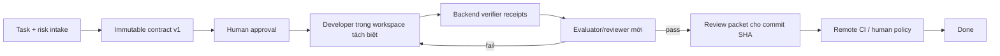

# Backlog cải tiến Agent Team - Review từ Anthropic Engineering

Trạng thái: **Ghi chú nghiên cứu / backlog đề xuất. Chưa có mục nào trong tài liệu này được phê duyệt để triển khai.**

Đối chiếu với: `agent_team` trên `master` tại `ad48252`, tháng 7 năm 2026.

Phạm vi: tổng hợp lại các nhận xét trước đó về workflow của `agent_team` với các ý tưởng từ catalog Anthropic Engineering. Mỗi mục nếu được chấp nhận nên được
tách thành một implementation plan riêng trước khi sửa code.

---

## 1. Tóm tắt điều hành

`agent_team` hiện đã có nhiều nền tảng đúng hơn một demo "multi-persona" thông
thường:

- mô hình task/board kiểu Jira và workspace riêng cho từng task;
- conversation, run, append-only event và journal có tính bền vững;
- artifact lập kế hoạch rõ ràng: `SPEC.md`, `PLAN.md`, `TASKS.json`, review,
evidence, intake, questions và plan-change;
- vòng lặp planner/generator/evaluator có budget và human approval;
- canonical repository kết hợp với task branch/clone;
- OpenSandbox, ACP sidecar, egress control, schedule và autopilot.

Bước tiếp theo **không nên** là thêm thật nhiều persona cố định như PO,
developer, tester, security reviewer, release manager cho mỗi task. Lợi ích lớn
nhất lúc này nằm ở việc làm vòng lặp hiện có trở nên bền vững, có thể kiểm chứng
độc lập, có permission theo vai trò, quan sát được, và đo được chất lượng.

Định hướng nên là:

> Một task là một workflow bền vững chạy trên một contract bất biến. Agent có
> thể đề xuất và triển khai công việc, nhưng chỉ evidence do backend tạo và
> completion policy mới được chứng nhận task là Done.

Nói đơn giản, hãy tưởng tượng `agent_team` như một xưởng phần mềm nhỏ:

- **task contract** là đơn hàng đã ký;
- **workflow run** là hồ sơ theo dõi công việc, vẫn sống sót nếu server restart;
- **agent role** là thẻ ra vào chỉ mở đúng khu vực cần cho việc đó;
- **verification receipt** là phiếu in từ máy test, không phải lời nhắn "tôi đã test";
- **review packet** là bộ hồ sơ bàn giao gắn với đúng commit;
- **eval lab** đo xem một thay đổi của "xưởng" có thật sự làm output tốt hơn
không.


### Thứ tự ưu tiên đề xuất

1. **Trust và durability trước:** workflow persistence, writer lease,
  immutable contract, trusted verification receipt và completion gate.
2. **Làm việc unattended một cách an toàn:** verified autopilot, reviewer thật,
  role permission, retry theo loại lỗi, và review packet.
3. **Đo trước khi tối ưu:** run manifest, eval lab, version prompt/model, và
  rollout có kiểm soát.
4. **Tăng hiệu suất:** context handoff, deferred tools, code-mode tool
  orchestration, skill lifecycle, và retrieval.
5. **Scale sau cùng:** parallel worker chỉ cho các node độc lập, trong worktree
  tách biệt, có ownership và merge coordination.

---


## 2. Điểm đáng học từ cách Anthropic thiết kế hệ thống

Qua các bài trong Anthropic Engineering, pattern lặp lại không phải là một danh sách tên agent cụ thể. Cái đáng giá hơn là các ranh giới hệ thống:

1. **Tách workflow deterministic khỏi model autonomy.** Phần lifecycle và policy
  đã biết nên dùng code; dùng agent khi đường đi thực sự mở.
2. **Tách "bộ não" khỏi "bàn tay".** Session state, harness state và execution
  sandbox cần có interface rõ và vòng đời riêng.
3. **Xem context là tài nguyên hữu hạn.** Lấy thông tin đúng lúc, handoff bằng
  state có cấu trúc, không mang theo toàn bộ transcript.
4. **Cho agent ground truth từ môi trường.** Test, tool và receipt từ backend
  đáng tin hơn lời agent tự khẳng định.
5. **Tăng ceremony theo risk.** Sửa một label nhỏ không nên trả cùng chi phí quy
  trình như migration authentication.
6. **Eval cả harness, không chỉ model.** Model, prompt, tool description,
  runtime, resource và orchestration đều ảnh hưởng kết quả.
7. **Giới hạn capability bằng cấu trúc.** Sandbox, credential, filesystem,
  network và role policy mới là blast radius thật; prompt chỉ là lớp phòng thủ
   thêm.
8. **Chỉ thêm độ phức tạp khi eval chứng minh có lợi.** Multi-agent có thể tăng
  độ bao phủ, nhưng tốn token và dễ lỗi coordination nếu task liên kết chặt.

Những nguyên tắc này hợp với hướng hiện tại của `agent_team`. Phần lớn đề xuất
bên dưới là làm mạnh subsystem đang có, không thay thế toàn bộ kiến trúc.

---


## 3. Ví dụ xuyên suốt

Dùng task sau để làm các đề xuất để hình dung:

> **Task:** "Sau khi session của user hết hạn, refresh access token và retry lại
> request API ban đầu đúng một lần. Không retry nếu credential không hợp lệ. Thêm
> test và giữ nguyên public API hiện có."

Ví dụ này tốt hơn một ví dụ trừu tượng vì nó chạm vào planning, security, code,
test, evidence và review nhưng không quá lớn.

Lifecycle mong muốn sau khi các mục ưu tiên cao được làm:




Mỗi phase được ghi vào `WorkflowRun` bền vững. Nếu process restart, hệ thống
resume từ checkpoint gần nhất thay vì coi task đã mất.

---


## 4. Điểm mạnh hiện có nên giữ

Những điểm sau nên được coi là asset, không nên viết lại vô cớ:

- **Planning contract dựa trên file.** Artifact trong `.agent-team/` dùng được
cho graph worker, CLI worker và người đọc.
- **Evaluator loop độc lập.** Tách generator/evaluator là đúng form cho công việc có acceptance criteria rõ.
- **Một public lifecycle.** `task.loop_state` giúp tránh lộ nhiều state machine
nội bộ ra ngoài.
- **Append-only run event và journal.** Đây là input tốt cho durable replay,
observability và post-task learning.
- **Risk lane.** quick, normal, risk nên dùng để chọn recipe/policy,
không nên biến thành ba implementation riêng.
- **Canonical repository ownership.** Task workspace và branch là nền tảng tốt
cho parallel execution có isolation.
- **OpenSandbox và sidecar architecture.** Đây là nền tảng mạnh cho việc tách
"brain / hands" và credential isolation bằng cấu trúc.
- **Friction và journal record.** Nguyên liệu cho một hệ thống tự cải tiến đã có;
cần curation và provenance, không cần thêm memory silo mới.

---


## 5. P0 - Trust và durability

Những mục này nên làm trước khi tăng autonomy hoặc parallelism.

### AT-01 - `WorkflowRun` bền vững, phase checkpoint và recovery

**Quan sát hiện tại.** Outer loop và planning launcher là các job
`asyncio.create_task(...)` trong process, được track bằng in-memory map như
`runtime/loop/service.py::_RUNNING_LOOPS`. Startup reconciliation có thể đánh dấu agent run bị mồ côi là failed, nhưng không thể tái dựng và resume toàn bộ
workflow planning/execution bên ngoài.

**Đề xuất.** Thêm record do backend sở hữu:

- `workflow_run`: task, recipe, state, current phase, contract version, cursor,
attempt, budget ledger, timestamp và terminal outcome;
- `workflow_phase_run`: role, agent run, input/output artifact references,
retry count, checkpoint và failure classification;
- lease fields: `lease_owner`, `lease_until`, `heartbeat_at`;
- idempotency key cho phase start và completion transition.

Worker claim workflow, renew lease, chạy một đơn vị có thể resume, persist
checkpoint, rồi release hoặc advance. Khi restart, lease hết hạn được reclaim và
resume từ phase đã commit gần nhất.

**Ví dụ để hiểu.** Developer sửa xong code token refresh, sau đó server restart
trước khi evaluator chạy. Hiện nay outer loop biến mất. Sau thay đổi này, process
mới thấy `phase=verify`, dùng lại task workspace và contract v1, rồi chạy
verification tiếp mà không re-plan hay sửa lại code.

**Done khi.** Test có thể kill process ở mỗi phase boundary, start worker mới và
đạt cùng final outcome, không duplicate run, không mất budget.

**Nguồn ảnh hưởng.** Managed Agents; Multi-agent Research; effective
long-running harnesses.

### AT-02 - Writer lease độc quyền cho task workspace

**Quan sát hiện tại.** Guard trong memory không ngăn được hai HTTP worker, một
schedule, autopilot và manual action cùng khởi động writer lên cùng task
workspace.

**Đề xuất.** Thêm database lease theo key `(task_id, workspace_id)`. Chỉ một
phase có quyền write được giữ lease. Reviewer read-only có thể chạy song song
nếu đọc từ snapshot/commit đã pin. Lease acquisition cần idempotent và UI/API
nên hiện owner, expiry và current phase.

**Ví dụ để hiểu.** Autopilot start task refresh session lúc 09:00, owner bấm
"Approve and run" lúc 09:00:01. Một request lấy được lease; request còn lại
attach vào workflow đang có thay vì tạo agent thứ hai cùng sửa file.

**Done khi.** Concurrency test từ nhiều process không thể tạo hai phase có quyền
write cho một task workspace.

**Dependency.** Nên làm cùng AT-01 để lease có owner bền vững.

### AT-03 - `ContractVersion` đã approve và bất biến

**Quan sát hiện tại.** Approval có ghi etag, nhưng planning file đã approve vẫn nằm trong workspace agent có thể ghi. Execution chưa luôn chứng minh rằng
`SPEC.md`, `PLAN.md`, `TASKS.json` mà nó đọc dùng là byte đã được approve.

**Đề xuất.** Khi approve, tạo immutable snapshot theo content address:

```text
ContractVersion
  id
  task_id
  version
  spec_sha256
  plan_sha256
  tasks_sha256
  intake_sha256
  approved_by / approved_at
  source_commit_sha
```

Execution tham chiếu `contract_version_id`, không tham chiếu file path mutable.
File vẫn có thể materialize vào workspace để agent đọc, nhưng backend so sánh
content hoặc mount bản read-only đã approve. Nếu cần đổi, tạo v2 với diff và
reapproval; không mutate v1.

**Ví dụ để hiểu.** Contract v1 nói "retry exactly once". Khi code, agent đổi
thành ba lần retry để test dễ hơn và sửa `SPEC.md`. Backend vẫn evaluate theo v1 và chặn
completion. Nếu ba lần retry thật sự cần, agent phải mở plan-change request tạo
v2.

**Done khi.** Test sửa bất kỳ approved artifact nào sau approval nhưng không thể thay đổi contract mà execution/verification dùng.

### AT-04 - Acceptance criteria có cấu trúc và verification receipt đáng tin

**Quan sát hiện tại.** `runtime/loop/verdict.py::has_verification_evidence`
kiểm tra các field giống evidence có rỗng hay không. Một `EVIDENCE.json` do model viết có thể tự claim command đã chạy, nhưng backend không có provenance về
execution hoặc repo state.

**Đề xuất.** Tách **agent observation** khỏi **trusted receipt**:

- acceptance criteria có ID ổn định: `AC-1`, `AC-2`, ...
- backend `VerificationRunner` chạy các command đã được approve;
- mỗi `VerificationReceipt` ghi command, exit code, duration, stdout/stderr
reference và hash có giới hạn, workspace tree/commit SHA, runtime image,
environment fingerprint, actor và timestamp;
- evidence map từng criterion vào một hoặc nhiều receipt ID;
- model evaluation có thể giải thích coverage và risk, nhưng không được mint
receipt;
- completion policy yêu cầu mandatory criteria phải được cover bởi receipt hợp
lệ.

**Ví dụ để hiểu.** Với task session-refresh:

- `AC-1`: expired token refresh và retry đúng một lần - receipt từ focused test;
- `AC-2`: invalid credential không retry - receipt focused test thứ hai;
- `AC-3`: public API không đổi - receipt type-check/API snapshot;
- `AC-4`: regression suite pass - receipt từ suite.

Evaluator có thể nói test chưa đủ, nhưng câu "all tests passed" không kèm
receipt ID không bao giờ đủ để đánh dấu Done.

**Done khi.** `EVIDENCE.json` giả, receipt cũ từ commit khác, và receipt từ sai
runtime đều bị gate từ chối.

**Nguồn ảnh hưởng.** Harness Design for Long-running Apps; Building Effective
Agents; Claude Code Best Practices.

### AT-05 - Backend completion policy và verified autopilot

**Quan sát hiện tại.** Board autopilot start một chat run thông thường và chuyển
task sang Done khi run phát `RUN_DONE`. Agent status tool cũng có thể yêu cầu
board status transition tùy ý. Việc này bypass strict planning, independent
evaluation và backend evidence gate.

**Đề xuất.** Thêm `completion_policy` cho board/task:

- `run_finished`: hành vi nhẹ hiện tại, chỉ cho việc non-code/low-risk;
- `verified`: contract + trusted receipts + evaluator pass;
- `human_accepted`: verified + owner chấp nhận rõ ràng;
- `ci_merged`: verified + remote CI cho cùng SHA + merge policy.

Autopilot nên gọi `WorkflowRecipe`, không gọi generic chat run. Với policy
`verified`, nếu agent yêu cầu Done thì chỉ đưa task về Review/Ready; chỉ
completion gate mới thực hiện transition Done.

**Ví dụ để hiểu.** Coding agent trả lời rất đẹp nhưng quên test invalid
credentials. `RUN_DONE` chỉ kết thúc developer phase. Task vẫn ở execution/review
đến khi `AC-2` có receipt hợp lệ.

**Done khi.** Không agent-controlled run hay status tool nào có thể chuyển một
verified task sang Done nếu chưa đạt completion policy.

### AT-06 - Role thật, tool theo role, và review độc lập

**Quan sát hiện tại.** `runtime/local_backend.py` hiện resolve ordinary run với
`WorkerRole.CHAT`; role chưa là authorization boundary thật. Planning reviewer
được ghi bằng planner role, nên một alias/session có thể review việc của chính mình. Các tool mạnh như status và Git action đang khá rộng so với trách nhiệm
lifecycle.

**Đề xuất.** Biến role thành capability profile do backend enforce:


| Role      | Read                       | Write           | Tool giá trị cao      | Cấm                      |
| --------- | -------------------------- | --------------- | --------------------- | ------------------------ |
| planner   | repo + task context        | planning draft  | search, inspect       | sửa source, push         |
| reviewer  | approved draft + repo      | review artifact | inspect, compare      | sửa plan/source          |
| developer | contract + source          | task workspace  | edit, test            | approve, publish         |
| verifier  | pinned source              | receipt store   | approved commands     | sửa source               |
| evaluator | contract + receipts + diff | verdict         | inspect, test request | mint receipt, sửa source |
| publisher | accepted commit            | Git metadata    | push/PR               | mutate code              |


Dùng `RUN_ROLE_REVIEWER` first-class, session mới, và tốt nhất là worker/alias
khác planner. Backend/sandbox policy phải enforce allowed paths, tool allowlist,
MCP allowlist, egress và credential scope.

**Ví dụ để hiểu.** Developer có thể sửa `src/auth/refresh.ts` và chạy test, nhưng không thể approve plan của chính mình hay push lên `main`. Verifier có thể chạy
`pytest tests/auth` nhưng không sửa test đang fail. Publisher chỉ nhận commit đã
được accept.

**Done khi.** Negative test chứng minh mỗi role bị từ chối một representative
forbidden file write, tool call, network destination và lifecycle transition.

**Nguồn ảnh hưởng.** Claude Code subagents; Sandboxing; Containment; Auto Mode.

### AT-07 - Failure taxonomy, retry policy và checkpoint-aware recovery

**Quan sát hiện tại.** Lỗi sản phẩm, lỗi provider, lỗi sandbox, quyết định của
user và policy violation có thể bị gom vào một failed attempt chung. Như vậy lãng phí attempt và khó chẩn đoán incident.

**Đề xuất.** Phân loại failure trước khi quyết định có tiêu tốn product attempt
budget hay không:


| Lớp lỗi                                    | Phản ứng mặc định                  | Tốn implementation attempt? |
| ------------------------------------------ | ---------------------------------- | --------------------------- |
| provider transient / rate limit            | exponential backoff + jitter       | không                       |
| sandbox provisioning / OOM / egress outage | reprovision và resume checkpoint   | không                       |
| code hoặc test failure                     | evaluator feedback cho developer   | có                          |
| cần user quyết định                        | pause và hỏi                       | không                       |
| policy violation                           | dừng và escalate                   | không                       |
| repeated unknown failure                   | retry có giới hạn, sau đó incident | tùy cấu hình                |


Persist classification, exception/tool result gốc, retry decision và checkpoint
vào workflow timeline.

**Ví dụ để hiểu.** Auth test fail vì code sai: consume một attempt. Lần verifier
sau container OOM: resize/reprovision và rerun verification cũ, không nói với
developer rằng code fail lần hai.

**Done khi.** Fault-injection test tạo đúng retry, budget và resume behavior cho
từng lớp.

### AT-08 - Sửa cumulative ACP token accounting

**Quan sát hiện tại.** ACP usage được document là cumulative cho một session
trong `runtime/acp/usage.py`, trong khi loop ledger cộng usage mỗi run report.
Nếu resume session, cumulative value có thể bị tính nhiều lần.

**Đề xuất.** Persist counter cumulative trước đó cho từng ACP session và chỉ tính
non-negative delta mỗi turn. Giữ raw cumulative value trong run manifest để debug.
Nếu counter reset, coi là usage epoch mới thay vì delta âm.

**Ví dụ để hiểu.** Turn 1 report 10k total token; turn 2 report 18k cumulative.
Task chỉ nên bị tính 18k tổng cộng, không phải 28k.

**Done khi.** Unit test cover continuation, reset/reconnect, missing usage và
parallel independent sessions.

---


## 6. P1 - Quality, observability và autonomy có kiểm soát


### AT-09 - `WorkflowRecipe` declarative được chọn theo risk lane

**Quan sát hiện tại.** Planning, execution, evaluation và autopilot có nhiều đường orchestration hard-code riêng. Nếu thêm nhiều persona tên gọi, các đường
này sẽ phức tạp hơn và task nhỏ cũng phải trả chi phí không cần.

**Đề xuất.** Tạo một recipe layer nhỏ. Mỗi phase khai báo:

- role và permission profile;
- input/output artifact types;
- model/provider/reasoning effort;
- deterministic gate và model exit gate;
- human gate;
- retry/failure policy;
- context policy;
- allowed parallelism.

Ví dụ recipe:

```yaml
recipes:
  quick-fix:
    phases: [developer, deterministic-verifier]
  standard-code:
    phases: [planner, plan-reviewer, approval, developer, verifier, evaluator]
  risk-code:
    phases: [planner, plan-reviewer, approval, developer, verifier,
             security-reviewer, evaluator, publisher, ci, human-merge]
```

Risk lane `quick`, `normal`, `risk` hiện có chọn recipe/profile. Role là trách nhiệm tạm thời của phase, không phải nhân viên thường trực luôn chạy.

**Ví dụ để hiểu.** Task đổi text label dùng `quick-fix`. Task session-refresh là
normal hoặc risk vì chạm authentication, nên có plan, review mới,
auth-focused verification và có thể cần human merge.

**Done khi.** Một workflow engine chạy được cả ba profile, và thêm recipe mới
cần configuration + validation, không cần thêm orchestrator custom.

**Nguồn ảnh hưởng.** Building Effective Agents: prompt chaining, routing,
parallelization, orchestrator-workers và evaluator-optimizer.

### AT-10 - Review packet gắn với đúng commit

**Đề xuất.** Tạo `REVIEW_PACKET.json` và `REVIEW_PACKET.md` sau verification.
Nó nên gồm:

- task và immutable contract version;
- base/head commit và tree SHA;
- coverage acceptance criteria với receipt ID;
- files changed và diff summary;
- verification commands và outcomes;
- plan deviation và approved change request;
- residual risk, migration và rollback note;
- prompt/model/runtime manifest reference;
- PR URL và remote CI result cho cùng SHA.

**Ví dụ để hiểu.** Reviewer đọc một packet gọn: `AC-1` đến `AC-4` pass trên commit
`abc123`, refresh endpoint là external call duy nhất, rollback là revert một
commit. Họ không cần đọc lại transcript 200 message.

**Done khi.** Mỗi source change làm packet/receipt invalid cho đến khi
verification chạy lại, và policy `ci_merged` check remote CI cho head SHA trong
packet.

### AT-11 - `RunManifest` có thể reproduce và observability cho agent

**Đề xuất.** Persist manifest cho mỗi phase/run:

- model, provider, reasoning effort, temperature/seed nếu có;
- prompt bundle version và hash;
- skill version/hash và file đã load;
- tool/MCP catalog version, deferred tool đã load, tool example;
- repo/base/head/tree SHA và contract version;
- runtime image digest, platform, CPU/memory guarantee và hard ceiling;
- network/egress và credential policy ID;
- CLI/ACP package version;
- token/cost/latency total và usage epoch.

Thêm trace cho phase transition, tool selection, tool error, context size,
checkpoint/retry event và subagent topology. Content-level telemetry phải theo
privacy policy; nhưng pattern quyết định cấp cao vẫn có thể đo.

**Ví dụ để hiểu.** Mười user báo agent hay quên sau khi idle resume. Manifest cho
thấy tất cả failure dùng harness v42, stale-session compaction policy v3 và một
ACP version cụ thể. Canary replay reproduce được mà không cần đoán model đổi.

**Done khi.** Một failed run có thể filter và reproduce theo đầy đủ tuple
model/harness/runtime, kèm cảnh báo rõ nếu dependency nào không còn sẵn sàng.

**Nguồn ảnh hưởng.** April 23 Quality Report; Postmortem; Infrastructure Noise;
Multi-agent Research.

### AT-12 - Eval lab cho chính harness `agent_team`

**Quan sát hiện tại.** Backend test validate deterministic code behavior, nhưng
chưa đo xem một cấu hình agent-team có tạo software outcome tốt hơn không.

**Đề xuất.** Xây eval harness với các khái niệm:

- **task:** repo snapshot, request, constraint, hidden criteria;
- **trial:** một lần execute với manifest đóng băng;
- **transcript:** trace model/tool/workflow append-only;
- **outcome:** final repository state và review packet;
- **graders:** deterministic test trước, sau đó model rubric và human sampling;
- **harness:** recipe và runtime đầy đủ của agent-team.

Bắt đầu với 20-50 task đại diện lấy từ công việc thật và friction record. Tách
suite:

- capability: task khó đo năng lực tối đa;
- regression: lỗi đã fix phải không tái xuất;
- security/policy: forbidden action và prompt-injection;
- recovery: crash, timeout, stale session, tool failure, OOM;
- long-horizon: multi-phase có context reset và resume.

Theo dõi ít nhất:

- verified pass@1;
- pass^k consistency cho độ tin cậy unattended;
- cost-to-pass và time-to-pass;
- số lần human intervention và repeated correction;
- tool error và unnecessary tool call;
- acceptance-criterion coverage và stale-evidence rejection;
- regression theo model/prompt/skill/runtime version.

Dùng private và rotating held-out tasks. Không để hidden test, answer key hay
golden patch lộ vào agent sandbox. Thêm canary string và audit access file/network
đáng nghi vì agent có thể nhận ra benchmark công khai hoặc để lại trace làm bản
thử nghiệm sau.

**Ví dụ để hiểu.** Trước khi bắt security-reviewer phase cho mỗi auth task, chạy
30 frozen trials. Nếu defect found chỉ tăng 2% nhưng cost gấp đôi và pass^3 giảm,
chỉ giữ phase này trong risk recipe thay vì tin rằng thêm role là auto tốt hơn.

**Done khi.** Mỗi thay đổi prompt, recipe, tool, model default và context policy
có before/after eval report kèm manifest reproduce được.

**Nguồn ảnh hưởng.** Demystifying Evals; AI-resistant Technical Evaluations;
Eval Awareness; Multi-agent Research.

### AT-13 - Quản lý thay đổi prompt/model/skill và rollout chất lượng

**Đề xuất.** Đổi behavioral configuration như production code:

- prompt bundle immutable/versioned và override theo model;
- review từng dòng và tool ablation prompt;
- eval rộng theo từng model, không chỉ một aggregate score;
- dogfooding dùng public build;
- shadow/canary trial, soak period, gradual rollout và rollback;
- quality SLO và anomaly alert chia theo manifest dimension;
- giữ user-selectable effort và khai báo default recipe rõ.

**Ví dụ để hiểu.** Một instruction mới làm agent viết ngắn tiết kiệm 8% token
nhưng developer bỏ qua edge case. Auth eval suite phát hiện drop trước rollout.
Change chỉ áp dụng cho low-risk chat, không đổi ngầm tất cả coding run.

**Done khi.** Không prompt, default reasoning effort, compaction rule hay skill
update nào thành global default nếu thiếu audit record, eval comparison và
rollback target.

**Nguồn ảnh hưởng.** April 23 Quality Report và Anthropic postmortems.

### AT-14 - Context budget, checkpoint reset và structured handoff

**Điểm mạnh hiện có.** Fresh evaluator context, file artifact, journal và retry
feedback theo delta đang đi đúng hướng.

**Đề xuất.** Thêm `ContextPolicy` rõ cho từng phase:

- đếm token prompt, tool schema, retrieved context, transcript và tool result;
- cảnh báo ở ngưỡng cấu hình và checkpoint trước khi context xuống chất lượng,
ví dụ quanh 70%, cần chỉnh bằng eval;
- reset tại boundary của task graph hoặc sau nhiều cách tiếp cận fail;
- viết `HANDOFF.json`/`HANDOFF.md` có objective, contract version, completed
nodes, changed files, receipts, decisions, failed approaches, blocker và exact
next action;
- raw session/event log vẫn durable; context assembler chỉ chọn slice liên quan
cho phase tiếp theo;
- truyền path, ID, hash và compact summary thay vì copy data lớn.

Dùng extended reasoning/decision checkpoint cho multi-tool action có risk cao:
kiểm applicable rules, missing information, policy compliance và tool-result
correctness trước khi hành động. Đây là phase policy, không nhất thiết là một
persona hay tool `think` mới.

**Ví dụ để hiểu.** Developer đã dùng 80k token tìm auth code và thử hai fix sai.
Thay vì mang tất cả output fail sang turn tiếp, hệ thống checkpoint facts và
receipts hữu ích, mở session developer mới, và nói rõ: "`AC-2` vẫn fail vì 401
được handle sau generic retry branch; inspect `refresh.ts:handleError`."

**Done khi.** Long-horizon eval cho thấy context reset giữ đủ state cần thiết,
giảm việc lặp lại cách sai, và không mất changed-file/verification data.

**Nguồn ảnh hưởng.** Context Engineering; Claude Code Best Practices; Agent
Skills; Harness Design for Long-running Apps.

### AT-15 - Deferred tool catalog, tool example và code-mode orchestration

**Quan sát hiện tại.** Graph builder có xu hướng expose tool set enabled ngay từ đầu. Khi có nhiều MCP server, riêng tool definition đã ăn nhiều context, và
intermediate tool result bị copy qua model.

**Đề xuất.** Tạo `ToolCatalog` có version:

- core cực nhỏ luôn bật: `search_tools`, file search/read, approved shell, task
state read, và artifact read/write theo role;
- MCP/tool schema defer, được discover bằng semantic và keyword search;
- mục đích tool rõ, không overlap, description ngắn;
- usage example đã test cho semantic mà JSON Schema không dạy được;
- allowlist tool và server theo role;
- metric cho selection, error, retry, token footprint và completion time;
- sandboxed code-mode gateway có thể gọi nhiều MCP API, lặp, join, filter và
aggregate data, rồi chỉ trả compact result vào model context.

**Ví dụ để hiểu.** Planner cần board wiki và repo history, không cần 20 schema
write Jira/Slack/GitHub. Nó load hai read-only tool. Một code helper fetch 200
issue record, lọc ra 5 auth incident, và trả về 5 ID + summary thay vì đưa cả
200 record vào context.

**Done khi.** Tool-definition token và intermediate-result token giảm rõ rệt mà
không làm giảm success trên held-out tasks; tool-search miss và wrong-tool choice
được đo.

**Nguồn ảnh hưởng.** Advanced Tool Use; Code Execution with MCP; Writing
Effective Tools; SWE-bench harness.

### AT-16 - Credential boundary bằng cấu trúc và action policy

**Điểm mạnh hiện có.** OpenSandbox, sidecar ACP, egress rule và credential
planning là nền tảng đúng.

**Đề xuất.** Hoàn thiện structural boundary:

- không mount full host provider config directory vào untrusted execution
sandbox;
- giữ long-lived secret trong vault/broker bên ngoài sandbox;
- cấp short-lived credential theo role và destination qua MCP hoặc network proxy;
- enforce filesystem và network isolation cùng nhau;
- bind egress, MCP server, credential và host mount vào role profile;
- preflight action bằng deterministic policy engine: safe allowlist, blocked
actions, và consent hẹp cho ambiguous/high-impact operation;
- dùng model classifier chỉ như defense in depth, với context tối thiểu không
gồm rationale thuyết phục của acting agent;
- yêu cầu human confirmation cho publication risk cao, destructive data
operation, production credential hoặc broad network access.

**Ví dụ để hiểu.** Developer có thể gọi staging auth API bằng proxy token hết hạn
sau 15 phút và không truy cập production. Prompt injection trong dependency
không đọc được GitHub token vì token không có trong filesystem hay environment.
Publisher sau đó nhận credential khác, chỉ đủ để tạo PR một lần.

**Done khi.** Red-team test không exfiltrate được credential qua shell, file,
process inspection, MCP, DNS/HTTP, log hay host fallback do model yêu cầu.

**Nguồn ảnh hưởng.** How We Contain Claude; Claude Code Sandboxing; Auto Mode;
Managed Agents; Desktop Extensions.

### AT-17 - Runtime profile và kiểm soát infrastructure noise

**Đề xuất.** Tách **guaranteed allocation** khỏi **hard ceiling** cho CPU,
memory, disk, time và concurrency. Version runtime profile và bind với
risk/recipe. Persist full infrastructure fingerprint trong run manifest.

Khi so sánh eval, dùng image và resource profile giống nhau. Phân loại resource
starvation là infrastructure failure, không phải model/product failure. Duy trì
một tập canary task nhỏ để liên tục đo runtime health.

**Ví dụ để hiểu.** Cùng auth suite pass với 4 GB RAM nhưng flaky với 1 GB. Nếu
không có fingerprint, nhìn như model randomness. Với runtime profile, OOM được
nhận diện, retry ngoài product attempt budget, và bị loại khỏi model-quality
comparison.

**Done khi.** Repeated trials report và control resource variance, quality
dashboard có thể segment theo runtime profile/image.

**Nguồn ảnh hưởng.** Quantifying Infrastructure Noise.

---


## 7. P2 - Scale an toàn và học hỏi của tổ chức


### AT-18 - Chỉ parallelize task graph khi có isolation và ownership

**Đề xuất.** Chỉ parallelize node khai báo độc lập:

- mỗi node có `depends_on`, `owns_paths` hoặc domain ownership, output contract,
verifier và budget;
- mỗi writer nhận isolated worktree/branch và DB claim/lease;
- node trả compact result về orchestrator;
- merge queue sắp thứ tự integration, detect diff overlap, và chạy integration
verifier sau merge;
- node conflict hoặc share state quay về sequential execution.

Không để nhiều agent edit một workspace lớn dùng chung. Không spawn nhiều role
chỉ để tiêu thêm token. Multi-agent hợp cho breadth và công việc độc lập; coding
task liên kết chặt thường dễ fail vì coordination.

**Ví dụ để hiểu.** Với auth epic lớn, một worker update backend token refresh,
một worker độc lập update frontend session messaging, worker thứ ba viết docs.
Họ sở hữu path và branch riêng. Database migration và ORM model change vẫn
sequential vì chung contract.

**Done khi.** Parallel integration test chứng minh không mất edit, không double
claim, merge order deterministic, và wall-clock tốt hơn single-worker baseline
với cost chấp nhận được.

**Nguồn ảnh hưởng.** Building a C Compiler with Parallel Claudes; Multi-agent
Research; Building Effective Agents; Claude Code worktrees.

### AT-19 - Post-task knowledge assimilation có provenance

**Đề xuất.** Sau khi task được accept/merge, chạy read-only assimilator để đề xuất patch cho Board Wiki, chỉ gồm reusable knowledge:

- architectural decision và scope;
- setup/debugging procedure ổn định;
- invariant mới và failure signature;
- accepted tool/skill guidance;
- failed approach đáng tránh.

Mỗi câu liên kết đến task ID, contract version, commit/PR và receipt. Patch đi qua task branch và human review bình thường. Không âm thầm rewrite shared memory.

**Ví dụ để hiểu.** Task session-refresh phát hiện tất cả 401 handling phải đi qua
`AuthRetryPolicy`, và raw HTTP client bypass telemetry. Assimilator đề xuất
invariant này vào auth wiki, link tới PR đã merge. Planner sau này retrieve được
mà không cần đọc transcript cũ.

**Done khi.** Knowledge đã accept search được và có attribution, proposal bị từ chối không vào wiki, statement cũ có thể trace và retire.

### AT-20 - Contextual hybrid retrieval cho wiki, journal và decision

**Đề xuất.** Khi knowledge lớn đến mức full-context loading không còn rẻ, xây
retrieval layer dùng:

- chunk hiểu document với contextual header 50-100 token;
- hybrid lexical/BM25 và embedding retrieval;
- optional reranking trước context assembly;
- filter theo board, repository, path, artifact type, time, contract version và
accepted/proposed status;
- source ID và quote/snippet có provenance;
- retrieval eval từ câu hỏi thật của planner/developer.

Với knowledge base nhỏ, ưu tiên full-context hoặc filesystem discovery đơn giản;
không thêm RAG chỉ vì nó đang hot.

**Ví dụ để hiểu.** Chunk "retry once after refresh" tự thân nó khá mơ hồ. Context
header nói nó đến từ auth architecture decision cho API client 401 handling,
được accept trong PR 184. OAuth task sau retrieve dùng rule, không nhầm với
payment retry rule có câu tương tự.

**Done khi.** Held-out retrieval recall và downstream task success tốt hơn cách
search/context hiện tại với latency và token cost chấp nhận được.

**Nguồn ảnh hưởng.** Contextual Retrieval; Context Engineering.

### AT-21 - Skill lifecycle: progressive disclosure, trust và eval

**Điểm mạnh hiện có.** `agent_team` đã materialize skill pack vào task workspace,
rất hợp với filesystem-based progressive disclosure.

**Đề xuất.** Coi skill là versioned capability package:

- manifest nhỏ load trước: name, purpose, trigger, owner, version,
compatibility, requested tools/egress/credentials và trust source;
- `SKILL.md` chỉ load khi liên quan; các reference sâu hơn được discover theo nhu cầu;
- deterministic script cho thao tác nên làm bằng code;
- hash/signature và install/review policy cho untrusted skill;
- per-skill eval task, activation precision/recall, tool error và outcome delta;
- canary rollout và rollback như prompt change;
- proposal workflow có thể biến repeated successful trajectory thành draft
skill, nhưng không auto-publish.

**Ví dụ để hiểu.** Skill `auth-migration` lúc startup chỉ expose tên và mô tả một
dòng. Nó chỉ load rule refresh-token chi tiết cho auth task, và chạy deterministic
API compatibility script. Khi install, nó request read auth docs và test
execution, không request Git push hay production egress.

**Done khi.** Platform giải thích được vì sao skill activated, file/script nào đã
load, permission nào đã dùng, và skill có cải thiện eval không.

**Nguồn ảnh hưởng.** Agent Skills; Advanced Tool Use; Desktop Extensions.

### AT-22 - Biến friction thành improvement work có evidence

**Điểm mạnh hiện có.** Friction record và journal artifact đã bắt được nhiều lỗi
lặp lại.

**Đề xuất.** Thêm curation loop:

- chỉ cluster sau human confirmation hoặc deterministic identity mạnh;
- hiện recurrence count, recipe/model/tool bị ảnh hưởng, cost và lost time;
- một nút "Create improvement task" với example đã link;
- sau khi fix, replay các case liên quan trong eval lab;
- chỉ close improvement khi recurrence metric giảm;
- không để agent âm thầm mutate backlog hoặc shared methodology.

**Ví dụ để hiểu.** Năm task báo "agent chạy full suite trước focused test và bị
timeout". Owner tạo một improvement task cho tool guidance, update test skill,
và verify năm frozen case giờ chạy nhanh hơn mà pass rate không giảm.

**Done khi.** Mỗi improvement được promote có link problem evidence, proposed
change, eval comparison, rollout và post-rollout recurrence.

### AT-23 - Quality incident, feedback và canary replay

**Đề xuất.** Thêm đường vận hành chất lượng song song với software health
monitoring:

- user feedback attach run manifest, phase timeline và example reproduce được,
có redaction theo privacy;
- anomaly detection segment theo model, prompt, skill, tool, ACP, runtime và
context-policy version;
- canary task chạy trên current và candidate harness build;
- suspected regression có thể freeze rollout hoặc revert một behavioral
component;
- incident report phân biệt model, harness, context, infrastructure và tool
failure.

**Ví dụ để hiểu.** User nói "agent lặp lại sau khi idle". Thay vì coi là model
variation mơ hồ, hệ thống group stale-session run, replay canary, và tìm ra
context-pruning policy version.

**Done khi.** Một behavioral regression có thể được detect, thu hẹp theo
manifest dimension, reproduce và rollback mà không phải thay cả hệ thống.

---


## 8. P3 - Hygiene và follow-through


### AT-24 - Test isolation, live integration coverage và docs consistency

**Quan sát hiện tại.** Lần chạy full backend test trước đó pass 362/363 test.
Test sidecar relay còn lại chạm vào PostgreSQL thật qua cancellation store, nên
failure này cho thấy test isolation thiếu, không phải bằng chứng production bug.
Một số roadmap/wiki cũng chậm hơn current risk-lane và endpoint behavior.

**Đề xuất.** Thêm:

- dependency injection/fake cho cancellation và event store trong unit test;
- live OpenSandbox/ACP integration suite sau explicit environment marker;
- restart/lease/receipt/security fault-injection test từ P0;
- frontend type/build test và browser test cho lifecycle control;
- docs linting cho route, artifact name, status, constant và plan state;
- generated reference section nếu backend schema là source of truth.

**Ví dụ để hiểu.** Unit test cho sidecar frame relay phải pass trên laptop không
có PostgreSQL. Một integration test riêng có label chứng minh path DB và sandbox
thật trong CI. Docs checker bắt được endpoint cũ trước release.

**Done khi.** Unit suite không có accidental network/service dependency,
integration prerequisite rõ ràng, và stale API/artifact reference làm CI fail.

---


## 9. Những thứ không nên copy máy móc


### 9.1 Không tạo một sơ đồ công ty cố định cho mỗi task

PO, planner, architect, developer, tester, security reviewer và release manager
là các **trách nhiệm** hữu ích, nhưng tách thành model call riêng chỉ đáng nếu
independence, permission hoặc focused context làm eval tốt hơn.

Với task session-refresh, recipe bình thường có thể cần planner, developer,
verifier và evaluator. PO riêng không thêm nhiều giá trị nếu task contract đã rõ.
Security reviewer có thể đáng giá vì authentication là risk flag. Recipe nên
quyết định, không phải org chart cố định.

### 9.2 Không coi evidence do model viết là bằng chứng

Evaluator độc lập vẫn là LLM và có thể hiểu sai hoặc fabricate claim. Nó nên
diễn giải trusted receipt, tìm coverage thiếu và giải thích risk. Nó không nên
là authority xác nhận command của chính nó đã chạy.

### 9.3 Không parallelize một workspace mutable dùng chung

Parallel agent hiệu quả khi công việc tách sạch. Nhiều writer trong một checkout
tạo conflict, việc trùng lặp và lỗi tương quan. Isolation, ownership, lease và
integration verification là điều kiện tiên quyết.

### 9.4 Không dùng LLM classifier làm security boundary

Chính Auto Mode của Anthropic cũng tìm thấy false negative đáng kể. Model
classification có thể giảm prompt cho ambiguous action, nhưng sandbox,
filesystem, network, credential và deterministic policy phải giới hạn blast
radius thật.

### 9.5 Không tối ưu theo static public benchmark

Agent mạnh có thể nhận ra benchmark, tìm answer key, hoặc làm bẩn trial sau qua
file/network trace. Nên dùng private rotating case, hidden grader, isolated
trial, canary và phân phối task thật.

### 9.6 Không thêm RAG hay tool search trước khi đo nhu cầu

Với board wiki nhỏ, đọc concise index hoặc full document có thể đơn giản và tốt
hơn. Retrieval, reranking và deferred tools chỉ đáng giá khi context/tool
definition size và eval failure chứng minh vấn đề.

---


## 10. Delivery sequence đề xuất


### Slice 0 - Các fix nhỏ, rõ ràng

- AT-08 cumulative ACP token delta.
- Reviewer role first-class và invariant fresh-session từ AT-06.
- Unit-test dependency isolation từ AT-24.
- Sửa docs nếu có thể chứng minh từ code hiện tại.

Đây là các mục hẹp, có thể land mà chưa cam kết full target model.

### Slice 1 - Durable trust core

- AT-01 durable workflow/phase run và restart recovery.
- AT-02 writer lease.
- AT-03 immutable contract version.
- AT-04 structured criteria và backend verification receipt.

Đây là nền móng cho vận hành 24/7. Nên thiết kế cùng nhau, dù delivery bằng
nhiều migration nhỏ.

### Slice 2 - Verified unattended execution

- AT-05 completion policy và verified autopilot.
- Phần role policy còn lại của AT-06.
- AT-07 retry theo loại failure.
- AT-09 declarative recipe/risk routing.
- AT-10 review packet và CI-SHA gate.
- AT-16 credential/action boundary cần cho unattended publication.


### Slice 3 - Đo và rollout an toàn

- AT-11 run manifest và observability.
- AT-12 eval lab.
- AT-13 behavioral configuration rollout.
- AT-17 runtime profile.
- AT-23 quality incident và canary.

Minimal manifest nên bắt đầu từ Slice 1 để data workflow sớm có ích; hệ thống
quality đầy đủ có thể theo sau.

### Slice 4 - Hiệu suất và memory

- AT-14 context budget và handoff.
- AT-15 deferred tools/code-mode orchestration.
- AT-19 knowledge assimilation.
- AT-20 contextual retrieval khi eval chứng minh cần.
- AT-21 skill lifecycle.
- AT-22 friction-to-improvement loop.


### Slice 5 - Parallel execution có isolation

- AT-18 task-graph fan-out, worktree, ownership, merge queue và integration
verification.

Chỉ bắt đầu slice này sau khi single-workflow reliability và eval baseline đã vững. Nếu không, parallelism chỉ nhân uncertainty lên.

---


## 11. Các quyết định cần review trước khi triển khai

Nên review theo thứ tự vì quyết định sau phụ thuộc quyết định trước:

1. **Durability boundary:** `WorkflowRun` có phải owner duy nhất của
  phase/cursor state, còn agent run là child execution không?
2. **Contract authority:** Approved contract bytes lưu trong database,
  content-addressed object storage, hay protected Git commit?
3. **Evidence authority:** Backend verifier được chạy command nào, và mapping
  criterion-to-receipt được biểu diễn thế nào?
4. **Completion policy:** Policy nào là default cho code task và task đó
  autopilot tạo?
5. **Role policy:** Role nào cần đầu tiên, và permission filesystem, tool, MCP,
  egress, credential chính xác cho từng role là gì?
6. **Recipe schema:** Field nào cần declarative trong v1, field nào tạm giữ
  trong backend code đến khi pattern ổn định?
7. **Eval corpus:** 20-50 task thật nào có thể đóng băng mà không lo private
  data hoặc answer key vào runtime?
8. **Manifest privacy/retention:** Trace content nào được giữ, redact,
  aggregate hoặc loại bỏ?
9. **Publication gate:** Done gắn với local verification, PR creation, remote CI,
  merge hay human acceptance cho từng board type?
10. **Parallel threshold:** Cần wall-clock/cost improvement bao nhiêu trước khi
  bắt AT-18 ngoài experiment?

---


## 12. Source map

Tất cả nguồn bên dưới là bài first-party Anthropic Engineering hoặc tài liệu
Claude Code chính thức. Các đề xuất là adaptation cho `agent_team`, không phải
claim rằng Anthropic implement đúng schema này.


| Source                                                                                                                            | Bài học chính áp dụng                                                                                 | Proposal IDs                      |
| --------------------------------------------------------------------------------------------------------------------------------- | ----------------------------------------------------------------------------------------------------- | --------------------------------- |
| [Harness design for long-running application development](https://www.anthropic.com/engineering/harness-design-long-running-apps) | planner/generator/evaluator, criteria có thể negotiate, verification granular, handoff sạch           | AT-04, AT-09, AT-14               |
| [Scaling Managed Agents: Decoupling the brain from the hands](https://www.anthropic.com/engineering/managed-agents)               | session durable bên ngoài harness stateless; sandbox interface; credential ngoài guest                | AT-01, AT-11, AT-16               |
| [Effective harnesses for long-running agents](https://www.anthropic.com/engineering/effective-harnesses-for-long-running-agents)  | tiến độ incremental, initialization, persistent artifact, resume                                      | AT-01, AT-14                      |
| [Building effective agents](https://www.anthropic.com/engineering/building-effective-agents)                                      | workflow đơn giản có thể compose, routing, parallelization, evaluator-optimizer, ground truth         | AT-04, AT-09, AT-18               |
| [How we built our multi-agent research system](https://www.anthropic.com/engineering/multi-agent-research-system)                 | orchestrator-worker fit, delegation chi tiết, scale effort, checkpoint, tracing, token cost cao       | AT-01, AT-09, AT-11, AT-12, AT-18 |
| [Building a C compiler with a team of parallel Claudes](https://www.anthropic.com/engineering/building-c-compiler)                | isolated clone, task lock, merge coordination, test quality, giới hạn parallelism                     | AT-02, AT-18                      |
| [Demystifying evals for AI agents](https://www.anthropic.com/engineering/demystifying-evals-for-ai-agents)                        | task/trial/grader/harness, 20-50 tasks, pass@k và pass^k                                             | AT-12                             |
| [Designing AI-resistant technical evaluations](https://www.anthropic.com/engineering/AI-resistant-technical-evaluations)          | long-horizon work đại diện, nhiều cơ hội chấm điểm, eval tiến hóa                                     | AT-12                             |
| [Eval awareness in BrowseComp](https://www.anthropic.com/engineering/eval-awareness-browsecomp)                                   | nhận diện benchmark, answer-key access, trace contamination                                           | AT-12                             |
| [Effective context engineering for AI agents](https://www.anthropic.com/engineering/effective-context-engineering-for-ai-agents)  | context nhỏ nhưng high-signal, retrieval đúng lúc, compaction, note, subagent                         | AT-14, AT-20                      |
| [Claude Code best practices](https://code.claude.com/docs/en/best-practices)                                                      | verify work, explore-plan-code, reviewer mới, checkpoint, context reset, worktree                     | AT-04, AT-06, AT-14, AT-18        |
| [The think tool](https://www.anthropic.com/engineering/claude-think-tool)                                                         | deliberate policy/result check trước high-risk tool action; extended reasoning phù hợp hơn hiện nay   | AT-14, AT-16                      |
| [Introducing advanced tool use](https://www.anthropic.com/engineering/advanced-tool-use)                                          | tool search/deferred schema, programmatic calling, usage example                                      | AT-15                             |
| [Code execution with MCP](https://www.anthropic.com/engineering/code-execution-with-mcp)                                          | discover API bằng code và lọc intermediate result ngoài model context                                 | AT-15, AT-16                      |
| [Writing effective tools for agents](https://www.anthropic.com/engineering/writing-tools-for-agents)                              | đánh giá tool ergonomics trên task thật; interface rõ và không overlap                                | AT-12, AT-15                      |
| [SWE-bench harness](https://www.anthropic.com/engineering/swe-bench-sonnet)                                                       | reproduce trước, thay đổi tối thiểu, tool description chi tiết và persistence semantics               | AT-04, AT-15                      |
| [Equipping agents with Agent Skills](https://www.anthropic.com/engineering/equipping-agents-for-the-real-world-with-agent-skills) | filesystem package, progressive disclosure, deterministic code, skill eval/security                   | AT-14, AT-21                      |
| [Introducing Contextual Retrieval](https://www.anthropic.com/engineering/contextual-retrieval)                                    | contextual chunk, hybrid BM25+embedding, reranking, eval tradeoff                                     | AT-20                             |
| [How we contain Claude across products](https://www.anthropic.com/engineering/how-we-contain-claude)                              | phòng thủ model/environment/external-content; giới hạn blast radius bằng cấu trúc                     | AT-06, AT-16                      |
| [Beyond permission prompts: Claude Code sandboxing](https://www.anthropic.com/engineering/claude-code-sandboxing)                 | filesystem và network isolation cùng nhau; autonomy an toàn nhờ containment                           | AT-06, AT-16                      |
| [How we built Claude Code auto mode](https://www.anthropic.com/engineering/claude-code-auto-mode)                                 | deterministic allowlist + classifier; classifier không phải security boundary hoàn hảo                | AT-05, AT-16                      |
| [Quantifying infrastructure noise](https://www.anthropic.com/engineering/infrastructure-noise)                                    | runtime resource ảnh hưởng eval score; guarantee khác ceiling                                         | AT-11, AT-17                      |
| [An update on recent Claude Code quality reports](https://www.anthropic.com/engineering/april-23-postmortem)                      | effort/context/prompt change có thể giống model degradation; eval rộng, ablation, soak, rollout       | AT-11, AT-13, AT-23               |
| [A postmortem of three recent issues](https://www.anthropic.com/engineering/a-postmortem-of-three-recent-issues)                  | lỗi infra/harness có thể làm degrade output theo cách intermittent; cần equivalence và diagnosis chat | AT-11, AT-13, AT-23               |
| [Desktop Extensions](https://www.anthropic.com/engineering/desktop-extensions)                                                    | manifest, compatibility, declared capability/config, secret storage, package validation               | AT-16, AT-21                      |


---


## 13. Review đầu tiên nên làm

Implementation review đầu tiên nên gồm **AT-01 đến AT-05 thành một buổi kiến trúc chung**, sau đó mới tách delivery thành các plan nhỏ. Năm mục này định nghĩa một task 24/7 đáng tin là gì:

1. workflow bền vững có thể resume;
2. chỉ một writer sở hữu workspace;
3. contract đã approve không bị đổi âm thầm;
4. proof đến từ backend receipt gắn với đúng source state;
5. Done là quyết định của policy, không phải một event trong conversation.

Khi các invariant này đã chốt, roles, recipes, evals, tools, learning và
parallelism sẽ dễ thêm hơn nhiều mà không tạo nhiều source of truth cạnh tranh.
