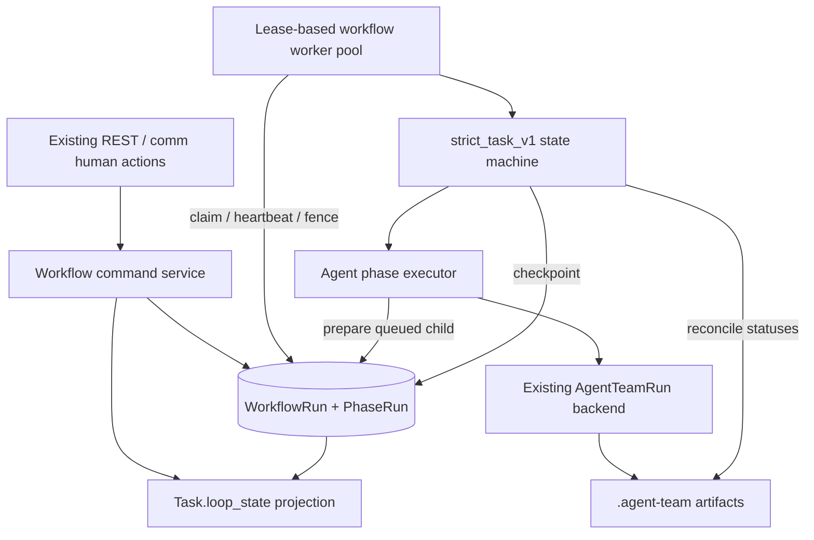
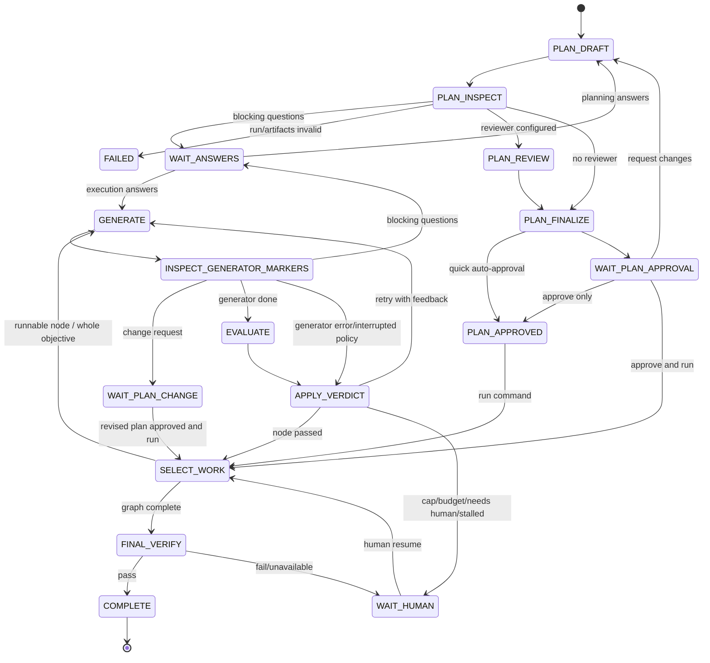

# Durable Workflow Recovery v1 — Implementation Plan

Status: **Proposed overall. Turn-aware retry foundation implemented.**

Parent proposal: `AT-01` in
`docs/plans/anthropic-engineering-improvement-backlog.md`.

Reviewed against: `agent_team` on `master` at `ad48252`, July 2026.

Implementation update (July 11, 2026): the narrower Case 2 recovery discussed
after this plan was written is now implemented. Planner/generator turns capture
a workspace checkpoint, freeze their file/tool delta on infrastructure
interruption, and hand that context to exactly one same-role successor. This is
a precursor to, not a replacement for, the durable phase workflow below.

Primary implementation areas:

- `features/board/runtime/loop/`
- `features/board/runtime/local_backend.py`
- `features/board/runtime/event_store.py`
- `features/board/models.py`
- `features/board/router.py`
- `features/board/schemas.py`
- `plugin.py`
- `tests/`

---

## 0. Decision summary

Implement one concrete durable workflow, `strict_task_v1`, covering the existing
strict lifecycle:

```text
planning draft
→ optional plan review
→ human approval wait
→ task-graph or whole-objective execution
→ evaluator feedback loop
→ final verification
→ terminal outcome
```

The workflow is stored in the database and executed by a small lease-based
worker pool. Every external agent turn is represented by an idempotent phase
record before the run starts. The workflow checkpoints after each durable
boundary, so a new process can continue from the last committed phase.

This plan deliberately does **not** build a general recipe engine. It introduces
the minimum stable abstractions a future recipe engine can reuse:

- durable workflow identity and state;
- typed versioned configuration and cursor;
- phase execution history;
- atomic claim, heartbeat, lease reclaim, and fencing;
- idempotent child-run creation/consumption;
- a strict-task-specific state machine.

The existing `LoopController` remains the pure owner of pass/fail/continue
decisions. The database workflow owns orchestration progress; agent-facing files
remain contracts and projections, not process locks.

### Implemented precursor: turn-aware retry

The current implementation now provides the safe interrupted-writer retry used
by future durable phase recovery:

- `AgentTeamRun` is the turn record; recoverable planner/generator runs store a
  versioned `workspace_snapshot_json` baseline;
- checkpoints record Git HEAD plus signatures for pre-existing dirty/untracked
  paths and a bounded manifest for planning artifacts/files outside task repos;
- the checkpoint never mutates the real Git index and creates no hidden Git
  commits or tree objects;
- an errored run, or a cancelled run without a durable user cancel request,
  freezes `workspace_delta_json` immediately at terminal handling/startup;
- one successor claims the source through unique `recovery_source_run_id` and
  receives a machine-generated recovery block before its normal prompt;
- persisted tool events identify the last observed completed tool and tool calls
  whose completion was not observed;
- planner and generator keep their existing continuous role sessions; recovery
  context still works if ACP session loading falls back to a fresh session;
- plan reviewer now has a distinct fresh `reviewer` role/session and cannot be
  mistaken for a recoverable planner turn;
- startup marks active loop/planning task projections `failed`, enabling the
  existing manual resume/re-plan controls.

Implemented in:

- `db_migrations/035_run_workspace_snapshot.sql` through
  `038_run_recovery_source_index.sql`;
- `features/board/runtime/turn_recovery.py`;
- `features/board/runtime/local_backend.py`;
- `features/board/models.py`.

Current boundary: the application does **not** automatically recreate the lost
outer planning/execution driver. A human still invokes existing resume/re-plan,
at which point the new turn receives the precise recovery hand-off. Automatic
phase selection, durable budgets/controller cursor, leases, fencing and
multi-process ownership remain the work specified by this plan.

---

## 1. Goal

After this feature ships, restarting or replacing an application process must
not lose a strict planning/execution workflow.

The expected user-visible behavior is:

> A task resumes automatically from its last safe checkpoint. Completed agent
> phases are not repeated, interrupted phases are retried explicitly, attempts
> and budgets do not reset, and two processes cannot drive the same workflow at
> the same time.

### Concrete example

Task:

> Refresh an expired access token, retry the original request once, do not retry
> invalid credentials, preserve the public API, and add tests.

The developer run finishes and persists its final answer. The process dies
before the evaluator starts.

Current behavior:

1. the in-memory outer loop disappears;
2. startup marks non-terminal agent runs as errors;
3. `task.loop_state` may say `running` or later become `failed`;
4. a human must resume, and the loop reconstructs only from files/run params;
5. attempt count, zero-progress streak, budget, and exact phase are lost.

Target behavior:

1. the generator phase is already `succeeded` in the database;
2. the workflow lease expires and another worker claims it;
3. the worker sees `cursor.step = evaluate` and the completed generator run;
4. it starts only a fresh evaluator phase;
5. the same workflow ID, attempt, budget, and task-graph node continue.

---

## 2. Current implementation findings

### 2.1 What is already good and should remain

| Component | Existing strength |
|---|---|
| `loop/controller.py` | Pure continue/stop decision logic with no I/O; easy to snapshot and test. |
| `loop/driver.py` | Generator/evaluator dependencies are injected and attempts/evaluations are durable. |
| `loop/task_graph.py` | `TASKS.json` records completed graph nodes and dependency order. |
| `loop/planning.py` | Human approval is already a true park: no process is held while waiting. |
| `AgentTeamRun` + event store | Agent turns, streams, terminal status, answer, tokens, and errors are durable. |
| task journal | Durable human-readable history exists and supports writing on a caller transaction. |
| core long-horizon queue | The repo already has a proven Postgres `SKIP LOCKED` / SQLite CAS lease pattern to follow. |

### 2.2 State that is currently process-local

| State | Current owner | Lost on restart |
|---|---|---:|
| active loop/planning job | `_RUNNING_LOOPS`, `_RUNNING_PLANS` | yes |
| cancel signal | `asyncio.Event` | yes |
| current generator/evaluator boundary | Python call stack | yes |
| controller attempt count | `LoopController._attempts` | yes |
| zero-progress streak | `LoopController._zero_streak` | yes |
| next follow-up prompt | local `prompt` variable | yes |
| graph-wide token/cost ledger | `LoopLedger` | yes |
| wall-runtime start | `time.monotonic()` | yes |
| current graph task | local `nxt` variable plus file status | partially |
| final-verification progress | Python call stack | yes |

### 2.3 Important correctness gaps

1. `start_autonomous_loop` and `start_planning_job` prevent duplicates only
   inside one process.
2. `AgentTeamAttempt.attempt_no` is allocated with `max + 1`; two process-local
   loops can race despite the unique constraint.
3. `LocalRunBackend.start` registers an asyncio task before an atomic database
   claim. Two starts can execute the same queued run.
4. startup reconciliation marks every non-terminal run as errored, but does not
   recover its parent workflow.
5. task-graph startup resets every `in_progress` node to `pending`; after a
   completed generator this can unnecessarily rerun development instead of
   continuing evaluation.
6. evaluator output paths are partly generated in memory. A crash after the
   evaluator writes its result but before parsing can lose the path needed to
   consume that result safely.
7. task state, attempt closure, journal entries, and graph-file updates happen in
   separate transactions/side effects, so replay can duplicate or skip work.
8. current manual resume starts a new in-memory ledger and controller. It is a
   useful workspace-level restart, not an exact workflow continuation.

---

## 3. Scope

### 3.1 In scope

- strict planning draft and optional reviewer;
- waiting for plan approval and `plan_approved` park;
- approve-and-run;
- task-graph and whole-objective execution;
- generator/evaluator attempts;
- final whole-SPEC verification;
- waiting for answers, plan changes, and human review;
- manual cancel and resume;
- automatic restart recovery;
- durable attempts, zero-streak, budget usage, and active runtime;
- multi-process-safe workflow ownership;
- existing API compatibility plus additive workflow diagnostics;
- migration/bootstrap of existing strict tasks.

### 3.2 Explicit non-goals

- a declarative `WorkflowRecipe` engine;
- multiple graph nodes executing in parallel;
- a lease covering ordinary chat/autopilot/manual workspace writers (AT-02);
- immutable approved contract snapshots (AT-03);
- trusted backend verification receipts (AT-04);
- failure taxonomy beyond known restart/interruption handling (AT-07);
- resuming a model/tool call in the middle of an unfinished turn;
- changing planner/reviewer role permissions;
- changing completion policy or board Done semantics;
- changing ACP cumulative token semantics (AT-08).

The design leaves extension points for these items without implementing them
inside the recovery feature.

---

## 4. Correctness invariants

These are implementation requirements, not suggestions.

### I1 — One open strict workflow per task

At most one non-abandoned workflow may occupy a task's active slot. A duplicate
HTTP request returns the existing workflow when idempotent or a conflict when it
requests an incompatible action.

### I2 — One fenced workflow owner

Only the worker holding the current `(lease_owner, lease_token)` may commit a
runner transition. Lease token increments on every claim. A stale worker cannot
complete a phase after another worker reclaims the workflow.

### I3 — No transaction across an agent await

Prepare state and child run in one short transaction, commit, execute the agent,
then consume the result in another short transaction.

### I4 — Child run exists before external execution

The `WorkflowPhaseRun` and its queued `AgentTeamRun` are committed before
`RunBackend.start`. Recovery can therefore identify whether to start, wait,
consume, interrupt, or retry the exact phase.

### I5 — Succeeded phases are never rerun

If an agent run is terminal `done` and its phase has been consumed, recovery
moves forward. If it is terminal `done` but not consumed, recovery consumes the
same output.

### I6 — Interrupted phases are explicit

A run that was genuinely in progress when its owner died becomes an
`interrupted` phase attempt. Retrying creates a new infrastructure try for the
same logical phase. It does not silently look like a new product attempt.

### I7 — Product attempt and infrastructure retry are distinct

Generator/evaluator feedback increments the loop's product attempt only when the
controller applies a completed attempt. Restarting an interrupted child run does
not consume the product attempt cap.

### I8 — Budget is monotonic

Token, cost, and active-runtime usage never decreases or resets when the worker,
process, or human pause changes. Phase usage is accounted exactly once.

### I9 — Human waits have no worker lease

`waiting_plan_approval`, `plan_approved`, `waiting_answers`,
`plan_change_requested`, and `waiting_for_human` are durable parks. No worker,
DB session, sandbox reference, or heartbeat remains active.

### I10 — DB owns orchestration; files are reconciled projections

`SPEC.md`, `PLAN.md`, and `TASKS.json` remain agent/human contracts. The DB
workflow cursor owns which phase/node/attempt runs next. Backend-written status
fields in `TASKS.json` are synchronized from the cursor before the next agent
phase.

### I11 — Public lifecycle remains singular

`AgentTeamTask.loop_state` remains the cockpit's public lifecycle. It is updated
in the same transaction as workflow transitions and is a projection of the open
workflow, not a second independent state machine.

### I12 — Replay is idempotent

Reapplying any committed transition or recovery sweep produces the same state,
does not create a duplicate child run, and does not duplicate a product attempt
or budget charge.

---

## 5. Target architecture



### Responsibility boundaries

| Layer | Owns | Does not own |
|---|---|---|
| command service | authorization-independent lifecycle commands after caller auth; atomic enqueue/park/cancel/resume | running agents |
| workflow store | models, queries, claim, heartbeat, fencing, transitions | prompt or artifact semantics |
| strict state machine | next phase/step for strict task workflow | DB sessions, network, background task lifetime |
| phase executor | preparing/starting/reading one agent phase | deciding overall lifecycle |
| existing loop controller | pass/fail/continue and next feedback prompt | persistence and recovery |
| worker pool | claim, heartbeat, run one resumable unit, reclaim | business decisions |
| task/artifact projector | public `loop_state`, task graph status mirror, board notification | authoritative workflow cursor |

---

## 6. Data model

Add two plugin models. New tables are registered in `plugin.models()` and are
created by the existing plugin metadata path. No existing table needs a new
column in v1.

### 6.1 `AgentTeamWorkflowRun`

Table: `plugin_agent_team_workflow_run`

| Field | Type | Purpose |
|---|---|---|
| `id` | `String(32)` PK | stable workflow identity |
| `task_id` | FK, indexed | owning task |
| `kind` | `String(32)` | `strict_task_v1` in v1 |
| `status` | `String(20)`, indexed | `queued`, `running`, `waiting`, `completed`, `failed`, `cancelled`, `abandoned` |
| `current_phase` | `String(32)`, indexed | coarse operator/UI phase |
| `active_slot` | nullable integer | `1` while workflow is open; `NULL` after terminal/abandoned |
| `state_version` | integer | optimistic transition version |
| `config_json` | text | versioned typed configuration |
| `cursor_json` | text | versioned typed recovery cursor |
| `outcome` | nullable string | existing loop outcome vocabulary |
| `cancel_requested` | bool | durable graceful-cancel request |
| `run_after` | nullable timestamp, indexed | optional delayed requeue |
| `lease_owner` | nullable string | process-unique worker ID |
| `lease_token` | integer | fencing token, incremented on claim |
| `lease_acquired_at` | nullable timestamp | active-runtime accounting |
| `lease_expires_at` | nullable timestamp, indexed | reclaim eligibility |
| `heartbeat_at` | nullable timestamp | health/diagnostics |
| `recovery_count` | integer | lease-loss/interruption count |
| `total_tokens` | integer | idempotently-accounted phase tokens |
| `total_cost_usd` | float | idempotently-accounted phase cost |
| `active_seconds` | float | active worker time; human waits/downtime excluded |
| `last_error` | nullable text | actionable operator error |
| `requested_by` | nullable user FK/plain ID | initiating actor |
| timestamps | timezone timestamps | created/updated/started/ended |

Constraints and indexes:

- unique `(task_id, active_slot)`;
- index `(status, run_after, created_at)` for claims;
- index `lease_expires_at` for the reaper;
- check/validation in Python for known status/kind values;
- cascade delete with task.

`active_slot = 1` stays set across human waits and resumable failures. It becomes
`NULL` only for `completed`, `cancelled`, or `abandoned`. PostgreSQL and SQLite
both allow multiple historical rows with `NULL` in a unique constraint.

### 6.2 `AgentTeamWorkflowPhaseRun`

Table: `plugin_agent_team_workflow_phase_run`

| Field | Type | Purpose |
|---|---|---|
| `id` | `String(32)` PK | phase execution identity |
| `workflow_run_id` | FK, indexed | parent workflow |
| `logical_key` | string | deterministic logical unit |
| `try_no` | integer | infrastructure retry number |
| `kind` | string, indexed | planner/reviewer/generator/evaluator/final evaluator |
| `status` | string, indexed | `prepared`, `running`, `succeeded`, `failed`, `interrupted`, `skipped` |
| `graph_task_key` | nullable string | `TASKS.json` node, or `__whole__` |
| `product_attempt_no` | nullable integer | loop attempt within the node |
| `attempt_id` | nullable FK | existing `AgentTeamAttempt` group |
| `agent_run_id` | nullable FK | existing queued/terminal agent run |
| `output_path` | nullable string | unique evaluator output path when applicable |
| `input_json` | text | versioned compact phase input/metadata |
| `output_json` | text | normalized consumed result/verdict reference |
| `usage_tokens` | integer | frozen terminal run usage |
| `usage_cost_usd` | float | frozen terminal run cost |
| `usage_accounted` | bool | guards exactly-once workflow ledger update |
| `error_class` | nullable string | structured failure category, initially restart/run error |
| `error_message` | nullable text | bounded diagnostic |
| `workflow_lease_token` | integer | token that started this try |
| timestamps | timezone timestamps | created/started/ended |

Constraints:

- unique `(workflow_run_id, logical_key, try_no)`;
- one phase row references at most one child agent run;
- retries use a new `try_no`; they never mutate a succeeded try;
- cascade delete with workflow; child agent runs/attempts remain task history.

Example logical keys:

```text
plan:1:draft
plan:1:review
task:T2:attempt:1:generator
task:T2:attempt:1:evaluator
final-verify:1
```

### 6.3 Why not add `workflow_id` to every existing table in v1

The phase table already links workflow → attempt → agent run. Avoiding columns on
`AgentTeamRun` and `AgentTeamAttempt` keeps migration portable and limits blast
radius. Direct links can be added later only if query profiles demonstrate they
are needed.

---

## 7. Typed configuration and cursor

JSON is used for evolvable workflow-specific state, but it must never be edited
as unvalidated dictionaries throughout the code.

Create codecs with explicit schema versions:

```python
@dataclass(frozen=True)
class StrictTaskConfigV1:
    schema_version: int
    objective: str
    planner_id: str | None
    reviewer_id: str | None
    generator_id: str | None
    evaluator_id: str | None
    task_graph: bool
    max_attempts: int
    max_zero_streak: int
    max_tokens: int | None
    max_cost_usd: float | None
    max_active_seconds: int | None
    allow_auto_approve: bool
```

Execution identities may be `None` while the workflow is waiting for approval;
the approve-and-run command validates and fills them before enqueueing execution.

```python
@dataclass(frozen=True)
class StrictTaskCursorV1:
    schema_version: int
    step: str
    plan_revision: int
    graph_contract_hash: str | None
    current_task_key: str | None
    completed_task_keys: tuple[str, ...]
    skipped_task_keys: tuple[str, ...]
    blocked_task_keys: tuple[str, ...]
    product_attempt_no: int
    controller_attempts: int
    zero_streak: int
    next_prompt: str | None
    current_attempt_id: str | None
    current_phase_run_id: str | None
    resume_step: str | None
    resume_context: str | None
```

Rules:

- decoding an unknown schema version parks the workflow as `failed` with an
  actionable error; it never guesses;
- encode/decode round trips are unit-tested;
- cursor updates are immutable replacements, not in-place dict mutation;
- `next_prompt` is persisted because it contains bounded evaluator evidence and
  must remain exact across recovery;
- prompt and resume-context sizes use existing request limits plus a strict
  storage clamp;
- sensitive values are not stored in config/cursor.

---

## 8. Internal state machine

`WorkflowRun.status` describes scheduling/ownership. `cursor.step` describes the
strict workflow's exact next action.

### 8.1 Steps

```text
PLAN_DRAFT
PLAN_INSPECT
PLAN_REVIEW
PLAN_FINALIZE
WAIT_PLAN_APPROVAL
PLAN_APPROVED
SELECT_WORK
GENERATE
INSPECT_GENERATOR_MARKERS
EVALUATE
APPLY_VERDICT
FINAL_VERIFY
WAIT_ANSWERS
WAIT_PLAN_CHANGE
WAIT_HUMAN
COMPLETE
FAILED
CANCELLED
```

The public `current_phase` is coarser:

| Cursor steps | `current_phase` | `task.loop_state` |
|---|---|---|
| plan draft/inspect | `planning` | `planning` |
| plan review/finalize | `plan_review` | `planning` |
| wait plan approval | `waiting_plan_approval` | `waiting_plan_approval` |
| plan approved | `plan_approved` | `plan_approved` |
| select/generate/markers | `execution` | `running` |
| evaluate/apply/final verify | `verification` | `running` |
| wait answers | `waiting_answers` | `waiting_answers` |
| wait plan change | `plan_change_requested` | `plan_change_requested` |
| wait human | `waiting_for_human` | `waiting_for_human` |
| complete | `complete` | `complete` |
| failed | `failed` | `failed` |
| cancelled | `cancelled` | `cancelled` |

### 8.2 Lifecycle



### 8.3 Transition implementation

Use a strict-task-specific transition function. It accepts typed config/cursor
plus a normalized observation and returns a typed transition:

```python
Transition(
    next_cursor=...,
    workflow_status=...,
    public_loop_state=...,
    outcome=...,
    journal_entry=...,
    enqueue=True | False,
)
```

The transition function is pure. The store applies it with a fenced compare and
swap and writes `AgentTeamTask.loop_state` plus the journal entry in the same
database transaction.

`LoopController` gains snapshot support rather than persistence concerns:

- `LoopController.snapshot() -> ControllerSnapshot`;
- `LoopController.from_snapshot(...)`;
- snapshot fields: attempts and zero streak;
- existing decision-table tests continue to pass;
- the workflow cursor stores the snapshot fields and `next_prompt`.

---

## 9. Worker pool, lease, and fencing

Follow the existing implementation style in
`src/core/agents/long_horizon/store.py` and `runner.py`. Do not import its private
SQL or tables; reuse the pattern locally because lifecycle semantics differ.

### 9.1 Defaults

Add temporary settings/env knobs:

```text
AGENT_TEAM_WORKFLOW_WORKERS=2
AGENT_TEAM_WORKFLOW_LEASE_SECONDS=60
AGENT_TEAM_WORKFLOW_POLL_SECONDS=1.5
AGENT_TEAM_WORKFLOW_MAX_RECOVERIES=5
AGENT_TEAM_WORKFLOW_PHASE_RETRIES=3
```

Clamp unsafe values in code. Heartbeat interval is approximately lease/3.

### 9.2 Claim

PostgreSQL:

```sql
UPDATE plugin_agent_team_workflow_run
SET status = 'running',
    lease_owner = :owner,
    lease_token = lease_token + 1,
    lease_acquired_at = :now,
    lease_expires_at = :expiry,
    heartbeat_at = :now,
    started_at = COALESCE(started_at, :now)
WHERE id = (
    SELECT id
    FROM plugin_agent_team_workflow_run
    WHERE status = 'queued'
      AND (run_after IS NULL OR run_after <= :now)
    ORDER BY created_at
    FOR UPDATE SKIP LOCKED
    LIMIT 1
)
RETURNING id, lease_token;
```

SQLite uses the repo's existing select-then-guarded-update CAS pattern with WAL
and busy timeout. Retry a bounded number of times when another worker wins.

### 9.3 Heartbeat

Heartbeat update is guarded by workflow ID, owner, token, and `status=running`.
It returns one of:

- `ok`: continue;
- `cancel`: set the local graceful-cancel event;
- `lost`: stop the orchestrator and cancel/yield its active child run;
- `missing`: stop without finalizing.

### 9.4 Fenced transition

Every runner transition uses:

```sql
... WHERE id = :id
      AND lease_owner = :owner
      AND lease_token = :token
      AND state_version = :expected_version
      AND status = 'running'
```

Zero rows means ownership/version was lost. The stale runner must not retry the
write, close attempts, change task state, journal completion, or account usage.

### 9.5 Release, park, and finish

- **requeue:** set `status=queued`, clear lease, set next cursor;
- **human park:** set `status=waiting`, clear lease;
- **recoverable failure:** set `status=failed`, keep `active_slot=1`, clear lease;
- **complete/cancel/abandon:** clear lease, set timestamps and `active_slot=NULL`;
- before clearing an owned lease, fold elapsed lease time into `active_seconds`.

### 9.6 Reaper

The reaper runs in every serving process; guarded updates make it idempotent.

For expired workflows:

1. inspect the active phase and child run;
2. if child is `done`, requeue the workflow to consume it;
3. if child is `queued`, requeue and preserve the same child run;
4. if child is `running`, mark the phase/run interrupted only after the workflow
   lease is expired, then requeue the logical phase for an infrastructure retry;
5. increment `recovery_count` once per reclaimed lease;
6. after `MAX_RECOVERIES`, park as `failed` for a human rather than loop forever.

Repeated reaper sweeps must not increment counts or create retries more than
once for the same expired lease token.

### 9.7 Startup and shutdown

- start the workflow pool in `_build_loop_capture_app()` lifespan, next to loop
  capture/autopilot startup;
- on graceful shutdown, stop claims, request local runners to checkpoint/yield,
  and requeue owned workflows where no child writer is active;
- on hard death, lease expiry/reaper handles recovery;
- the local wake event reduces same-process pickup latency; polling handles
  cross-process enqueue.

---

## 10. Idempotent child agent runs

### 10.1 Prepare transaction

For an agent phase, one transaction must:

1. verify workflow fence/version;
2. get-or-create the phase by `(workflow, logical_key, try_no)`;
3. get-or-create its role conversation;
4. create one queued `AgentTeamRun` if absent;
5. save `agent_run_id`, `output_path`, and phase input;
6. set `cursor.current_phase_run_id`;
7. commit.

Then, outside the transaction, start/await the child run.

Refactor `_create_loop_run` into a repository/domain helper that can operate on
an existing `Session`; retain a short-session wrapper for legacy callers.

### 10.2 Atomic run start

Replace unconditional `event_store.mark_running` semantics with an atomic run
claim:

```sql
UPDATE plugin_agent_team_run
SET status='running', started_at=COALESCE(started_at, :now)
WHERE id=:id AND status='queued'
```

`LocalRunBackend.start` creates an asyncio drive only when this update succeeds.
If the run is already terminal it is consumed; if already running locally it is
awaited; otherwise the workflow recovery policy handles ownership loss.

This change benefits every run and is required for exactly-once phase start.

### 10.3 Evaluator output path

The phase creates a deterministic unique path before the evaluator starts:

```text
.agent-team/loop/<phase-run-id>-verdict.json
```

Pass that path into `WorkerEvaluator.evaluate(...)`; do not generate it only in
local memory. Strict and non-strict evaluators use the same phase-specific
channel. After successful parsing:

- normalize the verdict into `phase.output_json`;
- optionally update canonical `.agent-team/EVIDENCE.json` for the cockpit;
- remove/archive the phase-specific file;
- recovery consumes `phase.output_json` if already present.

This prevents stale `EVIDENCE.json` from being mistaken for the current phase.
Trusted receipts remain a later proposal.

### 10.4 Interrupted writer retry

If a generator run was `running` when its owner died:

- mark phase try N `interrupted`;
- keep the same `AgentTeamAttempt` and product attempt number;
- create phase try N+1 with a recovery preamble requiring inspection of the real
  workspace state;
- do not run evaluator until a generator try reaches `done`;
- cap infrastructure tries separately and then park `failed`.

The retry cannot undo partial file edits. The prompt and existing generator
session must explicitly re-ground from disk, matching current loop discipline.

---

## 11. Checkpoint and crash semantics

The system promises phase-boundary recovery, not mid-token continuation.

| Crash window | Durable state | Recovery action |
|---|---|---|
| before phase prepare transaction | cursor still points to phase | prepare it normally |
| after phase+queued run commit, before backend start | phase `prepared`, run `queued` | start the same run ID |
| after atomic run claim, before worker body | run `running`, lease later expires | mark interrupted and retry same logical phase |
| during generator edits | run `running`, workspace may be partial | interrupt, then recovery generator inspects disk |
| generator `done`, before phase consume | terminal answer/usage in run | consume same result; start evaluator only |
| evaluator `done`, before verdict parse | deterministic output path stored | parse same file/result |
| verdict saved in phase, before controller decision | phase output durable | reapply pure decision once under fence |
| decision committed, before board event publish | workflow/task state durable | REST is correct; later UI refresh repairs missed event |
| node completion committed, before `TASKS.json` write | completed key in cursor | projection reconciliation writes `complete` |
| final verifier `done`, before terminal transition | final phase durable | consume and finish without rerunning verifier |
| process dies in human wait | workflow waiting, no lease | no action until human command |

### Required crash-injection mechanism

Add test-only failpoints around each boundary rather than trying to kill real
processes in every unit test. Each failpoint raises after the preceding commit.
Restart a fresh runner against the same file-backed SQLite database and assert
the expected next phase and child-run counts.

At least one subprocess integration test must hard-kill a worker while a fake
generator is blocked to validate lease expiry/reclaim end to end.

---

## 12. Task-graph recovery

### 12.1 Authority change

Current `task_graph.py` calls `TASKS.json` the single source of truth and resets
all `in_progress` rows at startup. Durable recovery needs a narrower split:

- task definitions, dependencies, acceptance, and validation remain in the
  approved `TASKS.json`;
- execution progress (`current`, `completed`, `blocked`) is authoritative in the
  workflow cursor;
- statuses in `TASKS.json` are an agent/cockpit projection reconciled from the
  cursor before every generator/evaluator phase.

Remove the unconditional blanket reset of all `in_progress` rows.

### 12.2 Graph contract hash

At execution start, compute a normalized hash over fields that define the graph,
excluding mutable `status`:

```text
id, title, depends_on, objective, files, acceptance, validation, risk
```

Before selecting work, recompute it:

- same hash: continue;
- changed hash without an approved plan-change transition: park `failed` with an
  actionable "task graph changed during execution" error;
- approved plan revision: increment `plan_revision`, store the new hash, and
  reconcile progress according to an explicit plan-change rule.

Full immutable contract versions are AT-03; this hash prevents recovery from
silently executing a different graph in the meantime.

### 12.3 Selection and node completion

Create pure helpers that select the next task using cursor progress plus graph
dependencies. Do not rely on an agent-written `status=complete` to skip work.

For each node:

1. cursor chooses and records `current_task_key`;
2. file projector writes `in_progress` atomically;
3. generator/evaluator attempts execute;
4. on pass, one DB transaction records the node in `completed_task_keys`, closes
   the attempt, and advances to `SELECT_WORK`;
5. file projector writes `complete` after commit;
6. recovery repairs any missed projection before the next external phase.

Use temporary file + `fsync` where appropriate + `os.replace` for backend-owned
artifact writes so `TASKS.json` is never left half-written.

### 12.4 Final verification

Final verification is an ordinary idempotent phase with logical key
`final-verify:<plan_revision>`. Its verdict is accounted and consumed once.

---

## 13. Attempts, controller, and budget

### 13.1 Attempts

- `AgentTeamAttempt.attempt_no` remains task-global for existing UI history;
- cursor `product_attempt_no` is per current graph node/whole objective;
- one open attempt is referenced by `cursor.current_attempt_id`;
- an interrupted generator retry reuses it;
- controller decision closes it exactly once;
- a new product retry opens a new attempt;
- active workflow exclusivity removes the current `max + 1` race for loop paths;
- still retry `open_attempt` on a unique-conflict as defense in depth.

### 13.2 Controller snapshot

Persist and restore:

- completed product attempt count for the current sub-loop;
- zero-progress streak;
- exact next prompt.

Reset controller snapshot when moving to a new graph node. Preserve it when
recovering the same node or answering an execution question.

### 13.3 Token/cost accounting

When a phase reaches terminal and is consumed:

1. freeze child-run tokens/cost into phase fields;
2. update workflow totals only if `usage_accounted = false`;
3. set `usage_accounted = true` in the same transaction.

This makes recovery idempotent. It does not fix cumulative ACP values inside an
individual run; AT-08 remains required.

### 13.4 Active-runtime accounting

Define `max_wall_seconds` as **active workflow runtime**, excluding:

- time waiting for human approval/answers/review;
- downtime after a process dies;
- delayed `run_after` deferral.

It includes time spent waiting for active agent phases. On normal release, add
`now - lease_acquired_at`. On lease reclaim, add up to the last trustworthy
heartbeat, once for the expired lease token.

Rename only the internal typed field to `max_active_seconds`; preserve the
existing API name for compatibility and document its clarified semantics.

---

## 14. Human commands and cancellation

### 14.1 Command service

Add lifecycle functions that accept an existing DB session and never commit
internally:

```text
start_planning(...)
request_plan_changes(...)
approve_plan(...)
approve_and_run(...)
answer_questions(...)
resume_workflow(...)
request_cancel(...)
ack_or_abandon(...)
```

REST and communication-gateway callers keep their authorization layer, then call
the same command service and commit once.

Refactor `human_actions.approve_plan` and related paths so approval metadata,
workflow transition, task projection, and journal entry share one transaction.

### 14.2 Human waits

Parking writes:

- workflow status/phase/cursor;
- `task.loop_state` projection;
- journal entry;
- lease release and active-runtime fold.

After commit, publish board/communication notifications best-effort. A missed
notification does not affect durable state.

### 14.3 Answers and filesystem artifacts

Store the normalized answer/addendum in `cursor.resume_context` in the same DB
transaction that requeues the workflow. Treat `QUESTIONS.json`, archived
questions, and appended clarifications as filesystem projections/inputs that can
be reconciled idempotently by the resumed step.

This removes the current failure window where files are archived before a DB
resume is durable.

### 14.4 Cancel

Preserve current graceful semantics:

- queued workflow: cancel immediately;
- waiting workflow: cancel immediately;
- running workflow: set `cancel_requested`; the heartbeat/local event causes the
  runner to stop after the current external phase reaches a safe boundary;
- do not abandon the workspace while a generator is actively writing;
- final cancel transition closes any open attempt, clears active slot/lease,
  projects `task.loop_state=cancelled`, and journals once.

Lease loss differs from human cancel: it fences the runner immediately and
recovery handles the active phase.

### 14.5 Acknowledge

- acknowledging `completed`/`cancelled` only clears the cockpit projection;
- acknowledging a recoverable `failed`/`waiting_for_human` workflow explicitly
  marks it `abandoned` and clears its active slot;
- a later start creates a new workflow history row rather than mutating the
  abandoned one.

---

## 15. API and cockpit compatibility

Keep existing endpoints and request bodies.

### 15.1 Behavioral changes

| Endpoint/action | New behavior |
|---|---|
| planning start | creates/enqueues or idempotently returns one open workflow |
| request changes | transitions the same workflow to next plan revision |
| approve | parks same workflow at plan approved |
| approve and run | fills execution config and enqueues same workflow |
| answer | writes durable resume input and enqueues same workflow |
| loop resume | resumes same workflow ID; optional agent swap updates typed config |
| cancel | durable DB request, works across processes |
| ack | clears/abandons according to workflow state |

### 15.2 Additive DTO fields

Add to `LoopInfoDTO` and/or `PlanningInfoDTO`:

```text
workflow_id
workflow_status
workflow_phase
workflow_recovery_count
workflow_last_error
workflow_heartbeat_at
```

Derive `is_running`, `is_planning`, and `can_resume` from the open workflow row,
not in-memory maps. Keep their public names to avoid a frontend flag day.

### 15.3 Board events

Continue publishing `loop.status`, adding `workflow_id`, `workflow_status`, and
`phase`. Publish only after the DB transition commits.

The cockpit does not need a new screen in v1. It should show a small recovery
message when relevant:

```text
Recovering
Last safe phase: Development
Next phase: Verification
Previous worker heartbeat expired
```

---

## 16. Proposed module layout

```text
features/board/runtime/workflow/
├── __init__.py
├── types.py          # enums, typed config/cursor, transition/result types
├── store.py          # CRUD, active slot, claim, heartbeat, fence, reaper
├── commands.py       # start/approve/run/answer/resume/cancel/abandon
├── runner.py         # pool, local wake, heartbeat, one claimed-workflow drive
├── strict_task.py    # strict_task_v1 state machine/orchestrator
├── phases.py         # prepare/start/consume agent phase
└── projection.py     # task.loop_state, TASKS status sync, board publish
```

Existing modules after refactor:

- `loop/controller.py`: add snapshot/restore only;
- `loop/driver.py`: retain an in-memory adapter powered by the same controller
  decisions for narrow tests/legacy use; production strict paths use workflow;
- `loop/task_graph.py`: retain pure graph validation/selection helpers and remove
  process-restart heuristics from production path;
- `loop/service.py`: keep generator/evaluator adapters; remove production
  `_RUNNING_LOOPS` ownership after rollout;
- `loop/planning.py`: keep planning/reviewer phase implementation; remove
  `_RUNNING_PLANS` ownership after rollout;
- `human_actions.py`: thin domain command wrappers with caller-owned transaction;
- `local_backend.py`: atomic child run start and workflow-aware orphan handling.

### Dependency direction

```text
router / comm
  → workflow.commands
  → workflow.store + task_journal

workflow.runner
  → workflow.strict_task
  → workflow.phases
  → existing run backend / loop controller / planning artifacts
```

No workflow module imports the HTTP router or frontend schema.

---

## 17. Implementation slices

Each slice must leave tests green and be independently reviewable. The feature
is not considered complete until Slice 7.

### Slice 1 — Models, codecs, and repository

Files:

- `features/board/models.py`
- `plugin.py`
- new `runtime/workflow/types.py`
- new `runtime/workflow/store.py`
- model/test fixtures

Work:

1. add workflow/phase models, constraints, indexes, serialization helpers;
2. register models in deterministic plugin order;
3. implement typed config/cursor codecs;
4. implement create/get-open/idempotent-active-slot behavior;
5. implement Postgres claim SQL and SQLite guarded CAS;
6. implement heartbeat, fenced update, release, park, finish, cancel, reclaim;
7. unit-test model constraints and every store transition.

Exit criteria:

- two independent DB sessions cannot claim/create two active workflows;
- stale token transition fails;
- codec rejects unknown versions;
- no loop behavior changes yet.

### Slice 2 — Durable worker runtime

Files:

- new `runtime/workflow/runner.py`
- `plugin.py` lifespan
- settings/config access

Work:

1. worker pool and local wake event;
2. heartbeat and local handles;
3. reaper and max recovery cap;
4. graceful shutdown/requeue;
5. fake workflow handler for lifecycle tests;
6. operational logs and metrics.

Exit criteria:

- a queued fake workflow is picked up after process restart;
- lease expiry transfers ownership once;
- stale worker cannot finalize;
- waiting workflows consume no worker.

### Slice 3 — Idempotent agent phases and run start

Files:

- new `runtime/workflow/phases.py`
- `runtime/event_store.py`
- `runtime/local_backend.py`
- `loop/service.py`
- `loop/planning.py`

Work:

1. session-aware loop-run creation;
2. phase+queued-run prepare transaction;
3. atomic queued→running run claim;
4. start/await/consume existing child run by status;
5. phase-specific evaluator output paths;
6. interrupted-phase retries with separate `try_no`;
7. workflow-aware orphan reconciliation.

Exit criteria:

- duplicate `start(run_id)` executes the worker once;
- crash after queued run creation starts the same run after recovery;
- done child output is consumed without rerun;
- interrupted writer retry stays in the same product attempt.

### Slice 4 — Resumable execution loop

Files:

- new `runtime/workflow/strict_task.py`
- `loop/controller.py`
- `loop/driver.py`
- `loop/task_graph.py`
- `loop/planning_artifacts.py`
- `loop/service.py`

Work:

1. controller snapshot/restore;
2. typed strict execution cursor and pure transitions;
3. `SELECT_WORK → GENERATE → EVALUATE → APPLY_VERDICT` checkpoints;
4. task graph cursor authority and status projection;
5. normalized graph contract hash;
6. final verification phase;
7. exactly-once attempt closure, verdict persistence, usage accounting;
8. active-runtime budget.

Exit criteria:

- all existing loop decision/task graph tests pass through shared logic;
- crash matrix for execution/final verification passes;
- attempts, zero streak, and budgets survive recovery;
- no succeeded generator/evaluator is repeated.

### Slice 5 — Durable planning and human gates

Files:

- `loop/planning.py`
- `loop/human_actions.py`
- new `runtime/workflow/commands.py`
- `router.py`
- communication inbound callers

Work:

1. planning/reviewer/finalize steps;
2. quick-lane auto-approval transition;
3. waiting approval/approved parks;
4. request changes as next plan revision on same workflow;
5. approve/approve-and-run transaction integration;
6. question answers and plan-change resume context;
7. durable cancel/resume/abandon.

Exit criteria:

- process death in planner/reviewer phases recovers;
- human waits hold no lease;
- duplicate approve-and-run starts one execution;
- REST and comm actions share one command implementation.

### Slice 6 — API, cockpit, journal, and projection

Files:

- `schemas.py`
- `router.py`
- frontend source/build pipeline
- task journal integration

Work:

1. additive workflow fields in existing DTOs/events;
2. DB-derived running/planning/resume flags;
3. recovery status message;
4. same-transaction task state and journal transitions;
5. board publish after commit;
6. preserve current attempt/evaluator transcript UI.

Exit criteria:

- old clients continue to function;
- refresh shows correct state even if a board event was missed;
- workflow/phase/run/attempt links are navigable in the cockpit.

### Slice 7 — Rollout, bootstrap, and old ownership removal

Files:

- startup lifecycle
- temporary compatibility/bootstrap module
- docs/wiki

Work:

1. bootstrap open workflow rows for pre-feature strict tasks;
2. enable durable path for all new strict starts;
3. run soak with recovery canaries;
4. remove `_RUNNING_LOOPS`/`_RUNNING_PLANS` as correctness guards;
5. keep only local handles as cancellation/observability fast paths;
6. remove fallback execution path after the rollback window;
7. update docs and operations runbook.

Exit criteria:

- no strict production endpoint launches a raw background outer loop;
- startup no longer converts recoverable strict work into terminal failure;
- all acceptance criteria below pass on SQLite and PostgreSQL.

---

## 18. Test plan

### 18.1 Pure unit tests

- config/cursor encode/decode and unknown versions;
- workflow/phase enum validation;
- controller snapshot round trip;
- strict transition table for every step/observation;
- graph selection using cursor progress;
- graph contract hash ignores status but detects contract changes;
- public loop-state projection;
- active-runtime and budget math;
- recovery preamble generation.

### 18.2 Store tests

Run with file-backed SQLite using independent sessions/connections:

- unique active slot;
- idempotent duplicate start;
- two claimers, one winner;
- heartbeat renew/cancel/lost;
- fenced stale update rejected;
- expired lease reclaimed once;
- max recovery parks failed;
- phase logical key/try uniqueness;
- exactly-once usage accounting;
- terminal clears active slot;
- waiting is not claimable.

Add PostgreSQL integration coverage for:

- `FOR UPDATE SKIP LOCKED` claim under concurrent workers;
- timestamp/timezone behavior;
- rolling worker/reaper contention;
- unique active slot semantics.

### 18.3 Phase/run tests

- phase and run created in one transaction;
- duplicate phase prepare returns the same run;
- duplicate run start drives once;
- queued run recovered and started;
- running orphan interrupted;
- done run consumed;
- evaluator path survives restart;
- strict canonical evidence projection occurs only after parse;
- infra retry reuses product attempt;
- phase retry cap parks workflow.

### 18.4 Crash matrix tests

Inject failure after each boundary listed in Section 11. For each case assert:

- next cursor step;
- workflow/task public state;
- number of phase tries and child runs;
- open/closed attempt state;
- tokens/cost counted once;
- task graph status;
- journal terminal line count;
- no duplicate generator/evaluator when prior one succeeded.

### 18.5 Human lifecycle tests

- planning start duplicate;
- planner questions → answer → same workflow replans;
- reviewer done before crash → finalize only;
- waiting approval survives process restart;
- approve only remains parked;
- approve-and-run duplicate starts once;
- execution questions resume exact node/attempt;
- plan change revision returns to execution;
- human resume can swap agents and preserves ledger;
- cancel queued/waiting/running;
- acknowledge abandon semantics.

### 18.6 End-to-end fake-worker scenarios

Use deterministic fake generator/evaluator workers; no live model required:

1. whole-objective fail then pass;
2. three-node dependency graph;
3. crash after node 1 generator, resume evaluator;
4. crash during node 2 generator, retry same attempt;
5. crash after final verifier done, finish without rerun;
6. restart during planning reviewer;
7. two app worker processes competing for one workflow;
8. five repeated hard deaths hit recovery cap and park safely.

### 18.7 Regression tests

Keep or adapt all current tests covering:

- loop decision table/stall guard;
- planning fail-open behavior where intentionally retained;
- plan change/questions;
- evaluator evidence downgrade;
- task graph dependency order/blocking;
- evaluator spend/budget caps;
- role conversation isolation;
- SSE run replay and cancellation;
- communication gateway human actions.

---

## 19. Observability and operations

### Logs

Every log line for workflow execution includes:

```text
workflow_id task_id worker_id lease_token phase phase_run_id child_run_id
```

Log claim, phase prepare/start/consume, transition, park, reclaim, retry,
fence-loss, cancel, and terminal outcome.

### Metrics

- queued/running/waiting workflow counts;
- claim latency;
- phase duration by kind;
- heartbeat failures and lease losses;
- recovery count and recovery success;
- duplicate-start conflicts prevented;
- phase infrastructure retries;
- workflows parked by recovery cap;
- active runtime, tokens, and cost;
- stale-fence write attempts;
- graph projection repairs.

### Admin diagnostics

No full admin UI is required initially. Add a structured log/runbook query and
expose workflow diagnostics in task loop DTO. A later admin endpoint may list
stale leases and phase history.

### Alerts

Alert on:

- repeated recovery cap failures;
- oldest queued workflow age;
- running workflow heartbeat older than lease;
- phase child run `running` without a valid workflow lease;
- workflow/task public-state mismatch;
- abnormal projection repair frequency.

---

## 20. Migration and rollout

### 20.1 Schema rollout

1. register new tables/models while old execution path still works;
2. deploy worker runtime disabled;
3. verify table/index creation on a copy of SQLite and PostgreSQL data;
4. enable durable starts behind a temporary setting;
5. remove the temporary flag after soak so two orchestrators are not maintained.

### 20.2 Existing-task bootstrap

Run an idempotent startup/bootstrap command once when durable mode is enabled:

| Existing task state | Bootstrap action |
|---|---|
| `planning` | infer planner/reviewer from planning metadata/journal/latest run; enqueue plan draft recovery, or park failed with explicit missing config |
| `waiting_plan_approval` | create waiting workflow with current plan revision |
| `plan_approved` | create waiting approved workflow |
| `running` + strict run params | create execution workflow at `SELECT_WORK`, import completed/skipped task keys, interrupt old active child run |
| `waiting_answers` | create waiting workflow and infer resume phase from approved/run params |
| `plan_change_requested` | create plan-change waiting workflow |
| `waiting_for_human` / `failed` with run params | create recoverable open workflow |
| complete/cancelled/plain chat | no bootstrap required |

Record a journal entry when a legacy task is bootstrapped. Never silently mark a
task complete during bootstrap.

### 20.3 Orphan reconciliation order

Replace blanket strict-run reconciliation with:

1. load workflow associations through phase rows;
2. let valid leases retain their child runs;
3. reclaim expired workflows and classify their active phase;
4. apply existing generic orphan failure only to runs not owned by a workflow.

This is necessary for rolling deploys where another worker may still hold a
valid workflow lease.

### 20.4 Rollback

During the short rollback window:

- old code ignores new tables;
- stop workflow workers before rolling back;
- bootstrap/fallback may project open durable workflows into existing
  `planning_meta.run_params` and `task.loop_state`;
- do not delete workflow history;
- a rolled-back process may require manual resume but must not start duplicate
  work while durable workers remain active.

Operational rollback order:

1. disable new workflow claims;
2. wait for active phases to checkpoint or request graceful park;
3. stop all durable workers;
4. verify no valid leases remain;
5. roll back application code;
6. use existing manual resume only after the durable pool is confirmed stopped.

---

## 21. Maintenance and extension rules

### Keep deterministic policy pure

Do not put DB queries, file writes, worker starts, or notifications inside the
transition/controller functions.

### Keep JSON typed and versioned

Adding a cursor field requires a codec version or backward-compatible default
with tests. No module should reach into raw `cursor_json` using magic keys.

### Keep phases idempotent

Every new external side effect needs:

- a deterministic logical key;
- a prepared durable record;
- a way to inspect whether it already happened;
- a normalized durable result;
- fenced consumption.

### Keep transactions short

No transaction spans an LLM call, sandbox command, network request, filesystem
wait, or board notification.

### Keep the initial workflow concrete

Do not add generic YAML recipes, arbitrary plugins, parallel joins, or dynamic
phase registration in this feature. When a second genuinely different workflow
is implemented, extract the common interface from two working examples.

### Preserve raw history

Do not mutate succeeded phase attempts into retries. A retry creates a new phase
try so incident review can reconstruct what happened.

---

## 22. Rejected alternatives

### Store everything in `task.planning_meta_json`

Rejected because it has no phase history, claim indexes, relational links,
active-workflow uniqueness, lease fencing, or safe concurrent updates. It also
mixes approval metadata with process orchestration.

### Use `TASKS.json` as the only recovery source

Rejected because it cannot represent planning/reviewer/final verification,
active agent run IDs, controller state, budget, lease ownership, or exactly-once
usage accounting. Agents can also edit it.

### Serialize/pickle the Python driver object

Rejected because it couples recovery to code layout, is unsafe to load, and does
not solve external side-effect idempotency.

### Reuse `core_agent_jobs` directly

Rejected for storage because a strict task workflow has human waits, multiple
child agent runs, product attempts, task-graph nodes, and phase history. Reuse
its proven claim/lease implementation pattern instead.

### Add only a startup `resume all running tasks` hook

Rejected because it still allows duplicate workers, resets budgets/controller
state, and cannot tell whether generator or evaluator already completed.

### Use only a process/file lock

Rejected because it does not support multi-host deployment, phase history,
stale-owner fencing, durable cancellation, or operational queries.

### Build the full recipe engine now

Rejected because it expands the design surface before one durable workflow is
proven. The workflow/phase/store boundaries are enough preparation.

---

## 23. Definition of done

The feature is complete only when all statements below are true.

### Durability

- strict planning and execution automatically resume after hard process death;
- recovery continues from generator/evaluator/final-verifier boundaries;
- a succeeded phase is never repeated;
- an interrupted writer phase retries explicitly and safely from workspace state;
- human waits survive indefinitely without a worker.

### Concurrency

- one open workflow exists per task;
- two PostgreSQL/SQLite workers cannot both own it;
- stale lease owners cannot commit;
- duplicate HTTP/comm actions do not create duplicate execution;
- duplicate child-run start executes once.

### State and budgets

- attempt count, zero streak, next prompt, graph node, token/cost totals, and
  active-runtime budget survive restart and human pause;
- usage is accounted exactly once;
- `task.loop_state` always matches the open workflow projection;
- `TASKS.json` status drift is repaired from the cursor before external work.

### Operations

- startup recovery is safe during rolling multi-process deploys;
- graceful shutdown releases/requeues work;
- repeated crashes hit a bounded recovery cap and park for a human;
- logs/DTO identify workflow, phase, child run, owner, and recovery reason;
- SQLite unit/integration tests and PostgreSQL concurrency tests pass.

### Maintainability

- pure transition/controller code has exhaustive decision tests;
- DB claim/fence code is isolated in `workflow/store.py`;
- strict task behavior is isolated from the generic worker runtime;
- existing REST request shapes remain compatible;
- old in-memory maps are not retained as an alternative source of truth;
- no generic recipe abstraction is introduced without a second concrete use.

---

## 24. Recommended review order

Review and approve the design in this order:

1. invariants and recovery promise;
2. workflow/phase data model and active-slot semantics;
3. lease claim, fencing, and stale-child handling;
4. typed cursor and strict state machine;
5. task-graph authority/projection change;
6. human command transaction boundaries;
7. crash matrix and PostgreSQL concurrency tests;
8. bootstrap/rollout and old-map removal.

Implementation should begin only after items 1–6 are settled. Test and rollout
details can be tuned without changing the architecture.
