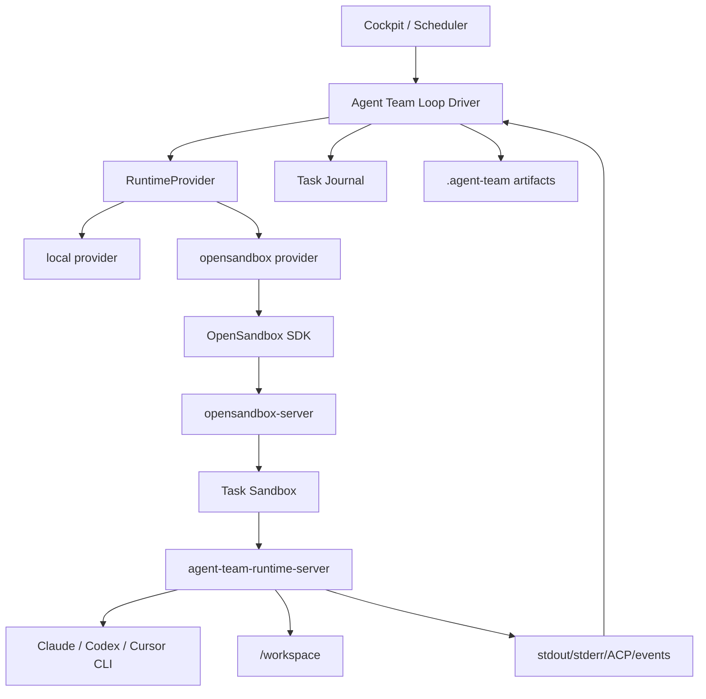

# OpenSandbox Isolated Runtime for agent_team

Status: Proposed design draft.
Audience: coding agents implementing fully isolated execution environments for
`community_plugins/agent_team`.

This document drafts a north-star design for using OpenSandbox as a fully
isolated runtime for coding agents in Agent Team. The goal is to move from
"agent runs on the host and occasionally calls sandbox file/shell tools" to
"planner/generator/evaluator run their coding work inside a task-scoped sandbox,
with no silent access to the host filesystem or host secrets".

This is a design/spec only. Do not change runtime code as part of this document
task.

## 0. Executive summary

Agent Team currently gives each task a host workspace and runs direct CLI agents
from the host process. The existing `sandbox_integration` plugin uses
OpenSandbox, but only as a LangChain-style tool surface: shell, read/write/edit,
search, git diff, and session lifecycle tools. That is useful, but it is not a
full execution sandbox for direct coding CLIs such as Claude Code, Codex CLI, or
Cursor CLI.

OpenSandbox is more capable than the current integration uses. The installed SDK
version in this project is `opensandbox==0.1.9`, and it already exposes:

- sandbox create/connect/kill/pause/resume/renew
- create from image or snapshot
- resource limits, env, metadata, entrypoint, platform
- network egress policy
- volumes: host path, PVC, OSSFS
- file APIs: read/write/search/info/move/delete/chmod/replace
- command APIs: SSE streaming, background commands, interrupt, command status,
  persistent shell sessions, run-in-session
- metrics and diagnostics
- endpoints and signed endpoints
- async/sync sandbox pools with warm idle sandboxes

The recommended direction is to add a first-class Agent Team runtime abstraction:

```text
Runtime provider
├── local             # current behavior
├── docker            # possible OpenHands-style local Docker runtime
└── opensandbox       # OpenSandbox-backed isolated runtime
```

For OpenSandbox, the cleanest long-term design is not to make every agent call
OpenSandbox file tools directly. Instead, Agent Team should create a sandbox per
task/run, mount or sync the task workspace into it, start a small
`agent-team-runtime-server` sidecar inside the sandbox, and run coding CLIs
inside that sandbox. The host should receive structured events, stdout/stderr,
artifacts, git diff, and evidence through the runtime server, not through direct
host process execution.

## 1. Current code facts

These facts were validated against the current repository.

- Direct CLI execution currently starts from
  `features/board/runtime/workers/acp_cli.py`. `AcpCliWorker` builds a
  `DirectCliRun` with `cwd=ctx.workspace_path`, so the CLI process runs against
  the host task workspace.
- Agent Team task workspaces are host folders created by
  `features/board/workspace.py`.
- Board repositories are copied into task workspaces by
  `features/repos/task_copy.py`, using local git copies and per-task branches.
- The existing OpenSandbox integration is under
  `src/plugins/sandbox_integration/`.
- `src/plugins/sandbox_integration/plugin.py` registers a `ToolFactory` named
  `enable_sandbox_tools`. It is disabled by default and returns LangChain tools.
- `src/plugins/sandbox_integration/sandbox.py` currently wraps only a small
  subset of the SDK: `Sandbox.create`, `commands.run`, `files.read_file`,
  `files.write_files`, and `kill`.
- `src/plugins/sandbox_integration/tools.py` defines tools such as
  `swe_sandbox_shell`, `swe_sandbox_read_file`, `swe_sandbox_write_file`,
  `swe_sandbox_search`, and `swe_sandbox_git_diff`.
- Current Agent Team loop/runtime code does not directly integrate
  `sandbox_integration` as a runtime provider.

Implication: enabling `sandbox_integration` today does not make Claude/Codex/
Cursor CLI run inside a sandbox. It only gives compatible graph/LLM agents a set
of sandbox tools.

## 2. Target outcome

The target is a strict, task-scoped execution runtime:

```text
Human task
  -> Agent Team creates or acquires OpenSandbox
  -> Task workspace is mounted/synced into sandbox
  -> Planner/generator/evaluator prompts reference sandbox paths
  -> Coding CLI runs inside sandbox
  -> Commands/files/git/tests execute inside sandbox
  -> Evidence and changed files are reported back
  -> Host persists journal, artifacts, diff, and final state
  -> Sandbox is paused/reused/terminated according to policy
```

Hard requirements:

- No direct host filesystem mutation when strict sandbox mode is enabled.
- No silent fallback from sandbox to host execution.
- No broad host home mount.
- No unmasked host secrets copied into the sandbox.
- Every run has a durable `sandbox_session_id` and lifecycle history.
- UI can show sandbox status, logs, current runtime profile, and failure reason.
- Generator and evaluator can run tests/builds inside the same isolated task
  environment.
- If the sandbox cannot start, the task should fail or wait for human, not run
  unsandboxed.

## 3. Naming

Recommended names:

- Feature: **OpenSandbox Runtime**
- Runtime provider key: `opensandbox`
- Strict mode label: **Isolated runtime**
- Runtime profile model: `AgentTeamRuntimeProfile`
- Per-task session model: `AgentTeamSandboxSession`
- Sidecar service: `agent-team-runtime-server`
- Workspace path inside sandbox: `/workspace`
- Agent runtime metadata folder: `/workspace/.agent-team/runtime/`

Avoid naming this only `Sandbox Tools`. That describes the current
`sandbox_integration` plugin but not the intended runtime.

## 4. OpenSandbox capability map

The following capabilities exist in the installed SDK or upstream design and are
relevant to Agent Team.

### 4.1 Lifecycle

OpenSandbox supports:

- create sandbox from image
- create sandbox from snapshot
- connect to existing sandbox id
- kill sandbox
- pause sandbox
- resume sandbox
- renew expiration
- list/filter sandboxes through `SandboxManager`
- patch metadata
- inspect status and timestamps

Agent Team use:

- Create one sandbox per task run or acquire from pool.
- Attach metadata:
  - `agent_team.task_id`
  - `agent_team.board_id`
  - `agent_team.run_id`
  - `agent_team.agent_alias`
  - `agent_team.runtime_profile`
- Renew sandbox expiration while long loops are active.
- Pause or terminate after terminal state.
- Kill on user cancel.

### 4.2 Images and snapshots

OpenSandbox can create from an image or snapshot.

Agent Team should use images for base runtime profiles and snapshots for faster
warm starts:

```text
base image
  -> installs Python/Node/git/build tools
  -> installs claude/codex/cursor CLIs
  -> installs agent-team-runtime-server
  -> optional warm package caches
  -> snapshot
  -> task sandboxes start from snapshot
```

Do not install heavy dependencies on every task start if they can be baked into
the image or snapshot.

### 4.3 Resource limits

SDK create supports a `resource` dictionary. Defaults in the SDK are roughly
`cpu=1`, `memory=2Gi` when not provided.

Agent Team should expose runtime profile fields:

```json
{
  "cpu": "2",
  "memory": "4Gi",
  "timeout_minutes": 180,
  "ready_timeout_seconds": 60
}
```

Resource choices should be visible in the UI because coding agents can easily
hit memory limits during dependency install, TypeScript builds, browser tests,
or language server startup.

### 4.4 Volumes

OpenSandbox SDK models include:

- host path volume
- PVC volume
- OSSFS volume
- mount path
- read-only flag
- sub-path

Agent Team should support two workspace strategies:

1. **Mount mode**: mount the host task workspace or a platform volume at
   `/workspace`.
2. **Sync mode**: upload workspace into sandbox at start and download diff or
   changed files at the end.

Mount mode is simpler and faster for local Docker-backed OpenSandbox. Sync mode
is safer for remote/Kubernetes deployments where host paths are not shared.

### 4.5 Command execution

OpenSandbox command API supports:

- foreground command execution
- SSE streaming handlers for stdout/stderr/result/init/complete/error
- background commands
- command status
- interrupt
- background logs with cursor
- persistent shell session
- run command inside an existing shell session
- working directory
- timeout
- env vars
- uid/gid

Agent Team should use streaming handlers to write Activity events in real time.
Do not wait until `commands.run()` returns and then dump the full output.

### 4.6 Filesystem

The SDK supports more than the current plugin exposes:

- read text
- read bytes
- read byte stream
- write file
- write multiple files
- search
- file info
- create directories
- delete files/directories
- move files
- chmod
- replace content

Agent Team can use these APIs for artifact reads/writes, but code-editing agents
should generally edit files inside the sandbox through their CLI/tooling. The
host should treat file API as a control/audit channel, not the primary coding
interface.

### 4.7 Network policy

OpenSandbox create accepts `network_policy`. Upstream docs also describe
credential and network controls.

Agent Team should use egress policy to make strict runtime meaningful:

```text
default: deny
allow:
  - LLM provider endpoints required by selected agent
  - git host endpoints for board repos
  - package registries allowed by board/runtime profile
  - browser/test endpoints explicitly configured for the project
```

For a first practical release, default can be `allow` with audit warnings. For
strict enterprise mode, default should become `deny` plus allowlist.

### 4.8 Metrics and diagnostics

OpenSandbox exposes metrics and diagnostic events/logs. Agent Team should store
a lightweight snapshot on failures:

- sandbox status
- last diagnostics summary
- resource usage if available
- command id/execution id
- tail of stderr/stdout

Do not dump long logs into Task Journal. Store references and short summaries.

### 4.9 Endpoints and signed endpoints

OpenSandbox supports getting endpoints and signed endpoints. Agent Team can use
this for:

- runtime sidecar HTTP/WebSocket endpoint
- preview server URLs
- VNC/browser preview in future
- authenticated human links for live artifacts

Use signed endpoints for anything exposed to a human browser.

### 4.10 Sandbox pools

The installed SDK includes `SandboxPoolAsync` and `SandboxPoolSync`.

Pool concepts:

- `pool_name`
- `max_idle`
- state store
- creation spec
- warmup concurrency
- acquire policy: `FAIL_FAST` or `DIRECT_CREATE`
- idle timeout
- warmup health check
- warmup sandbox preparer

Agent Team should use pools for frequent coding tasks:

```text
Pool key = owner_id + runtime_profile_id + image_or_snapshot + engine
```

Example:

```text
pool: owner-123/claude-code/python-node/default
max_idle: 2
warmup_concurrency: 1
idle_timeout: 2h
acquire policy: DIRECT_CREATE
```

Pooling is the main way OpenSandbox can beat simple per-task Docker startup
latency.

## 5. Architecture proposal

### 5.1 High-level runtime layers



### 5.2 Runtime provider interface

Add an internal Agent Team runtime interface. Names are illustrative.

```python
class RuntimeProvider(Protocol):
    provider_key: str

    async def prepare(self, ctx: RuntimePrepareContext) -> RuntimeSession:
        ...

    async def run_turn(
        self,
        session: RuntimeSession,
        request: RuntimeTurnRequest,
        emit: EmitFn,
        cancel: asyncio.Event,
    ) -> RuntimeTurnResult:
        ...

    async def read_file(self, session: RuntimeSession, path: str) -> str:
        ...

    async def write_file(self, session: RuntimeSession, path: str, content: str) -> None:
        ...

    async def git_diff(self, session: RuntimeSession, repo_path: str) -> GitDiffSummary:
        ...

    async def pause(self, session: RuntimeSession) -> None:
        ...

    async def terminate(self, session: RuntimeSession, reason: str) -> None:
        ...
```

Current local behavior becomes `LocalRuntimeProvider`. OpenSandbox becomes
`OpenSandboxRuntimeProvider`.

### 5.3 Do not wire OpenSandbox through LangChain tools for direct CLI

Direct CLI agents are not normal LangChain agents. They currently run as
subprocesses and speak ACP/stdio locally.

Therefore, do not try to make direct CLI agents "use" `swe_sandbox_shell` tools
as their main sandbox. That keeps the CLI on the host.

Instead, the provider must run the CLI inside the sandbox.

## 6. The hard part: running CLI agents inside OpenSandbox

### 6.1 Why direct subprocess ACP does not transfer automatically

The current `DirectCliRun` model starts a local process and talks to it over
stdio. If the process is inside OpenSandbox, the host cannot automatically reuse
that same stdio transport.

OpenSandbox command API is excellent for commands and streaming output, but an
ACP subprocess expects bidirectional JSON-RPC over stdin/stdout. A one-shot
`commands.run("codex ...")` is not the same as a long-lived local ACP subprocess.

### 6.2 Supported strategies

#### Strategy A: one-shot CLI command runner

Run CLI in non-interactive command mode inside sandbox.

Examples:

```text
codex exec "<prompt>"
claude -p "<prompt>"
cursor-agent "<prompt>"
```

Pros:

- Fastest to implement.
- Fully isolated if command runs inside sandbox.
- Uses OpenSandbox command streaming directly.

Cons:

- May lose rich ACP event model.
- Permission prompts may be harder.
- Session resume may be weaker.
- Tool call events may not be structured.

Use for early proof-of-concept only.

#### Strategy B: sandbox runtime sidecar (recommended)

Build an `agent-team-runtime-server` installed in the sandbox image. The sidecar
spawns and owns CLI processes inside the sandbox and exposes an HTTP/WebSocket
API to the host.

Sidecar responsibilities:

- start a CLI turn
- connect to CLI over local stdio/ACP inside sandbox
- translate ACP frames to Agent Team event frames
- stream events over WebSocket/SSE to host
- handle permission decisions from host
- support cancel/interrupt
- expose workspace file/git/evidence endpoints
- write local runtime logs
- mask secrets before streaming if possible

Recommended sidecar endpoints:

```text
GET  /health
POST /runs
GET  /runs/{run_id}/events
POST /runs/{run_id}/cancel
POST /runs/{run_id}/permission
GET  /files/read?path=...
POST /files/write
GET  /git/diff?repo=...
GET  /git/status?repo=...
GET  /runtime/info
```

Pros:

- Preserves direct CLI/ACP quality.
- Host no longer needs local process stdio.
- Similar spirit to OpenHands agent-server, but tailored to Agent Team.
- Works for Claude/Codex/Cursor if sidecar knows how to spawn each engine.

Cons:

- More code.
- Requires custom sandbox image.
- Needs protocol and compatibility tests.

#### Strategy C: OpenHands agent-server inside OpenSandbox

Run an OpenHands-like agent-server image inside OpenSandbox and adapt Agent Team
to that API.

Pros:

- Reuses a proven remote workspace pattern.
- Good bash/file/git event model.

Cons:

- Does not directly solve Claude/Codex/Cursor ACP unless extended.
- Adds dependency on OpenHands server API.
- More coupling to external project internals.

Use OpenHands as a pattern, not necessarily as a runtime dependency.

## 7. Workspace strategy

### 7.1 Mount mode

Mount the task workspace into the sandbox at `/workspace`.

OpenSandbox volume:

```python
Volume(
    name="task-workspace",
    host=Host(path=task_workspace_host_path),
    mount_path="/workspace",
    read_only=False,
)
```

Use when:

- OpenSandbox server runs on the same machine as Agent Team.
- Docker-backed local development.
- The server can see the host task workspace path.

Benefits:

- No copy-in/copy-out.
- Git diff on host sees changes immediately.
- Simple integration with current file browser and artifact panel.

Risks:

- The sandbox can mutate the mounted workspace.
- Need strict mount path: only task workspace, not repo root, not home.
- Host path must be valid from OpenSandbox server's point of view.

### 7.2 Sync mode

Copy task workspace into sandbox, run there, then copy changes back.

Use when:

- OpenSandbox is remote.
- Kubernetes workers cannot see host task paths.
- Stronger host isolation is required.

Algorithm:

```text
prepare:
  tar/zip selected workspace files
  upload to sandbox
  extract to /workspace
  record base git commit and file manifest

finish:
  collect git diff / changed file list
  download patch or changed files
  apply patch to host task copy
  record evidence
```

Risks:

- Conflict handling is harder.
- Large repos can be slow.
- Need ignore rules for `.git`, `node_modules`, caches, build outputs.

### 7.3 Recommended default

Start with mount mode for local Docker-backed OpenSandbox because it maps best
onto the current Agent Team workspace design.

Design the provider interface so sync mode can be added without changing loop
logic.

## 8. Runtime image design

Create a purpose-built image for Agent Team coding agents.

Base contents:

- Linux base image
- bash, git, curl, wget, jq, unzip, zip
- Python, uv
- Node.js, npm/pnpm/yarn/corepack
- common build tools
- Playwright dependencies if UI projects are common
- `agent-team-runtime-server`
- CLI agents:
  - Claude Code
  - Codex CLI
  - Cursor CLI, if installable in headless mode
- optional language toolchains:
  - Go
  - Rust
  - Java/Maven/Gradle

Do not hard-code every stack forever. Use runtime profiles:

```text
agent-team-runtime:base
agent-team-runtime:web
agent-team-runtime/python
agent-team-runtime/full
```

Image config example:

```json
{
  "provider": "opensandbox",
  "image": "agent-team/runtime-full:2026-07-01",
  "entrypoint": ["/usr/local/bin/agent-team-runtime-server", "--host", "0.0.0.0", "--port", "8765"],
  "workspace_mount_path": "/workspace",
  "default_shell": "/bin/bash"
}
```

## 9. Secrets model

Strict rule: never mount host home into the sandbox.

### 9.1 Secret injection

Inject only the minimum needed secrets per run:

- model provider API keys
- git token/SSH key for the task repos
- MCP secrets explicitly enabled for the agent
- package registry tokens if configured

Preferred delivery:

```text
/run/agent-team/secrets/
  env.json
  git-credentials
  ssh_key
  mcp.json
```

Permissions:

```text
owner: runtime user
mode: 0600 files, 0700 dir
```

Environment variables may be convenient but are easier to leak in process dumps,
logs, and child environments. Use env only for CLIs that require it.

### 9.2 Secret masking

Reuse existing secret masking discipline from Task Journal and ACP ingestion.

Mask:

- runtime profile API keys
- git tokens
- SSH private keys
- MCP secret values
- generated credentials written into sandbox

Mask at boundaries:

- sidecar event stream
- command stdout/stderr forwarding
- Task Journal entries
- Activity events
- diagnostics summaries

### 9.3 Git credentials

Current task copies configure git credentials on the host. In sandbox mode,
that may not be enough.

For mount mode, `.git/config` is visible inside sandbox, but helpers may point
to host Python paths or host-only files. Do not assume host git helper works
inside the sandbox.

Provide sandbox-native git credential setup:

- write a temporary credential helper script inside `/run/agent-team/git/`
- or write `.netrc`/credential store scoped to the sandbox
- for SSH, write key inside `/run/agent-team/git/id_ed25519`
- configure `GIT_SSH_COMMAND` for the run

Do not persist secrets into the worktree.

## 10. Network policy

OpenSandbox can enforce egress policy. Use this to make "isolated" mean more
than "containerized".

Recommended modes:

```text
permissive:
  default allow, log external domains

restricted:
  default deny, allow configured domains

offline:
  default deny, no external network except internal runtime endpoint
```

Board/runtime profile allowlist examples:

```json
{
  "llm": ["api.anthropic.com", "api.openai.com"],
  "git": ["github.com", "api.github.com"],
  "packages": ["registry.npmjs.org", "pypi.org", "files.pythonhosted.org"],
  "project": ["staging.example.com"]
}
```

For first implementation, record the policy in metadata even if enforcement is
not enabled yet. Do not silently claim network isolation until policy is
actually applied.

## 11. Data model proposal

### 11.1 Runtime profile

Add a runtime profile model or config table.

```text
AgentTeamRuntimeProfile
- id
- owner_id
- name
- provider              # local | opensandbox | docker
- image
- snapshot_id
- entrypoint_json
- resource_json
- network_policy_json
- volume_mode           # mount | sync
- pool_enabled
- pool_max_idle
- timeout_minutes
- ready_timeout_seconds
- strict_isolation
- created_at
- updated_at
```

If adding a DB table is too much for the first slice, start with environment
variables and board-level JSON config, but keep the DTO shape aligned with this
model.

### 11.2 Sandbox session

Track one row per task sandbox session.

```text
AgentTeamSandboxSession
- id
- task_id
- run_id nullable
- attempt_id nullable
- runtime_profile_id nullable
- provider              # opensandbox
- sandbox_id
- status                # creating | ready | running | paused | terminated | failed
- workspace_mode        # mount | sync
- workspace_host_path
- workspace_sandbox_path
- image
- snapshot_id
- metadata_json
- last_error
- created_at
- ready_at nullable
- last_used_at nullable
- terminated_at nullable
```

This should be distinct from `LoopState`. It is runtime metadata, not the public
task lifecycle.

### 11.3 Runtime events

Do not overload Task Journal with raw runtime events.

Use:

- run event store for raw frames
- Task Journal for semantic summaries
- sandbox session table for lifecycle
- evidence artifacts for verification

Journal examples:

```text
type=state_change, phase=execution, title="OpenSandbox runtime ready"
type=risk, phase=execution, title="Sandbox OOM during test run"
type=verdict, phase=verification, title="Evaluator passed in sandbox"
```

## 12. API proposal

Add API endpoints under the Agent Team plugin, not under generic
`sandbox_integration` UI routes.

```text
GET  /api/agent-team/tasks/{task_id}/runtime
POST /api/agent-team/tasks/{task_id}/runtime/prepare
POST /api/agent-team/tasks/{task_id}/runtime/terminate
POST /api/agent-team/tasks/{task_id}/runtime/restart
GET  /api/agent-team/tasks/{task_id}/runtime/logs
GET  /api/agent-team/runtime-profiles
POST /api/agent-team/runtime-profiles
PATCH /api/agent-team/runtime-profiles/{id}
```

Loop start API should accept:

```json
{
  "runtime_provider": "opensandbox",
  "runtime_profile_id": "...",
  "strict_isolation": true
}
```

When `strict_isolation=true`, failing to prepare the sandbox must stop the loop.
Do not fall back to local.

## 13. UI proposal

Add runtime controls in board settings and task cockpit.

### 13.1 Board settings

Runtime section:

- provider selector: Local / OpenSandbox
- runtime profile selector
- strict isolation toggle
- pool enabled indicator
- test runtime button
- estimated resources

### 13.2 Task cockpit

Runtime panel:

- provider
- sandbox id
- status
- image/snapshot
- workspace mode
- resource limits
- network mode
- created/ready/last used time
- buttons:
  - Open logs
  - Restart sandbox
  - Terminate
  - Copy sandbox id

Show warnings:

- "This task is running on host" when provider is local.
- "Strict isolation failed; execution stopped" when strict sandbox could not
  start.
- "Network policy is permissive" when egress is not restricted.

## 14. Prompt discipline

Runtime prompts should make the execution boundary explicit.

### 14.1 Generator prompt addition

```text
You are running inside an isolated OpenSandbox runtime.

Rules:
- Treat /workspace as the task workspace root.
- Do not refer to host paths outside /workspace.
- Do not assume host-global tools, credentials, or caches exist.
- Before editing, read the approved artifacts under /workspace/.agent-team/.
- Keep changes inside /workspace and the approved scope.
- Run validation commands inside the sandbox.
- If a required dependency, credential, network endpoint, or system package is missing,
  report the exact blocker instead of attempting host workarounds.
- If the approved plan is wrong or unsafe, write /workspace/.agent-team/PLAN_CHANGE_REQUEST.md
  and stop.
- Summarize changed files, commands run, exit codes, and remaining risks.
```

### 14.2 Evaluator prompt addition

```text
You are an independent verifier running inside the same isolated task runtime.

Verify against:
- /workspace/.agent-team/SPEC.md
- /workspace/.agent-team/PLAN.md
- /workspace/.agent-team/TASKS.json, if present
- actual git diff inside /workspace
- actual build/test/lint output inside the sandbox

Do not trust generator summaries without checking workspace state.
Record evidence with command, exit code, and short output summary.
If verification requires host-only state, return needs_human with the exact reason.
```

### 14.3 Planner prompt addition

```text
Plan for an isolated runtime.

Call out:
- dependencies that must be available in the runtime image
- network endpoints needed for tests/builds
- secrets needed for git/package registries/LLM tools
- commands likely to exceed default CPU/memory
- whether browser/GUI support is required
```

## 15. Execution flow

### 15.1 Prepare

```text
1. Resolve runtime profile from board/task/run request.
2. If provider=local, continue current path.
3. If provider=opensandbox:
   a. acquire from pool or create sandbox
   b. attach metadata
   c. mount or sync workspace
   d. wait for sidecar /health
   e. write runtime info to .agent-team/runtime/session.json
   f. append Task Journal entry: runtime ready
```

### 15.2 Run turn

```text
1. Build prompt exactly as today, plus runtime prompt discipline.
2. Send turn request to sidecar.
3. Sidecar starts selected CLI inside sandbox.
4. Sidecar streams ACP/progress/tool/usage events to host.
5. Host writes events to event store and UI.
6. On cancel, host calls sidecar cancel and/or OpenSandbox interrupt.
7. On completion, host records final text, usage, changed files, validation.
```

### 15.3 Verify

Evaluator should run in the same runtime provider.

Reason: if generator used sandbox dependencies and network policy, evaluator
must verify under the same constraints.

### 15.4 Finish

```text
if workspace mode = mount:
  host already sees changes
  record git diff and artifacts

if workspace mode = sync:
  download patch/changed files
  apply to task workspace
  record conflicts or failures

then:
  write evidence
  append journal summary
  pause/release/terminate sandbox based on policy
```

## 16. Pooling and performance plan

Do not rely on cold sandbox creation for every short task.

### 16.1 Metrics to capture

Record timing for:

- runtime profile resolution
- pool acquire time
- cold create time
- sandbox ready time
- sidecar health time
- workspace mount/sync time
- CLI first-token time
- command execution duration
- finish/sync-back time

Persist these in sandbox session metadata or a runtime metrics table.

### 16.2 Pool policy

Recommended first policy:

```text
pool enabled per runtime profile
max_idle = 1 or 2
warmup_concurrency = 1
idle_timeout = 2h
acquire policy = DIRECT_CREATE
```

For CI-like heavy usage, increase `max_idle`.

### 16.3 Warmup preparer

A warm sandbox should already have:

- `/workspace` directory
- sidecar running
- CLI binaries checked
- git configured
- language toolchain sanity checked

Do not clone task repos during pool warmup because repos are task-specific.

### 16.4 Dependency caches

For speed, optionally mount named cache volumes:

```text
/cache/pip
/cache/uv
/cache/npm
/cache/pnpm
/cache/go
/cache/cargo
```

Security caveat: shared caches can leak package names or poison builds. Make
them owner-scoped or board-scoped, not globally shared across tenants.

## 17. Failure handling

### 17.1 Sandbox creation failure

Strict mode:

- set loop state to `failed` or `waiting_for_human`
- append journal entry
- notify human if Communication Gateway is enabled
- do not run locally

Non-strict mode:

- allowed fallback only if user explicitly configured fallback
- UI must show "fell back to local runtime"
- journal must record the fallback

### 17.2 Sidecar not healthy

Actions:

- fetch diagnostics/logs
- terminate sandbox if unusable
- retry once if profile allows
- then fail/wait for human

### 17.3 CLI missing

If selected engine binary is missing inside sandbox:

- fail fast
- report runtime image/profile issue
- do not install arbitrary global CLIs unless profile allows bootstrap commands

### 17.4 OOM or timeout

If command exits due to OOM/timeout:

- evaluator should not mark task complete
- journal should record resource blocker
- UI should suggest larger runtime profile

### 17.5 Network denied

If network policy blocks a required endpoint:

- record endpoint if visible
- ask human/admin to approve runtime profile allowlist change
- do not silently switch network to open mode

### 17.6 Sync-back conflicts

For sync mode:

- never overwrite host changes blindly
- generate conflict report
- pause task in `waiting_for_human`

## 18. Security checklist

Implementation must satisfy:

- No host home mount.
- No root user unless unavoidable.
- Only task workspace mounted read-write.
- Runtime secrets are scoped per task/run.
- Secrets are masked in all event streams and journals.
- Network mode is visible.
- Resource limits are visible.
- Sandbox id and runtime profile are auditable.
- Strict mode never falls back to local silently.
- User cancel kills/interrupts the sandbox process.
- Terminal cleanup policy is deterministic.

## 19. Implementation roadmap

Build this in slices, but avoid throwaway architecture.

### Slice 1: runtime abstraction and local parity

- Add `RuntimeProvider` interface.
- Wrap existing local direct CLI behavior in `LocalRuntimeProvider`.
- No behavior change.
- Add tests proving local loop still works.

### Slice 2: OpenSandbox session lifecycle

- Add runtime profile config.
- Add sandbox session DB table or metadata store.
- Implement create/connect/kill/renew/pause/resume.
- Use OpenSandbox metadata.
- Add task cockpit runtime status.
- No CLI execution inside sandbox yet.

### Slice 3: mount-mode workspace

- Create sandbox with host volume mounted to `/workspace`.
- Write `.agent-team/runtime/session.json`.
- Verify host task workspace changes are visible inside sandbox and vice versa.
- Add strict-mode no-fallback behavior.

### Slice 4: command streaming proof

- Run simple shell commands inside sandbox using OpenSandbox `ExecutionHandlers`.
- Stream stdout/stderr into Activity events.
- Support cancel/interrupt.
- Run evaluator shell checks inside sandbox.

### Slice 5: one-shot CLI runner

- Support a limited one-shot mode for one CLI engine.
- Prompt goes to CLI command inside sandbox.
- Stream output.
- Record final text and evidence.
- Mark this as transitional if ACP richness is missing.

### Slice 6: runtime sidecar

- Build `agent-team-runtime-server`.
- Sidecar launches CLI locally inside sandbox.
- Sidecar translates ACP/events to Agent Team frames.
- Host runtime provider talks to sidecar endpoint.
- Support permission decisions, cancel, usage, plan events if available.

### Slice 7: evaluator and planner in sandbox

- Planner, generator, and evaluator all use runtime provider.
- Evaluator verifies inside same sandbox.
- Planning artifacts are read from `/workspace/.agent-team/`.

### Slice 8: pools and snapshots

- Add `SandboxPoolAsync`.
- Add runtime profile pool config.
- Add warmup health check.
- Add metrics for cold vs warm start.
- Optional snapshot-based profile startup.

### Slice 9: restricted network and secrets hardening

- Add egress policy configuration.
- Add sandbox-native git credential setup.
- Add secret file injection.
- Add masking tests.

## 20. Test plan

Required tests:

- Local provider preserves existing behavior.
- OpenSandbox profile creates sandbox with expected metadata.
- Strict mode does not fallback to local when sandbox creation fails.
- Mount mode exposes task workspace at `/workspace`.
- Sandbox command output streams incrementally.
- Cancel interrupts a long-running sandbox command.
- Sandbox session status updates on create/ready/running/terminated/failed.
- Runtime prompt includes isolated workspace instructions.
- Generator receives `/workspace` paths, not host paths.
- Evaluator runs validation command inside sandbox.
- Secrets are masked from streamed output and journal entries.
- Git credentials inside sandbox can fetch/push only the task branch.
- OOM/timeout/network-denied failures become human-visible task failures.
- Pool acquire from warm sandbox is recorded separately from cold create.
- Existing chat/mention flow remains unaffected.
- Existing loop with local provider still works.

Manual verification scenarios:

```text
1. Start a task with local provider and confirm no regression.
2. Start a task with OpenSandbox mount mode and run `pwd`, `ls`, `git status`.
3. Ask agent to edit a file; confirm change appears in host task workspace.
4. Run test command inside sandbox; confirm Activity streams output live.
5. Cancel a long command; confirm process stops.
6. Remove network access; confirm task pauses/fails visibly.
7. Enable strict isolation and break sandbox config; confirm no host fallback.
8. Acquire from pool twice; compare cold/warm timing.
```

## 21. Benchmark plan

Do not claim OpenSandbox is faster or slower until measuring in the target
deployment.

Benchmark these cases:

```text
OpenHands-style Docker cold:
  docker run agent-server image -> health ready

OpenSandbox Docker cold:
  Sandbox.create image -> check_ready -> sidecar health

OpenSandbox pool warm:
  pool.acquire -> sidecar health

OpenSandbox snapshot:
  Sandbox.create snapshot -> sidecar health
```

Measure:

- p50/p95 startup latency
- first command latency
- first CLI token/event latency
- memory overhead
- CPU overhead
- workspace sync/mount time
- cleanup time
- failure rate under concurrency

Suggested benchmark task:

```text
repo size: small, medium, large
command: git status
command: npm test or pytest
agent: one-shot prompt that edits a tiny file
concurrency: 1, 4, 8 tasks
```

Expected hypothesis:

- Local Docker with bind mount may be fastest for one cold local task.
- OpenSandbox cold Docker may be slightly slower because it adds control-plane
  and endpoint resolution.
- OpenSandbox warm pool should be faster for repeated tasks.
- OpenSandbox Kubernetes should scale better when many tasks run concurrently,
  but it needs cluster-level tuning.

## 22. Open questions

Questions for the implementer/product owner:

- Should OpenSandbox runtime live inside `agent_team`, or should
  `sandbox_integration` expose a shared service API that Agent Team imports?
- Is local Docker-backed OpenSandbox the first target, or remote/Kubernetes?
- Should v1 require mount mode, or must sync mode ship first?
- Which CLI engine should be the first fully sandboxed engine?
- Can we build and distribute a custom `agent-team-runtime` image?
- Which secrets must be available inside sandbox for the first board?
- Should strict network mode be default or opt-in?
- How long should completed task sandboxes remain paused for debugging?
- Should evaluator reuse the generator sandbox or use a fresh sandbox with the
  same workspace diff?

## 23. Recommended first implementation decision

Start with:

```text
provider: opensandbox
runtime target: local Docker-backed OpenSandbox
workspace mode: host volume mount
strict mode: opt-in per run/profile
CLI mode: command streaming proof first, then sidecar ACP bridge
pool: design now, implement after command streaming works
```

This gives the fastest path to real isolation while preserving a path to the
full architecture.

Do not make the first slice depend on Kubernetes. Keep Kubernetes and remote
sync mode in the design, but prove the runtime boundary locally first.

## 24. References

- OpenSandbox overview: https://open-sandbox.ai/overview/home
- OpenSandbox GitHub: https://github.com/opensandbox-group/OpenSandbox
- OpenSandbox Python SDK README: https://github.com/opensandbox-group/OpenSandbox/blob/main/sdks/sandbox/python/README.md
- OpenSandbox configuration guide: https://github.com/opensandbox-group/OpenSandbox/blob/main/server/configuration.md
- OpenSandbox Kubernetes controller README: https://github.com/opensandbox-group/OpenSandbox/blob/main/kubernetes/charts/opensandbox-controller/README.md
- OpenSandbox fast runtime proposal: https://github.com/opensandbox-group/OpenSandbox/blob/main/oseps/0007-fast-sandbox-runtime-support.md
- OpenHands Docker workspace reference:
  `/Users/truong/projects/singapore/coding/openhands/software-agent-sdk/openhands-workspace/openhands/workspace/docker/workspace.py`
- OpenHands remote workspace reference:
  `/Users/truong/projects/singapore/coding/openhands/software-agent-sdk/openhands-sdk/openhands/sdk/workspace/remote/remote_workspace_mixin.py`
- Current Agent Team ACP worker:
  `/Users/truong/projects/singapore/coding/agent-manager/community_plugins/agent_team/features/board/runtime/workers/acp_cli.py`
- Current Agent Manager OpenSandbox integration:
  `/Users/truong/projects/singapore/coding/agent-manager/src/plugins/sandbox_integration/`
