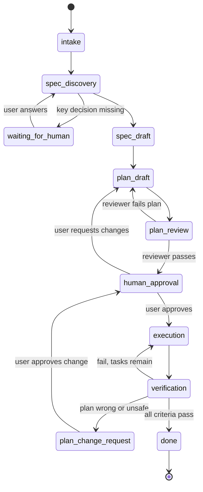

# Planning Workflow Upgrade for agent_team

Status: Proposed.
Audience: engineers and coding agents working on
`community_plugins/agent_team`, especially the board cockpit and autonomous loop
runtime.

This document is a detailed implementation brief for upgrading `agent_team`
from a lightweight "planner writes `.agent-team/PLAN.md`" phase into a
contract-driven planning workflow for autonomous coding agents.

The target product experience is:

1. A human can create a rough task.
2. Agents help turn it into a clear spec and plan.
3. The human approves or edits the plan.
4. The generator executes small tasks autonomously.
5. An independent evaluator verifies the work with evidence.
6. The loop continues, pauses for a plan change, or finishes only when the
   approved spec is genuinely satisfied.

This is a documentation-only design. It does not change runtime code by itself.

## 0. Design principles

The planning workflow should follow these principles:

- Planning is a contract, not a transcript. The system should persist explicit
  artifacts that the generator and evaluator can both read.
- The human owns intent. Agents can draft, critique, and refine the spec, but a
  strict autonomous run should start only from an approved contract.
- Agents should inspect the real workspace before planning. Plans based on
  guesses waste loops.
- Every planned task should be independently verifiable. A task without a
  validation path is usually too vague.
- The evaluator should verify evidence, not trust the generator summary.
- Plan changes are first-class. If the implementation discovers that the plan is
  wrong, unsafe, or incomplete, the loop should pause and request a plan change
  instead of silently expanding scope.
- The existing chat path must remain unaffected. This planning workflow is an
  additive mode for autonomous goals.

## 1. Current state

The current `agent_team` planning phase is intentionally simple:

- The cockpit UI exposes a `Plan first` checkbox in
  `web-ui/src/features/board/cockpit/LoopPanel.tsx`.
- When `Plan first` is enabled, the loop start payload includes `planner_id`.
- `POST /tasks/{task_id}/loop` passes that alias to
  `runtime/loop/service.start_autonomous_loop`.
- `WorkerPlanner` in `runtime/loop/service.py` creates a planner run with role
  `RUN_ROLE_PLANNER`.
- The planner prompt is built by `runtime/loop/planner.py`.
- The planner is instructed to inspect the workspace and write one file:
  `.agent-team/PLAN.md`.
- `run_loop` in `runtime/loop/driver.py` treats planning as best-effort. If the
  planner fails or the plan file is missing, the loop falls back to the raw
  objective.
- The generator receives a prompt that points to the plan file by reference:
  "A detailed implementation plan has been written to `.agent-team/PLAN.md`.
  Read it first and implement every step in it."

This is a good foundation because it is simple, worker-agnostic, and cheap to
run. It is not yet enough for a Devin-like workspace because the plan is not a
durable contract.

### 1.1 Current risks

- A wrong plan can be implemented without review.
- The human does not get a required step to approve scope, non-goals, or
  acceptance criteria.
- The evaluator grades the broad objective, not a precise task graph.
- There is no machine-readable task list for progress, dependency tracking, or
  per-task verification.
- There is no structured evidence schema that records commands, exit codes,
  changed files, screenshots, or residual risks.
- There is no versioning or approval status for the plan.
- There is no plan critique step before implementation starts.
- There is no plan-change protocol when implementation discovers a bad
  assumption.
- The UI does not provide a plan review/edit/approve surface.
- The current fail-open behavior is useful for legacy mode, but strict planning
  should not silently fall through to raw-objective execution.

## 2. Target workflow

The upgraded workflow has ten stages. These stages can later become persisted
states on the task or on a dedicated planning table.



### 2.1 `intake`

The user creates a task, imports an issue, or chats with an agent. The initial
task can be rough. Examples:

- "Add GitHub PR creation after agent finishes."
- "Make autopilot use the autonomous loop."
- "Fix the ACP session resume bug."

The system should preserve the original user request. Do not overwrite it with
the agent-drafted spec; store the spec separately.

### 2.2 `spec_discovery`

The planner gathers facts before writing the spec:

- Read the task title, description, comments, run history, and linked repo.
- Inspect relevant files, tests, docs, routes, schemas, models, and frontend
  components.
- Identify existing patterns and constraints.
- Ask the user at most three concise questions only when the answer would
  materially change implementation.
- Prefer a safe explicit assumption when a question is low-impact.

The planner must not edit source files during this stage.

### 2.3 `spec_draft`

The planner writes `.agent-team/SPEC.md`. This is the source of truth for:

- goal
- context
- non-goals
- constraints
- acceptance criteria
- user-visible behavior
- API or data contract expectations
- verification expectations

The spec should be concise but testable. Avoid vague criteria like "works well".
Use concrete criteria like "GET `/tasks/{id}/planning` returns the latest
approved plan version and artifact paths".

### 2.4 `plan_draft`

The planner writes:

- `.agent-team/PLAN.md`
- `.agent-team/TASKS.json`

`PLAN.md` explains the technical approach. `TASKS.json` is machine-readable and
drives execution.

Planning must include:

- files and modules likely to change
- data model or migration implications
- API changes
- UI changes
- validation commands
- risks and rollback notes
- task dependencies

### 2.5 `plan_review`

A critic agent reviews the drafted `SPEC.md`, `PLAN.md`, and `TASKS.json`.

The reviewer is adversarial. It should try to prevent wasted autonomous work by
blocking:

- ambiguous acceptance criteria
- missing validation
- tasks that are too broad
- incorrect file assumptions
- risky migrations without rollback
- hidden human decisions
- plans the evaluator cannot verify

The reviewer writes a JSON verdict. A failed plan goes back to `plan_draft`.
A `needs_human` verdict pauses for the user.

### 2.6 `human_approval`

The human reviews the artifacts in the cockpit:

- spec
- plan
- task graph
- reviewer verdict
- risks

The human can:

- approve
- edit artifacts
- request changes
- cancel planning
- start legacy execution without strict planning if they intentionally choose
  that path

Strict planning mode must require approval before execution.

### 2.7 `execution`

The generator reads the approved artifacts and executes one small task at a
time. It should pick the first pending task whose dependencies are complete.

During execution, the generator:

- keeps changes scoped to the active task
- records changed files
- runs validation commands when possible
- updates task status only after validation
- stops if the plan is wrong or unsafe

The generator should not silently add new product scope. If new scope is
necessary, it should create a plan change request.

### 2.8 `verification`

The evaluator verifies against:

- `.agent-team/SPEC.md`
- `.agent-team/PLAN.md`
- `.agent-team/TASKS.json`
- actual git diff
- actual command output
- acceptance criteria

It writes `.agent-team/EVIDENCE.json`.

The evaluator should be skeptical. A pass requires concrete evidence. If tests
cannot be run, the evaluator should record why and lower confidence.

### 2.9 `plan_change_request`

If the implementation discovers that the approved plan is wrong, unsafe, or
insufficient, the loop pauses and writes:

- `.agent-team/PLAN_CHANGE_REQUEST.md`

Examples:

- The planned file does not exist and the real architecture differs.
- A required API behavior conflicts with existing migrations.
- A validation command reveals that the planned approach breaks a public
  contract.
- The user request is ambiguous in a way that cannot be safely assumed.

The human must approve the changed plan before strict autonomous execution
continues.

### 2.10 `done`

The task is complete only when:

- all approved acceptance criteria pass
- all required tasks are complete or explicitly waived
- evidence is present
- evaluator verdict is `pass`
- no blocking plan change request is open

## 3. Proposed planning artifacts

All planning artifacts live inside the task workspace under `.agent-team/`.

For strict planning, the source-of-truth artifact set is:

- `.agent-team/SPEC.md`
- `.agent-team/PLAN.md`
- `.agent-team/TASKS.json`
- `.agent-team/EVIDENCE.json`

Optional supporting artifacts:

- `.agent-team/PLAN_REVIEW.json`
- `.agent-team/PLAN_CHANGE_REQUEST.md`
- `.agent-team/RETROSPECTIVE.md`
- `.agent-team/artifacts/` for screenshots, logs, or generated reports

### 3.1 `.agent-team/SPEC.md`

Purpose: human-readable product and engineering contract.

Required structure:

```md
# SPEC

## Goal

One or two paragraphs describing the desired outcome in operational terms.

## Original Request

The user's original wording, preserved without cleanup.

## Current Context

- Relevant repo, workspace, task, issue, or run context.
- Important files and components discovered by inspection.
- Existing behavior that must remain true.

## In Scope

- Concrete behaviors or changes included in this task.

## Non Goals

- Things that are intentionally not part of this task.

## Constraints

- Architecture, compatibility, security, UX, data, or rollout constraints.

## Acceptance Criteria

- [ ] Concrete criterion 1.
- [ ] Concrete criterion 2.
- [ ] Concrete criterion 3.

## Verification Expectations

- Tests, builds, lint, manual checks, screenshots, or other evidence expected.

## Open Questions

- Questions requiring human input, or `None`.

## Assumptions

- Safe assumptions the planner made instead of blocking for input.

## Risks

- Known risks and how they should be mitigated.
```

Rules:

- Acceptance criteria must be checkable.
- The spec should mention user-visible behavior if any UI/API behavior changes.
- If the task is purely internal, say so explicitly.
- Open questions should be empty before human approval, unless the human
  intentionally approves a plan with known open questions.

### 3.2 `.agent-team/PLAN.md`

Purpose: human-readable engineering plan.

Required structure:

```md
# PLAN

## Summary

Short implementation summary.

## Files And Components

| Area | Expected files | Reason |
|---|---|---|
| Backend | `path/to/file.py` | Why this file is involved |

## Approach

The selected approach and why it fits the existing codebase.

## Alternatives Considered

- Alternative A: rejected because ...
- Alternative B: rejected because ...

## Implementation Steps

1. Step title.
   Goal: ...
   Method: ...
   Files: ...
   Validation: ...

## Data And API Changes

- New fields, schemas, endpoints, events, or migrations.
- Backward compatibility notes.

## UI Changes

- Cockpit screens, controls, states, empty states, and error states.

## Verification Plan

- Commands to run.
- Manual checks to perform.
- Expected success signals.

## Rollback Or Recovery

- How to recover if the change is wrong or partially applied.

## Risks

- Risk and mitigation.
```

Rules:

- Keep the plan scoped to `SPEC.md`.
- Avoid implementation details that the repo will decide better during coding,
  but include enough detail that the generator does not need to choose the
  product behavior.
- Use repo-relative paths.
- Do not invent APIs without listing their expected consumers.

### 3.3 `.agent-team/TASKS.json`

Purpose: machine-readable task graph for generator and evaluator.

Schema version 1:

```json
{
  "version": 1,
  "status": "draft",
  "approved_at": null,
  "approved_by": null,
  "tasks": [
    {
      "id": "T1",
      "title": "Short imperative task",
      "status": "pending",
      "depends_on": [],
      "objective": "What this task accomplishes",
      "files": ["relative/path.py"],
      "acceptance": ["Concrete condition"],
      "validation": ["pytest path/to/test.py -q"],
      "risk": "low"
    }
  ]
}
```

Recommended status values:

- `draft`
- `approved`
- `in_progress`
- `blocked`
- `complete`
- `cancelled`

Recommended per-task status values:

- `pending`
- `in_progress`
- `complete`
- `blocked`
- `skipped`

Field rules:

- `id` must be stable across plan revisions when the task meaning is unchanged.
- `depends_on` references task ids.
- `files` uses repo-relative or workspace-relative paths.
- `acceptance` must be observable.
- `validation` should include exact commands where possible.
- `risk` is one of `low`, `medium`, or `high`.

Future backend code should validate at least:

- JSON parses.
- `version` is supported.
- task ids are unique.
- dependencies reference existing tasks.
- dependency graph is acyclic.
- statuses are known.
- strict mode cannot approve with zero tasks.
- strict mode cannot approve with empty acceptance criteria.

### 3.4 `.agent-team/PLAN_REVIEW.json`

Purpose: machine-readable critic output.

Schema version 1:

```json
{
  "version": 1,
  "verdict": "pass",
  "blocking_issues": [],
  "suggested_fixes": [],
  "risk_level": "low",
  "reviewed_artifacts": [
    ".agent-team/SPEC.md",
    ".agent-team/PLAN.md",
    ".agent-team/TASKS.json"
  ]
}
```

Rules:

- `verdict` is `pass`, `fail`, or `needs_human`.
- `fail` means the planner can revise without human input.
- `needs_human` means a product or safety decision is required.
- `risk_level` is the reviewer's final residual risk estimate.

### 3.5 `.agent-team/EVIDENCE.json`

Purpose: durable verification record.

Schema version 1:

```json
{
  "version": 1,
  "verdict": "pass",
  "score": 1.0,
  "checked_tasks": ["T1"],
  "commands": [
    {
      "cmd": "pytest community_plugins/agent_team/tests -q",
      "exit_code": 0,
      "summary": "156 passed"
    }
  ],
  "changed_files": [
    "community_plugins/agent_team/features/board/runtime/loop/planner.py"
  ],
  "artifacts": [
    {
      "type": "screenshot",
      "path": ".agent-team/artifacts/loop-panel.png",
      "summary": "Plan review panel renders approved state"
    }
  ],
  "missing": [],
  "risks": []
}
```

Rules:

- `verdict` is `pass`, `fail`, or `needs_human`.
- `score` is from `0.0` to `1.0`.
- A `pass` with failed commands is invalid unless the failed commands are
  explicitly non-blocking and explained in `risks`.
- `changed_files` should come from git diff where possible, not from memory.
- `missing` should be actionable because it feeds the next generator turn.

### 3.6 `.agent-team/PLAN_CHANGE_REQUEST.md`

Purpose: pause strict execution when the approved plan is no longer safe.

Required structure:

```md
# PLAN CHANGE REQUEST

## Summary

Short explanation of why the approved plan cannot continue as-is.

## Failed Assumption

The exact assumption that failed.

## Evidence

Workspace facts, command output, test failures, or code references.

## Risk Of Continuing

What could go wrong if the agent continues without changing the plan.

## Proposed Change

The new plan or decision requested.

## Human Approval Required

Yes or no, with rationale.
```

Strict mode behavior:

- If this file exists and is unresolved, the loop should enter human review.
- The generator should stop after creating it.
- The UI should surface it prominently.

### 3.7 `.agent-team/RETROSPECTIVE.md`

Purpose: improve future planning prompts and repo guidance after the loop ends.

Suggested structure:

```md
# RETROSPECTIVE

## Outcome

complete | failed | cancelled | needs_human

## What Worked

- ...

## What Failed Or Was Slow

- ...

## Prompt Or Guidance Updates Suggested

- ...

## Tests Or Tooling To Add

- ...
```

This artifact is optional for v1 but valuable for loop engineering. It helps
convert repeated mistakes into durable guidance.

## 4. Prompt templates

Prompt templates should live in a dedicated module when implemented, for
example `runtime/loop/planning_prompts.py`, rather than being scattered across
service code.

The templates below are intentionally strict. They are designed for CLI coding
agents such as Claude Code, Cursor CLI, and Codex CLI, where the agent can read
files and run commands.

### 4.1 `SPEC_DISCOVERY_SYSTEM`

```text
You are a senior product-engineering planning agent. Your job is to turn a rough task into a precise implementation spec before any code is changed.

Rules:
- Do not edit source files.
- Read the real workspace before making claims.
- Prefer concrete facts from files, tests, docs, errors, and existing conventions.
- If a missing decision would materially change implementation, ask the human at most 3 concise questions.
- If you can proceed with a safe default, state the assumption instead of asking.
- Produce a SPEC.md that becomes the contract for implementation and verification.
```

Recommended user prompt:

```text
## Task
{objective}

## Available context
- Task id: {task_id}
- Workspace path: {workspace_path}
- Repository: {repo_name_or_unknown}
- Existing task description/comments may contain additional context.

## Required output
Write a Markdown spec to `.agent-team/SPEC.md`.

Use exactly this structure:

# SPEC

## Goal
## Original Request
## Current Context
## In Scope
## Non Goals
## Constraints
## Acceptance Criteria
## Verification Expectations
## Open Questions
## Assumptions
## Risks

If important information is missing, ask at most 3 concise questions instead of
writing the final spec. Ask only questions whose answers materially change the
implementation plan.

Do not implement. Do not edit source files.
```

### 4.2 `PLAN_DRAFT_SYSTEM`

```text
You are a senior software architect preparing an implementation plan for an autonomous coding agent.

Rules:
- Do not implement.
- Inspect relevant files and existing patterns.
- Keep the plan scoped to the approved spec.
- Break the work into small independently verifiable tasks.
- Every task must include acceptance criteria and validation commands.
- Prefer existing project patterns over new abstractions.
- Call out risky assumptions and human decisions explicitly.
```

Recommended user prompt:

```text
## Inputs
- Approved or draft spec: `.agent-team/SPEC.md`
- Workspace path: {workspace_path}
- Task id: {task_id}

## Required outputs
Write:
- `.agent-team/PLAN.md`
- `.agent-team/TASKS.json`

`PLAN.md` must use this structure:

# PLAN

## Summary
## Files And Components
## Approach
## Alternatives Considered
## Implementation Steps
## Data And API Changes
## UI Changes
## Verification Plan
## Rollback Or Recovery
## Risks

`TASKS.json` must use schema version 1:

{
  "version": 1,
  "status": "draft",
  "approved_at": null,
  "approved_by": null,
  "tasks": [
    {
      "id": "T1",
      "title": "Short imperative task",
      "status": "pending",
      "depends_on": [],
      "objective": "What this task accomplishes",
      "files": ["relative/path.py"],
      "acceptance": ["Concrete condition"],
      "validation": ["pytest path/to/test.py -q"],
      "risk": "low|medium|high"
    }
  ]
}

Create small tasks. Each task should be implementable and verifiable in one
agent turn when possible.

Do not implement. Do not edit source files outside `.agent-team/`.
```

### 4.3 `PLAN_REVIEW_SYSTEM`

```text
You are an adversarial plan reviewer. Your job is to prevent wasted autonomous work.

Review the SPEC.md, PLAN.md, and TASKS.json.

Look for:
- Ambiguous acceptance criteria.
- Missing tests or weak validation.
- Tasks that are too large.
- Incorrect file assumptions.
- Risky migrations or compatibility breaks.
- Hidden human decisions.
- Places where the evaluator would be unable to verify completion.

Return JSON:
{
  "verdict": "pass|fail|needs_human",
  "blocking_issues": ["..."],
  "suggested_fixes": ["..."],
  "risk_level": "low|medium|high"
}
```

Recommended user prompt:

```text
## Inputs
- `.agent-team/SPEC.md`
- `.agent-team/PLAN.md`
- `.agent-team/TASKS.json`

## Required output
Write a single JSON object to `.agent-team/PLAN_REVIEW.json`.

Use this shape:

{
  "version": 1,
  "verdict": "pass|fail|needs_human",
  "blocking_issues": ["..."],
  "suggested_fixes": ["..."],
  "risk_level": "low|medium|high",
  "reviewed_artifacts": [
    ".agent-team/SPEC.md",
    ".agent-team/PLAN.md",
    ".agent-team/TASKS.json"
  ]
}

Be skeptical. A plan should pass only if an autonomous generator can execute it
and an independent evaluator can verify it.

Do not implement.
```

### 4.4 `GENERATOR_START_SYSTEM`

```text
You are the implementation agent. Work only from the approved planning artifacts.

Before editing:
- Read .agent-team/SPEC.md.
- Read .agent-team/PLAN.md.
- Read .agent-team/TASKS.json.
- Pick the first pending task whose dependencies are complete.

During work:
- Keep changes scoped to the current task.
- Update task status only after validation.
- If the plan is wrong or unsafe, stop and write .agent-team/PLAN_CHANGE_REQUEST.md.
- Do not silently expand scope.

When done:
- Summarize changed files.
- Record validation commands and results.
- State which task ids are complete.
```

Recommended user prompt:

```text
## Goal
Implement the next pending approved task from `.agent-team/TASKS.json`.

## Required reading
- `.agent-team/SPEC.md`
- `.agent-team/PLAN.md`
- `.agent-team/TASKS.json`

## Execution rules
- Work on only one ready task unless the tasks are inseparable and you explain why.
- Use existing project patterns.
- Keep changes scoped.
- Run the task's validation commands where possible.
- If validation commands are missing or impossible, record why.
- If the approved plan is wrong, unsafe, or incomplete, stop and write
  `.agent-team/PLAN_CHANGE_REQUEST.md`.

## Completion response
End with:
- active task id
- changed files
- validation commands and outcomes
- remaining tasks
```

### 4.5 `EVALUATOR_SYSTEM`

```text
You are an independent verifier. Assume the implementation is incomplete until proven otherwise.

Verify against:
- .agent-team/SPEC.md
- .agent-team/PLAN.md
- .agent-team/TASKS.json
- actual git diff
- actual test/build/lint output

Do not trust the generator summary without checking evidence.

Write .agent-team/EVIDENCE.json with:
{
  "verdict": "pass|fail|needs_human",
  "score": 0.0,
  "checked_tasks": ["T1"],
  "commands": [
    {"cmd": "...", "exit_code": 0, "summary": "..."}
  ],
  "changed_files": ["..."],
  "missing": ["..."],
  "risks": ["..."]
}
```

Recommended user prompt:

```text
## Inputs
- Objective: {objective}
- Generator summary: {generator_summary}
- Planning artifacts:
  - `.agent-team/SPEC.md`
  - `.agent-team/PLAN.md`
  - `.agent-team/TASKS.json`
- Workspace path: {workspace_path}

## Required verification
Inspect the actual workspace. Use git diff or equivalent to identify changed
files. Run relevant tests, lint, type checks, build commands, or targeted
manual checks where possible.

## Required output
Write `.agent-team/EVIDENCE.json` using schema version 1:

{
  "version": 1,
  "verdict": "pass|fail|needs_human",
  "score": 0.0,
  "checked_tasks": ["T1"],
  "commands": [
    {"cmd": "...", "exit_code": 0, "summary": "..."}
  ],
  "changed_files": ["..."],
  "artifacts": [],
  "missing": ["..."],
  "risks": ["..."]
}

Then end your reply with the same verdict JSON on its own line as a fallback.

Use `needs_human` only when a person must decide or when safe verification is
impossible in this environment.
```

### 4.6 `PLAN_CHANGE_REQUEST_SYSTEM`

```text
The approved plan may be wrong or insufficient. Do not continue implementation blindly.

Create .agent-team/PLAN_CHANGE_REQUEST.md with:
- What assumption failed.
- Evidence from workspace/tests.
- Why continuing would be risky.
- Proposed plan change.
- Whether human approval is required.

Stop after writing the request.
```

Recommended user prompt:

```text
## Situation
During implementation, the approved plan appears wrong, unsafe, or insufficient.

## Required output
Write `.agent-team/PLAN_CHANGE_REQUEST.md` with:

# PLAN CHANGE REQUEST

## Summary
## Failed Assumption
## Evidence
## Risk Of Continuing
## Proposed Change
## Human Approval Required

After writing the request, stop. Do not continue implementation.
```

### 4.7 `RETROSPECTIVE_SYSTEM`

Recommended for later phases:

```text
You are a loop improvement reviewer. Summarize what happened in this autonomous run and identify durable improvements to prompts, tests, repo instructions, or tooling.

Rules:
- Use evidence from the run history, plan artifacts, and evaluations.
- Do not blame the user.
- Prefer concrete improvements.
- Suggest updates only when they would prevent repeated failures.
```

Recommended user prompt:

```text
Write `.agent-team/RETROSPECTIVE.md` with:

# RETROSPECTIVE

## Outcome
## What Worked
## What Failed Or Was Slow
## Prompt Or Guidance Updates Suggested
## Tests Or Tooling To Add

Keep it concise and actionable.
```

## 5. Backend implementation roadmap

Implement this in phases. Do not attempt all phases in one change unless the
task explicitly asks for it.

### Phase 1: documentation and prompt module

- Add this design doc.
- Add a prompt module such as `runtime/loop/planning_prompts.py`.
- Move the existing planner prompt into that module or wrap it as legacy
  `simple_plan`.
- Add unit tests for prompt generation.
- Keep existing runtime behavior unchanged.

### Phase 2: artifact helpers and schemas

- Add artifact path constants:
  - `.agent-team/SPEC.md`
  - `.agent-team/PLAN.md`
  - `.agent-team/TASKS.json`
  - `.agent-team/PLAN_REVIEW.json`
  - `.agent-team/EVIDENCE.json`
  - `.agent-team/PLAN_CHANGE_REQUEST.md`
- Add read/write helpers that always resolve paths inside the task workspace.
- Add JSON parsing and validation helpers for `TASKS.json`,
  `PLAN_REVIEW.json`, and `EVIDENCE.json`.
- Never trust paths from JSON that point outside the workspace.

### Phase 3: persisted planning state

Add persistence using either task fields or a dedicated table.

Recommended dedicated model:

```text
AgentTeamPlanningSession
- id
- task_id
- status
- mode
- current_version
- approved_version
- created_by
- approved_by
- created_at
- updated_at
- approved_at
- last_error
```

Recommended statuses:

- `idle`
- `discovering`
- `drafting_spec`
- `drafting_plan`
- `reviewing_plan`
- `waiting_for_human`
- `approved`
- `executing`
- `change_requested`
- `complete`
- `failed`
- `cancelled`

Recommended modes:

- `legacy_plan`
- `strict_plan`

Rules:

- `legacy_plan` preserves current behavior.
- `strict_plan` requires complete artifacts and human approval before
  generator execution.
- Existing tasks without planning sessions should behave as they do today.

### Phase 4: planning endpoints

Add endpoints under the existing board/task router. Exact names can change to
match local conventions, but the behavior should be stable.

Recommended API:

```text
POST /tasks/{task_id}/planning/start
GET  /tasks/{task_id}/planning
POST /tasks/{task_id}/planning/review
POST /tasks/{task_id}/planning/approve
POST /tasks/{task_id}/planning/request-changes
POST /tasks/{task_id}/planning/cancel
```

`POST /tasks/{task_id}/planning/start`:

- Creates or reuses a planning session.
- Starts spec discovery and plan draft.
- Accepts planner and reviewer aliases.
- Accepts mode, default `strict_plan`.
- Does not start implementation.

`GET /tasks/{task_id}/planning`:

- Returns planning status.
- Returns artifact metadata.
- Returns artifact text for Markdown files where safe.
- Returns parsed JSON for task graph, review, and evidence.
- Returns approval metadata.

`POST /tasks/{task_id}/planning/review`:

- Runs or reruns critic review.
- Updates `PLAN_REVIEW.json`.
- Moves state to `waiting_for_human` or `approved_candidate`.

`POST /tasks/{task_id}/planning/approve`:

- Requires editor role.
- Requires valid `SPEC.md`, `PLAN.md`, `TASKS.json`.
- Requires reviewer pass unless the request explicitly sets an override flag.
- Stamps approval metadata.
- Updates `TASKS.json.status` to `approved`.
- Moves planning session to `approved`.

`POST /tasks/{task_id}/planning/request-changes`:

- Stores human feedback.
- Moves planning session back to draft.
- Starts a new planner turn or waits for manual edit.

`POST /tasks/{task_id}/planning/cancel`:

- Cancels active planning runs.
- Leaves artifacts on disk for inspection.

### Phase 5: loop integration

Update `POST /tasks/{task_id}/loop` and `run_loop` behavior:

- If no planner is selected, keep existing loop behavior.
- If planner is selected with legacy mode, keep current best-effort behavior.
- If strict planning is selected:
  - require approved planning session
  - require valid artifacts
  - pass artifact references to generator and evaluator
  - do not fail open to raw objective when plan artifacts are missing
  - route missing/invalid plan to human review

Generator prompt in strict mode should reference:

- `.agent-team/SPEC.md`
- `.agent-team/PLAN.md`
- `.agent-team/TASKS.json`

Evaluator prompt in strict mode should reference:

- `.agent-team/SPEC.md`
- `.agent-team/PLAN.md`
- `.agent-team/TASKS.json`
- `.agent-team/EVIDENCE.json`

If `.agent-team/PLAN_CHANGE_REQUEST.md` is created, the loop should:

- stop the current attempt
- mark outcome as `needs_human`
- publish loop status
- show the plan change request in the cockpit

### Phase 6: UI cockpit

Add a plan review panel to the task cockpit.

Required states:

- no plan
- planning running
- spec drafted
- plan drafted
- review failed
- waiting for human approval
- approved
- executing approved plan
- plan change requested
- complete

Required UI capabilities:

- Start planning.
- Select planner and reviewer agents.
- View `SPEC.md`, `PLAN.md`, `TASKS.json`, and review verdict.
- Edit Markdown artifacts before approval.
- Request changes with feedback.
- Approve plan.
- Start execution from approved plan.
- See task graph progress.
- See evidence and changed files.
- See plan change request and approve/reject it.

Design notes:

- Keep this inside the existing cockpit, not a separate product surface.
- Use tabs for Spec, Plan, Tasks, Review, Evidence.
- Use badges for planning state.
- Use a checklist/table for tasks.
- Keep risky actions explicit.
- Do not overload the existing `Start a goal` form with too many fields.

### Phase 7: retrospective and reusable guidance

After loop completion, optionally generate `.agent-team/RETROSPECTIVE.md`.

Use retrospectives to suggest:

- better task templates
- better evaluator prompts
- missing project tests
- updates to repo instructions such as `AGENTS.md` or equivalent
- new skills or reusable workflows

Do not auto-edit durable repo instructions without a separate human-approved
task.

## 6. Execution behavior details

### 6.1 Legacy mode vs strict mode

Keep both modes.

`legacy_plan`:

- Current behavior.
- Planner writes `.agent-team/PLAN.md`.
- Missing plan fails open to raw objective.
- Useful for quick tasks.

`strict_plan`:

- New behavior.
- Requires `SPEC.md`, `PLAN.md`, `TASKS.json`.
- Requires approval.
- Missing or invalid artifacts route to human review.
- Useful for longer-running autonomous work.

Default recommendation:

- UI should eventually default to `strict_plan` for `Plan first`.
- API should preserve backward compatibility by treating existing
  `planner_id` without a mode as legacy until the frontend is migrated.

### 6.2 Task selection

Generator task selection should be deterministic:

1. Parse `TASKS.json`.
2. Find tasks with status `pending`.
3. Filter to tasks whose `depends_on` tasks are `complete` or `skipped`.
4. Pick the first task in file order.
5. Mark it `in_progress`.
6. Implement and validate.
7. Mark it `complete` only after validation or evaluator confirmation.

If no task is ready and some are pending, the task graph is blocked. Route to
human review with a clear missing dependency explanation.

### 6.3 Evaluation and continuation

Evaluation should decide:

- `pass`: all checked tasks and relevant acceptance criteria pass.
- `fail`: concrete missing work can be fed into the next generator turn.
- `needs_human`: ambiguity, unsafe change, missing permission, impossible
  verification, or open plan change request.

Continuation prompt should include:

- missing items from evaluator
- active task id if any
- references to planning artifacts
- reminder not to expand scope

### 6.4 Plan revision

When a plan is revised:

- Keep artifact paths stable.
- Increment a planning version in persisted metadata.
- Preserve previous versions if cheap to do so.
- Keep task ids stable when the meaning is unchanged.
- Mark removed tasks as `skipped` rather than deleting them if they were already
  referenced by evidence.

Version history can be implemented later. V1 can overwrite files but should
persist approval timestamps and current status.

## 7. Test plan

Add tests in stages alongside implementation.

### 7.1 Prompt tests

- Spec discovery prompt includes "Do not edit source files".
- Spec discovery prompt requires `.agent-team/SPEC.md`.
- Plan draft prompt requires `.agent-team/PLAN.md` and `.agent-team/TASKS.json`.
- Plan review prompt returns JSON and includes ambiguity/test/risk checks.
- Generator prompt references approved artifacts.
- Evaluator prompt references actual git diff and command output.
- Plan change prompt requires the agent to stop after writing the request.

### 7.2 Artifact validation tests

- Valid `TASKS.json` parses.
- Duplicate task ids are rejected.
- Unknown dependency ids are rejected.
- Cyclic dependencies are rejected.
- Unknown statuses are rejected.
- Empty task list is rejected in strict mode.
- Empty acceptance criteria are rejected in strict mode.
- Evidence with invalid verdict is rejected.
- Evidence with missing command exit code is rejected.

### 7.3 Planning state tests

- Starting planning creates a planning session.
- Planner writes all required artifacts.
- Reviewer pass moves the session to human approval.
- Reviewer fail moves the session back to draft or waiting changes.
- Reviewer `needs_human` moves the session to human review.
- Human approval stamps approval metadata.
- Request changes clears approval.
- Cancel stops active planning run without deleting artifacts.

### 7.4 Loop integration tests

- Existing chat/mention flow remains unaffected.
- Existing loop without planner still works.
- Existing legacy planner behavior still works.
- Strict planning without artifacts routes to human review instead of executing
  the raw objective.
- Strict planning without approval refuses to start execution.
- Approved strict planning passes artifact references to generator.
- Evaluator records command evidence and changed files.
- Plan change request pauses the loop and reports `needs_human`.
- Budget and max-attempt guardrails still work.

### 7.5 UI tests

- Planning panel renders no-plan state.
- Planning panel renders running state.
- Spec/Plan/Tasks tabs render artifact contents.
- Invalid `TASKS.json` shows a readable error.
- Review failure shows blocking issues.
- Approve button is disabled until required artifacts are valid.
- Approved plan can start execution.
- Plan change request is visible and blocks continuation.

### 7.6 End-to-end scenario

Scenario: "Add a small backend endpoint."

Expected flow:

1. User creates task.
2. Planner writes `SPEC.md`, `PLAN.md`, `TASKS.json`.
3. Reviewer passes.
4. Human approves.
5. Generator implements first task.
6. Evaluator runs targeted tests.
7. Evidence records commands and changed files.
8. Loop completes only after all acceptance criteria pass.

Scenario: "Ambiguous UX behavior."

Expected flow:

1. Planner identifies missing decision.
2. System asks at most three questions.
3. No implementation starts.
4. User answers.
5. Planner drafts spec and plan.

Scenario: "Plan assumption is wrong."

Expected flow:

1. Generator discovers planned file does not exist.
2. Generator writes `PLAN_CHANGE_REQUEST.md`.
3. Loop pauses with `needs_human`.
4. UI shows the request.
5. Human approves revised plan before execution continues.

## 8. Acceptance criteria for the future implementation

The future implementation should be considered complete when:

- Strict planning can create `SPEC.md`, `PLAN.md`, and `TASKS.json`.
- A reviewer can pass/fail the plan using `PLAN_REVIEW.json`.
- A human can approve the plan.
- Execution can start from approved artifacts.
- Missing strict artifacts do not fail open to raw objective execution.
- Generator and evaluator prompts both reference the planning artifacts.
- Evaluator writes structured evidence.
- Plan change request pauses autonomous execution.
- Existing chat and legacy loop behavior remain compatible.
- Tests cover prompts, artifact validation, planning states, and loop
  integration.

## 9. Assumptions and defaults

- Target document path:
  `docs/plans/planning-workflow-upgrade.md`.
- Planning artifacts live under `.agent-team/` inside each task workspace.
- `SPEC.md`, `PLAN.md`, and `TASKS.json` are the source of truth for strict
  autonomous execution.
- Human approval is required for strict planning mode.
- Existing lightweight planner remains available as `legacy_plan`.
- Strict planning should not silently fall back to raw objective execution.
- Existing chat/mention flow must remain unchanged.
- Existing loop without planner must remain supported.
- This document does not require runtime code changes.

## 10. Recommended implementation order for coding agents

Use this order when handing the work to another coding agent:

1. Add or update documentation.
2. Add planning prompt templates and prompt tests.
3. Add artifact constants and validators.
4. Add persisted planning state.
5. Add planning API endpoints.
6. Add UI plan review panel.
7. Integrate approved strict plans into the loop driver.
8. Upgrade evaluator evidence handling.
9. Add plan change request handling.
10. Add end-to-end tests.
11. Add optional retrospective generation.

Do not begin with UI. The durable artifact contract should come first, because
the UI, generator, and evaluator all depend on it.

## 11. References

- OpenAI Codex best practices:
  <https://developers.openai.com/codex/learn/best-practices.md>
- Anthropic Claude Code best practices:
  <https://docs.anthropic.com/en/docs/claude-code/best-practices>
- Cursor agent best practices:
  <https://cursor.com/blog/agent-best-practices>
- GitHub Spec Kit:
  <https://github.com/github/spec-kit>
- Aider Architect mode:
  <https://aider.chat/2024/09/26/architect.html>
- Simon Willison agentic engineering patterns:
  <https://simonwillison.net/guides/agentic-engineering-patterns/>
- Addy Osmani good spec:
  <https://addyosmani.com/blog/good-spec/>
