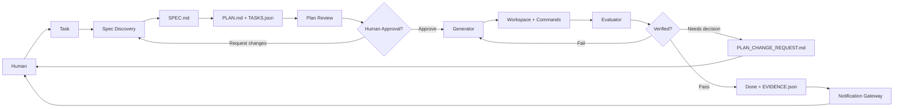
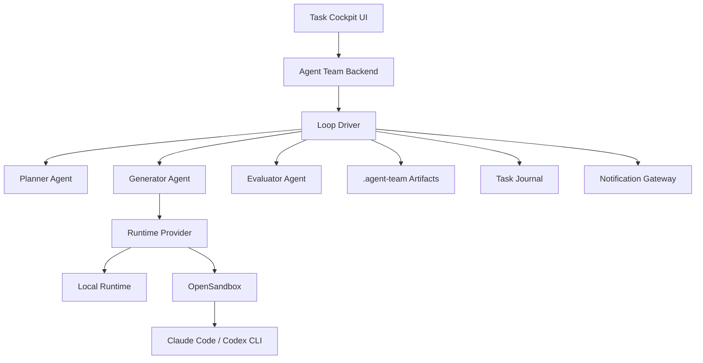
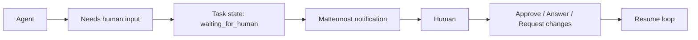

# Từ Coding Agent Mạnh Đến Agent Workflow Cho Team

> Bản chuẩn bị thuyết trình tiếng Việt, dùng `agent_team` làm case study.
>
> Audience: mixed audience - product, founder, engineer, operator, manager.
> Thời lượng gợi ý: 45-60 phút, gồm 10 phút demo.
> Các thuật ngữ tiếng Anh như `agent`, `workflow`, `loop`, `sandbox`, `evidence`, `human-in-the-loop` được giữ lại khi phù hợp.

---

## 0. Mục Tiêu Của Buổi Sharing

Sau buổi này, người nghe nên hiểu được:

- Vì sao Claude Code, Codex CLI, Cursor CLI đã rất mạnh nhưng vẫn chưa đủ để thành một team workflow hoàn chỉnh.
- Vì sao nên tận dụng harness của Claude Code/Codex/Cursor thay vì tự build toàn bộ agent bằng LLM API + tool calling.
- `agent_team` thêm giá trị ở đâu nếu bên dưới đã có các coding agents mạnh.
- Vì sao bài toán không còn là "agent có code được không", mà là "làm sao vận hành agents như một phần của engineering workflow".
- Một agent platform cần những mảnh ghép nào: task state, workspace, planning, human approval, sandbox, credentials, evaluator, evidence, journal, notification.
- Cách `agent_team` biến một coding agent đơn lẻ thành một worker trong hệ thống có kiểm soát.
- Khi nào dùng thẳng Claude Code/Codex là đủ, và khi nào cần một control plane như `agent_team`.

Thông điệp chính:

> Claude Code/Codex are the engine. Agent Team is the operating layer around that engine.

Hai câu nên lặp lại trong bài:

> **If you are doing one task alone in a terminal, Claude Code or Codex may be enough. If you want team-grade, long-running, auditable agent work, you need a workflow layer.**
>
> **Prompt is not the product. The loop is the product.**

---

## 1. Thesis Chính

### Phiên bản ngắn

> `agent_team` không cố thay Claude Code/Codex. Nó biến các coding agents mạnh đó thành một phần của hệ thống làm việc có task state, human gates, sandbox, evidence và team visibility.

### Phiên bản dễ hiểu

> Claude Code/Codex giống như một developer rất mạnh đang ngồi trong terminal. Nhưng một team không chỉ cần một developer giỏi. Team còn cần issue, spec, plan, review, CI, logs, notification, permission, audit trail và môi trường chạy an toàn. `agent_team` là lớp biến "agent trong terminal" thành "agent trong workflow của team".

### Phiên bản kỹ thuật hơn

```text
Team-grade Agent Workflow =
  Strong Coding Agent
  + Shared Task Workspace
  + State Machine
  + Planning Artifacts
  + Human Gates
  + Sandboxed Runtime
  + Evidence-Based Verification
  + Notifications
  + Audit Journal
```

Giải nghĩa nhanh:

- `Strong Coding Agent`: Claude Code, Codex CLI, Cursor CLI, hoặc các CLI agents khác.
- `Shared Task Workspace`: nơi human và agents cùng nhìn task, files, artifacts, logs.
- `State Machine`: task đang planning, waiting for approval, running, verifying, complete, waiting for human.
- `Planning Artifacts`: `SPEC.md`, `PLAN.md`, `TASKS.json`.
- `Human Gates`: approve plan, answer question, approve plan change, reconnect auth.
- `Sandboxed Runtime`: agent có quyền chạy code nhưng trong môi trường cô lập.
- `Evidence-Based Verification`: test/build/lint/diff/screenshot/evaluator verdict.
- `Notifications`: Mattermost/Slack/email/webhook để human không phải refresh UI.
- `Audit Journal`: sổ cái ghi lại decisions, lifecycle events, blockers, evidence.

### Positioning Quan Trọng

Đây là đoạn nên nói rõ sớm để tránh audience hiểu nhầm:

> Nếu bạn là một developer đang ngồi một mình trong terminal và muốn Claude Code sửa một bug nhỏ, bạn có thể không cần `agent_team`.
>
> Nhưng nếu bạn muốn nhiều người trong team giao task cho agents, review plan, approve work, theo dõi long-running tasks, nhận notification khi agent cần input, kiểm chứng evidence, quản lý sandbox/credentials và audit lại decision trail, thì lúc đó Claude Code/Codex là worker, còn `agent_team` là control plane.

Một framing khác:

```text
Claude Code / Codex:
  "Can this agent do the coding work?"

Agent Team:
  "Can our team safely delegate, supervise, verify, and resume agent work at scale?"
```

### Agent Team Có Thừa Không?

Nên nói thẳng:

```text
Không cần Agent Team nếu:
- một developer tự chạy một task nhỏ trong terminal
- không cần audit
- không cần approval
- không cần notification
- không cần sandbox riêng
- không cần người khác theo dõi/resume task

Cần một layer như Agent Team nếu:
- task kéo dài nhiều giờ hoặc nhiều vòng
- task cần plan/review/approval trước khi chạy
- nhiều người cần thấy task đang ở đâu
- agent cần hỏi human giữa chừng
- cần evidence để tin là task thật sự done
- cần chạy trong sandbox/isolated runtime
- cần quản lý credentials/subscription accounts
- cần journal/audit trail cho quyết định của agent
```

Framing quan trọng:

> Agent Team không tối ưu cho "một người hỏi một agent làm một việc nhỏ". Nó tối ưu cho "một team delegate nhiều việc cho agents và cần kiểm soát lifecycle của những việc đó".

---

## 2. Research Synthesis: Mindset Đang Trend Hiện Nay

Phần này là synthesis từ các guide/talk/pattern nổi bật:

- Anthropic - `Building Effective Agents`
- Anthropic - `Effective Context Engineering for AI Agents`
- OpenAI - `A Practical Guide to Building Agents`
- Cursor - `Best Practices for Coding with Agents`
- HumanLayer - `12-Factor Agents`
- Simon Willison - `Agentic Engineering Patterns`
- GitHub Spec Kit - `Spec-Driven Development`
- Addy Osmani - `How to Write a Good Spec for AI Agents`

### Trend 1 - Từ "agent framework phức tạp" về "simple composable workflows"

Các nguồn hiện tại đều khá thận trọng với việc nhảy ngay vào multi-agent framework phức tạp. Mindset tốt hơn:

```text
Start simple.
Use one strong agent + clear tools + clear state.
Add orchestration only when failure mode requires it.
```

Implication cho bài nói:

> `agent_team` không nên được pitch như một swarm/multi-agent framework phức tạp. Nên pitch như một workflow/control plane đơn giản nhưng có state, gates và evidence.

### Trend 2 - Prompt engineering đang chuyển thành context engineering

Agent chạy lâu sẽ tạo rất nhiều thông tin: plan, diffs, logs, tool output, test results, questions, decisions. Vấn đề không còn chỉ là prompt ban đầu, mà là:

```text
What context should the agent see now?
What should be summarized?
What should be persisted as artifact?
What should be hidden or excluded?
What is the source of truth?
```

Implication:

> `SPEC.md`, `PLAN.md`, `TASKS.json`, `EVIDENCE.json`, journal không phải paperwork. Chúng là context engineering artifacts.

### Trend 3 - Spec-driven / plan-first đang trở thành default cho serious coding agents

GitHub Spec Kit, Addy Osmani, Cursor best practices đều nhấn mạnh: đừng nhảy thẳng vào code với task mơ hồ.

Pattern:

```text
Spec -> Plan -> Tasks -> Implement -> Verify
```

Implication:

> Bài nói nên có một phần "spec as contract" trước khi demo Agent Team. Agent Team chỉ là một implementation của best practice này.

### Trend 4 - Verifiable goals quan trọng hơn final answer

Cursor nhấn mạnh goals phải verifiable: tests, lints, typed signals. Simon Willison nhấn mạnh testing/QA và tránh đưa code chưa review cho collaborators.

Pattern:

```text
No evidence -> not done.
No tests/checks -> low trust.
Generator summary != verification.
```

Implication:

> `agent_team` cần được trình bày như một hệ thống biến "agent says done" thành "system proves done".

### Trend 5 - Human-in-the-loop là control flow, không phải ngoại lệ

HumanLayer 12-Factor Agents có các factor như pause/resume, contact humans, own control flow. OpenAI guide cũng nhấn guardrails và human intervention cho production.

Pattern:

```text
Agent needs human
  -> enter waiting_for_human state
  -> notify
  -> resume after explicit action
```

Implication:

> `agent_team` nên nhấn mạnh approval, question, plan change, auth re-connect, notification gateway như state machine chính thức.

### Trend 6 - Long-running agents cần remote/sandboxed execution và async monitoring

Cursor cloud agents cho thấy hướng thị trường: agent clone repo, làm trên branch, notify khi xong, user review sau. Điều này rất gần với hướng `agent_team`: task cockpit + sandbox + notification.

Implication:

> Đừng pitch sandbox như một chi tiết infra. Pitch sandbox như điều kiện để agent làm long task an toàn và async.

### Trend 7 - Skills/rules/specs encode senior engineering discipline

Các bài gần đây về agent skills/rules/specs đều xoay quanh một ý: agent rất nhanh, nhưng nếu không encode discipline, nó sẽ đi đường ngắn nhất: thiếu test, thiếu review, thiếu edge cases.

Implication:

> `agent_team` nên được giới thiệu như nơi encode engineering discipline thành workflow: plan-first, approval, evaluator, evidence, journal.

### Kết Luận Research

Mạch bài nên không phải:

```text
Agent Team là gì -> feature demo
```

Mạch tốt hơn:

```text
Coding agents are powerful
  -> but production/team usage exposes operations problems
  -> world best practices converge on spec/context/verification/human gates
  -> Agent Team implements these patterns as a control plane
  -> demo one task lifecycle
```

---

## 3. Recommended Presentation Workflow

Đây là workflow thuyết trình nên dùng sau khi đã research:

### Act 1 - Acknowledge The New Baseline

Mục tiêu:

> Không nói với audience như thể họ chỉ biết ChatGPT. Thừa nhận Claude Code/Codex/Cursor đã mạnh.

Slides:

1. Title: `Beyond Claude Code & Codex`
2. `Coding agents are already powerful`
3. `What is a coding agent harness?`
4. `Why not build LLM API + tools from scratch?`

Core message:

> We reuse the coding brain. We build the operating layer.

### Act 2 - Define The Real Problem

Mục tiêu:

> Chuyển từ capability sang operations.

Slides:

5. `The bottleneck moves from capability to operations`
6. `Agent operations pain: state, approval, evidence, auth, sandbox, notification`
7. `Agent Team is a control plane`

Core message:

> The hard question is not "can the agent code?" but "can the team safely delegate and verify work?"

### Act 3 - Teach The Best Practices

Mục tiêu:

> Cho audience framework trước khi show product.

Slides:

8. `Best Practice: Work starts as a task, not a prompt`
9. `Best Practice: Spec before execution`
10. `Best Practice: Plan review and human gates`
11. `Best Practice: Evidence-based verification`
12. `Best Practice: Sandbox for long-running work`
13. `Best Practice: Journal + notification + resume`

Format mỗi best practice:

```text
Failure mode:
  Agent does X wrong.

Best practice:
  Do Y.

Agent Team implementation:
  Feature/artifact Z.
```

Core message:

> Agent Team is not arbitrary product design. It is a concrete implementation of emerging agent engineering patterns.

### Act 4 - Show Agent Team As The Implementation

Mục tiêu:

> Bây giờ mới demo product, vì audience đã có lens để hiểu.

Slides:

14. `Agent Team architecture: control plane + workers`
15. `Task cockpit`
16. `Planning artifacts`
17. `Execution loop`
18. `Evaluator + evidence`
19. `Journal + notification`
20. `Sandbox runtime`

Core message:

> Claude Code/Codex do the coding. Agent Team manages the lifecycle.

### Act 5 - Demo One Lifecycle

Mục tiêu:

> Không demo "agent trả lời hay". Demo lifecycle.

Demo sequence:

```text
Create task
  -> draft spec
  -> draft plan
  -> approve
  -> execute with CLI agent
  -> evaluator verifies
  -> evidence/journal
  -> notification/done
```

Core message:

> The value is not a single answer. The value is a reliable work loop.

### Act 6 - Close With The Operating Model

Mục tiêu:

> Chốt lại bằng mental model dễ nhớ.

Final slide:

```text
LLM API = primitive
Claude Code/Codex = coding worker
Agent Team = control plane / operating layer

Strong agents need strong workflows.
```

---

## 4. Format Buổi Nói

### Bản 45-60 phút

| Phần | Thời lượng | Mục tiêu |
|---|---:|---|
| Opening story | 5 phút | Acknowledge Claude Code/Codex đã mạnh |
| Why Agent Team exists | 8 phút | Trả lời "có thừa không?" |
| Why use CLI coding agents | 8 phút | Giải thích harness và build-vs-buy |
| Control plane mental model | 7 phút | Chuyển từ terminal agent sang team workflow |
| Agent Team overview | 10 phút | Cho thấy platform shape |
| Planning workflow | 8 phút | Spec, plan, approval |
| Loop engineering | 10 phút | Execute, evaluate, retry |
| Production concerns | 8 phút | Sandbox, auth, notification, journal |
| Demo | 10 phút | Đi qua một task thật |
| Takeaways + Q&A | 5 phút | Chốt bài |

### Bản rút gọn 30 phút

Giữ các phần:

- Opening story.
- Mental model.
- Agent Team overview.
- Planning + loop.
- Demo ngắn.
- Takeaways.

Bỏ hoặc nói rất nhanh:

- Deep sandbox details.
- Credential/auth details.
- Roadmap sâu.

---

## 3. Slide 1 - Title

### Nội dung trên slide

```text
Beyond Claude Code & Codex

Building Team-Grade Agent Workflows

Case study: Agent Team
```

### Mục tiêu slide

Đặt kỳ vọng: đây không phải bài nói rằng Claude Code/Codex yếu. Ngược lại, bài nói bắt đầu từ việc thừa nhận các coding agents đó đã rất mạnh. Câu hỏi là: nếu agents đã mạnh, mình cần build gì thêm để dùng chúng trong team workflow?

### Speaker notes

Mở đầu có thể nói:

> Hôm nay mình không muốn bắt đầu từ câu chuyện "chatbot chưa đủ" nữa, vì nhiều người ở đây có lẽ đã dùng Claude Code, Codex, Cursor CLI hoặc các coding agents tương tự. Những tool này rất mạnh, có thể đọc repo, sửa code, chạy command và làm long task.

Tiếp:

> Vậy câu hỏi đúng không còn là "AI có code được không?". Câu hỏi đúng hơn là: nếu mình muốn team của mình giao việc cho agents như một phần của engineering workflow, thì còn thiếu những gì?

Chốt:

> Bài này sẽ dùng `agent_team` làm case study. `agent_team` không cố thay thế Claude Code/Codex. Nó là lớp workflow/control plane ở phía trên: task state, planning, approval, sandbox, evidence, journal, notification và team visibility.

### Chuyển ý

> Để thấy vì sao lớp này cần thiết, mình bắt đầu từ chính các coding agents mạnh mà chúng ta đã dùng.

---

## 4. Slide 2 - Claude Code/Codex Đã Rất Mạnh. Vậy Còn Thiếu Gì?

### Nội dung trên slide

| Strong Coding Agent | Team-Grade Agent Workflow |
|---|---|
| Chạy tốt trong terminal cá nhân | Cần shared task cockpit |
| Một prompt / một session | Cần task state dài hạn |
| Agent tự plan và tự làm | Cần plan review + human approval |
| Summary cuối phiên | Cần evidence, journal, audit trail |
| Auth/files nằm ở máy user | Cần credential + sandbox policy |
| User phải canh terminal | Cần async notification |
| Tối ưu cho individual work | Cần coordination cho team |

### Mục tiêu slide

Trả lời trực diện objection: "Nếu đã có Claude Code/Codex, Agent Team có thừa không?"

### Speaker notes

Nói:

> Claude Code và Codex đã giải quyết rất tốt bài toán "một agent có thể code không?". Nhưng khi đưa vào team, mình gặp một bài toán khác: làm sao để nhiều người giao task, theo dõi task, approve plan, verify output, audit lại decision, và resume khi agent cần human?

Ví dụ:

> Nếu mình ngồi ở terminal và chạy `claude` để fix một bug nhỏ, rất ổn. Nhưng nếu PM tạo task lúc 10h tối, agent chạy 2 tiếng, giữa chừng cần approve plan change, rồi sáng mai engineer khác muốn biết nó đã làm gì, test nào đã chạy, vì sao quyết định như vậy - terminal session riêng lẻ không còn đủ.

Nhấn:

> Agent Team không cạnh tranh với coding agents. Nó làm phần mà coding agent terminal không tập trung giải quyết: shared state, governance, visibility, evidence và human workflow.

### Câu hay để dùng

> Claude Code/Codex are powerful workers. Agent Team is the work system around them.

### Chuyển ý

> Trước khi đi tiếp vào Agent Team, cần trả lời một câu nữa: vì sao không tự build agent bằng LLM API + một bộ tools của mình?

---

## 4A. Slide 2A - Coding Agent Harness Là Gì?

### Nội dung trên slide

```text
LLM alone:
- nhận prompt
- trả text

Coding agent harness:
- đọc repo
- search code
- sửa file
- apply patch
- chạy shell command
- chạy tests
- đọc lỗi
- sửa tiếp
- giữ session/context
- stream progress
```

### Mục tiêu slide

Giải thích từ `harness` cho audience level thấp hơn, để họ hiểu vì sao Claude Code/Codex không chỉ là "LLM trả code".

### Speaker notes

Nói:

> Harness là bộ khung làm việc giúp model biến suy nghĩ thành hành động thật. Nếu model là bộ não, harness là mắt, tay, bàn làm việc, bộ dụng cụ và thói quen làm việc của agent.

Ví dụ:

```text
Task: Fix failing login test

Without harness:
1. LLM đoán nguyên nhân từ prompt
2. Trả một code suggestion
3. Human copy/paste
4. Human chạy test
5. Human gửi lỗi lại

With coding harness:
1. Agent đọc failing test
2. Search login flow
3. Sửa đúng file
4. Chạy pytest
5. Đọc stack trace
6. Sửa tiếp
7. Báo diff + test result
```

Nhấn:

> Harness là lý do Claude Code/Codex/Cursor không chỉ là "LLM viết code". Chúng là coding environment có tool loop đã được tối ưu cho software engineering.

### Câu hay để dùng

> Harness giúp agent làm việc trong repo. Agent Team giúp team quản lý công việc của agent.

### Chuyển ý

> Nếu harness quan trọng như vậy, câu hỏi tiếp theo là: tự build harness đó hay tận dụng harness có sẵn?

---

## 4B. Slide 2B - Vì Sao Không Tự Build LLM API + Tools?

### Nội dung trên slide

| Tự build LLM API + tools | Dùng Claude Code/Codex/Cursor CLI |
|---|---|
| Chủ động tuyệt đối | Harness coding đã battle-tested |
| Phải tự build file edit/search/shell/test loop | Có sẵn repo tools và coding loop |
| Phải tự tune prompt/tool schema/retry | Vendor tối ưu liên tục |
| Dễ làm demo, khó đạt reliability cao | Dùng được sớm cho coding workflow thật |
| API/token cost do platform gánh | Có thể tận dụng subscription accounts |
| Phải tự build session/progress UX | CLI agents có session/progress model |
| Tốt cho domain đặc thù | Rất mạnh cho software engineering |

### Mục tiêu slide

Chứng minh lựa chọn architecture: `agent_team` không tự build coding brain từ đầu; nó tận dụng coding workers đã mạnh và build operating layer phía trên.

### Speaker notes

Nói:

> Tự build bằng LLM API + tools không sai. Nếu mục tiêu là research agent framework, hoặc domain rất đặc thù, tự build rất đáng làm. Nhưng nếu mục tiêu là cho agent làm coding task thật càng sớm càng tốt, thì việc tự build lại full coding harness là cực kỳ tốn công.

Liệt kê những thứ tự build phải làm:

- file read/write/edit an toàn,
- search/grep và repo indexing,
- shell execution,
- patch generation/apply/revert,
- context selection,
- session memory,
- permission mode,
- command streaming,
- tool result summarization,
- test/debug loop,
- cancellation,
- MCP/tools integration,
- auth/config handling,
- UX cho progress.

Nói:

> Claude Code/Codex/Cursor đã đầu tư rất nhiều vào những phần này. Nếu mình tự build lại, mình sẽ mất rất nhiều thời gian để đạt chất lượng tương tự, và vẫn phải đuổi theo tốc độ cải tiến của vendor.

Chốt:

> Vì vậy kiến trúc của `agent_team` là: không build lại coding brain. Dùng CLI coding agents làm worker. Dành effort để build phần chưa có sẵn: team workflow, state, approval, sandbox, evidence, notification, journal.

### Câu hay để dùng

> We do not need to rebuild the coding brain. We need to build the operating system around it.

### Cách Chứng Minh Trong Buổi Sharing

Nên nói bằng một mini benchmark, không cần quá formal:

```text
Same task, three approaches:

1. LLM API + simple file tools baseline
2. Claude Code or Codex directly in terminal
3. Claude Code/Codex as worker inside Agent Team
```

So sánh các tiêu chí:

- mất bao lâu để setup agent,
- agent có tự tìm đúng file không,
- có tự chạy test không,
- có đọc lỗi và sửa tiếp không,
- diff có nhỏ và đúng scope không,
- progress có quan sát được không,
- evidence có được lưu lại không,
- người khác có catch up/resume được không,
- task có human approval/notification không.

Expected conclusion:

```text
LLM API + tools proves the primitive.
Claude Code/Codex proves the coding worker.
Agent Team proves the team workflow.
```

### Chuyển ý

> Khi coding agent càng mạnh, failure mode cũng chuyển tầng: không còn chỉ là "agent code được không", mà là "system vận hành agent có đáng tin không".

---

## 5. Slide 3 - Khi Agent Đã Mạnh, Pain Chuyển Từ Coding Sang Operations

### Nội dung trên slide

```text
Pain mới khi dùng coding agents cho team:

- Ai đang sở hữu task này?
- Plan đã được approve chưa?
- Agent đã chạy test gì?
- Evidence nằm ở đâu?
- Nếu agent cần human thì notify bằng gì?
- Token/subscription account nào đang được dùng?
- Sandbox nào đang chạy, có an toàn không?
- Nếu app restart thì resume task thế nào?
- Team member khác catch up bằng cách nào?
- Ai có quyền approve plan change?
```

### Mục tiêu slide

Chuyển focus từ "agent capability" sang "agent operations". Đây là phần làm rõ `agent_team` không thừa.

### Speaker notes

Nói:

> Với Claude Code/Codex, mình có thể có một coding worker rất mạnh. Nhưng worker mạnh chưa tự động tạo ra process tốt. Trong một team, vấn đề không chỉ là agent có sửa được code không, mà là task đang ở trạng thái nào, ai approve, evidence ở đâu, có sandbox không, token của ai được dùng, nếu agent cần human thì gọi ai.

Ví dụ:

> Một developer dùng Codex trong terminal có thể rất productive. Nhưng manager hoặc teammate không nhìn thấy full context. Nếu Codex hỏi một câu trong terminal lúc user đi ngủ, task kẹt. Nếu agent báo done, người khác không biết test nào đã chạy. Nếu credential hết hạn trong sandbox, cần human action nhưng không có notification.

Nhấn:

> Đây là lý do mình gọi `agent_team` là workflow/control plane. Nó không làm coding agent thông minh hơn theo nghĩa model capability. Nó làm quá trình dùng coding agent trở nên visible, controllable, resumable và verifiable.

### Câu hay để dùng

> The bottleneck moves from agent capability to agent operations.

### Chuyển ý

> Vì vậy mental model của mình không phải "build một agent mới", mà là "build một operating layer cho agents".

---

## 6. Slide 4 - Mental Model: Agent Team Là Control Plane

### Nội dung trên slide

```text
Coding Agent = worker

Agent Team = control plane

Control plane responsibilities:
- task state
- planning artifacts
- human gates
- sandbox runtime
- execution loop
- evaluator
- evidence
- journal
- notifications
```

### Mục tiêu slide

Đưa ra framework chính của bài.

### Speaker notes

Đi từng phần:

> Claude Code/Codex là worker: nó đọc repo, sửa code, chạy command, có thể làm long task. Nhưng worker mạnh chưa tự tạo ra toàn bộ operating system của team. Control plane là nơi quản lý task state, approval, runtime, evidence, notification và audit.

Giải thích bằng analogy:

> Một developer giỏi vẫn cần Linear/Jira, GitHub PR, CI, Slack, staging, code review và quyền truy cập phù hợp. Coding agent cũng vậy. Agent Team cố gắng đóng vai trò giống lớp workflow đó cho agents.

Nhấn:

> Vì vậy câu hỏi không phải "Agent Team có code giỏi hơn Claude Code không?". Không. Câu hỏi là "Agent Team có giúp team giao việc cho Claude Code/Codex một cách có kiểm soát hơn, quan sát được hơn, và verify được hơn không?".

### Chuyển ý

> Coding work là case rất tốt để test control plane này, vì mọi thứ đều có dấu vết: diff, command, test, log, review.

---

## 7. Slide 5 - Vì Sao Coding Agents Là Case Study Tốt

### Nội dung trên slide

```text
Coding work exposes the real problems:

- Context nằm trong codebase
- Kết quả là diff thật
- Có tests/build/lint để verify
- Tool execution có rủi ro
- Task có thể kéo dài nhiều vòng
- Human review vẫn quan trọng
```

### Mục tiêu slide

Nói với audience rằng dù demo là coding agent, insight áp dụng rộng hơn cho nhiều loại AI workflow.

### Speaker notes

Nói:

> Coding agent là bài test khó nhưng rất rõ. Nếu agent sửa code sai, mình thấy diff. Nếu nó không chạy test, mình thấy thiếu evidence. Nếu nó đụng secret hoặc chạy lệnh nguy hiểm, mình thấy sandbox/security problem.

Mở rộng:

> Những pattern này không chỉ dành cho coding. Legal review, data analysis, finance ops, customer support automation cũng cần tương tự: context, plan, evidence, human approval, audit trail.

### Chuyển ý

> Đây là lý do mình build `agent_team` không phải như một terminal wrapper, mà như một workspace/control plane cho human và agents.

---

## 8. Slide 6 - Agent Team Là Gì?

### Nội dung trên slide

```text
Agent Team = shared workspace for humans and AI agents

Human tạo task
  -> discuss/clarify
  -> agent draft spec/plan
  -> human approve
  -> agent execute
  -> evaluator verify
  -> retry / ask human / done
```

### Mục tiêu slide

Giới thiệu `agent_team` ở mức product/workflow, không đi quá sâu code.

### Speaker notes

Nói:

> `agent_team` là một platform thử nghiệm để human và agent cùng làm việc trên task. Mỗi task có thread, artifacts, workspace, agents, runtime, journal và status.

Nói thêm:

> Mình không cố tự build một coding brain từ đầu. Mình ưu tiên dùng các CLI agents đã mạnh sẵn như Claude Code, Codex CLI, Cursor CLI. Những agent này có harness coding tốt. Nhưng mình cần một platform quanh chúng: task management, planning, approval, sandbox, verification, notification.

Phân biệt:

> CLI agent là worker. `agent_team` là workflow system điều phối worker đó.

### Chuyển ý

> Bây giờ nhìn vào một task trong Agent Team, mình muốn audience thấy nó không chỉ là một terminal session được bọc UI.

---

## 9. Slide 7 - Task Cockpit: Không Chỉ Là Terminal Session

### Nội dung trên slide

Hiển thị screenshot UI nếu có:

- Task title/status.
- Goal thread.
- Plan/Review/Run/Result stepper.
- Activity stream.
- Artifacts panel.
- Details panel.
- Runtime/sandbox state.
- Journal nếu có.

Text ngắn trên slide:

```text
Task cockpit:

- conversation
- plan artifacts
- execution activity
- workspace files
- verification evidence
- human actions
- notifications
```

### Mục tiêu slide

Giúp audience hình dung "workspace" là gì.

### Speaker notes

Nói:

> Trong terminal hoặc một chat thread, mọi thứ dễ trôi theo stream. Nhưng khi làm task thật, mình cần nhiều surfaces khác nhau: plan ở đâu, file ở đâu, agent đang làm gì, test đã chạy chưa, ai cần approve, có blocker không.

Nói rõ:

> Task cockpit là nơi gom các thứ này lại. Human không cần đọc lại toàn bộ terminal output hoặc message stream để đoán trạng thái. System phải nói rõ: task đang planning, waiting for approval, running, verifying hay complete.

### Chuyển ý

> Một trong những phần quan trọng nhất của cockpit là planning artifacts.

---

## 10. Slide 8 - Planning: Biến Ý Định Mơ Hồ Thành Contract

### Nội dung trên slide

```text
Planning artifacts:

.agent-team/SPEC.md
  -> goal, context, constraints, acceptance criteria

.agent-team/PLAN.md
  -> technical approach, files touched, validation strategy

.agent-team/TASKS.json
  -> machine-readable task graph
```

### Mục tiêu slide

Giải thích vì sao planning là một contract giữa human và agent.

### Speaker notes

Nói:

> Khi user tạo task, task thường mơ hồ. Ví dụ: "improve notification", "fix planning flow", "make sandbox work". Nếu agent chạy ngay, nó phải tự đoán rất nhiều.

Giải thích từng file:

> `SPEC.md` trả lời câu hỏi: mình đang cố đạt điều gì? Cái gì nằm ngoài scope? Acceptance criteria là gì?

> `PLAN.md` trả lời câu hỏi: sẽ làm bằng cách nào? Đụng file nào? Có migration không? Test thế nào? Có rủi ro gì?

> `TASKS.json` giúp system đọc được plan, không chỉ human đọc. Đây là bước chuyển từ text sang workflow.

Nhấn:

> Planning không phải để agent viết văn bản cho đẹp. Planning là cách tạo shared truth.

### Ví dụ nói miệng

Task thô:

```text
Add notification channels.
```

Spec tốt hơn:

```text
When a task needs human input or completes, send a Mattermost notification.
The design must support future providers like Slack/email.
Inbound replies may map to actions only when they are safe and authorized.
```

### Chuyển ý

> Nhưng plan do agent viết ra không nên tự động được tin 100%. Cần review và approval.

---

## 11. Slide 9 - Human Approval Là Một Feature

### Nội dung trên slide

```text
Plan drafted
  -> human reviews
  -> approve / edit / request changes
  -> execution starts
```

Subtitle:

```text
Human approval is not a bottleneck.
It is an alignment gate.
```

### Mục tiêu slide

Định vị human-in-the-loop là thiết kế chủ động, không phải dấu hiệu agent yếu.

### Speaker notes

Nói:

> Nhiều người nghe "autonomous agent" sẽ nghĩ phải bỏ human ra khỏi loop. Nhưng trong thực tế, human vẫn giữ product intent, business context, risk tolerance và quyền quyết định.

Ví dụ:

> Nếu agent muốn đổi data model, thêm migration, hoặc gửi notification tới customer, đó không phải việc nên tự quyết.

Nói với audience product:

> Approval giúp đảm bảo thứ agent sắp build đúng với intent.

Nói với audience engineering:

> Approval là một state transition trong workflow. Nó làm cho execution chỉ bắt đầu khi plan đã được chốt.

### Câu hay

> Human-in-the-loop should be a designed workflow, not an emergency interrupt.

### Chuyển ý

> Sau khi approve, agent mới đi vào execution loop.

---

## 12. Slide 10 - Execution Loop: Không Phải Là Chạy Một Lần

### Nội dung trên slide

```text
Generator
  -> implement
  -> run commands/tests
  -> summarize

Evaluator
  -> inspect diff
  -> check acceptance criteria
  -> verify evidence

Loop Driver
  -> pass / retry / ask human / plan change
```

### Mục tiêu slide

Giới thiệu kiến trúc loop engineering.

### Speaker notes

Nói:

> Điểm quan trọng là mình tách vai trò. Agent implement có thể rất giỏi, nhưng không nên để nó vừa làm vừa tự tuyên bố xong. Cần một evaluator hoặc critic độc lập hơn.

Giải thích loop:

> Nếu evaluator fail, feedback quay lại generator. Generator sửa tiếp. Nếu phát hiện plan sai, system không nên im lặng mở scope; nó phải tạo plan change request và chờ human.

Nói thực tế:

> Đây là pattern giống engineering thật: developer implement, CI/test chạy, reviewer review, nếu fail thì fix tiếp.

### Câu hay

> The agent should not say done. The system should prove done.

### Chuyển ý

> Vậy "prove done" nghĩa là gì? Đó là evidence.

---

## 13. Slide 11 - Evidence-Based Verification

### Nội dung trên slide

```text
Evidence answers:

- What changed?
- Which files changed?
- Which tests ran?
- What was the exit code?
- Which acceptance criteria passed?
- What risks remain?
```

Artifacts:

```text
.agent-team/EVIDENCE.json
git diff
test/build/lint output
screenshots for UI work
evaluator verdict
```

### Mục tiêu slide

Giải thích vì sao "agent summary" không đủ.

### Speaker notes

Nói:

> Nếu một agent nói "I ran tests and everything passed", mình không nên tin ngay. Mình cần biết command nào đã chạy, exit code là gì, output ra sao, có test đúng scope không.

Ví dụ:

> Với UI task, evidence có thể là screenshot. Với backend task, evidence có thể là pytest output. Với migration, evidence có thể là migrate up/down hoặc schema diff.

Nhấn:

> Evidence làm cho completion có thể audit được. Human không cần tin vào lời kể; human có thể kiểm tra dấu vết.

### Chuyển ý

> Nhưng đôi khi trong lúc làm, agent phát hiện plan ban đầu sai. Khi đó loop không nên cố chạy tiếp.

---

## 14. Slide 12 - Plan Change Request

### Nội dung trên slide

```text
When the approved plan is wrong:

1. Stop implementation
2. Write PLAN_CHANGE_REQUEST.md
3. Explain failed assumption
4. Show evidence
5. Propose change
6. Wait for human approval
```

### Mục tiêu slide

Cho thấy agent đáng tin phải biết dừng lại khi assumption sai.

### Speaker notes

Nói:

> Trong real work, plan sai là chuyện bình thường. File không tồn tại, API khác docs, dependency conflict, test cũ fail, requirement thiếu. Câu hỏi là agent làm gì khi gặp chuyện đó.

Bad behavior:

> Agent tự đổi hướng, tự mở scope, sửa thêm thứ không được approve.

Good behavior:

> Agent dừng, ghi rõ assumption nào fail, bằng chứng là gì, đề xuất thay đổi plan, và hỏi human nếu quyết định đó ảnh hưởng scope.

### Câu hay

> A good agent knows when not to continue.

### Chuyển ý

> Khi task kéo dài nhiều vòng như vậy, mình cần một nơi ghi lại lịch sử quyết định. Đó là journal.

---

## 15. Slide 13 - Task Journal: Sổ Cái Của Task

### Nội dung trên slide

```text
Task Journal records:

- planning started / completed
- plan approved
- execution started
- tests run
- evaluator verdict
- questions
- plan change requests
- human decisions
- completion evidence
```

### Mục tiêu slide

Giải thích journal như một audit trail và memory layer.

### Speaker notes

Nói:

> Khi agent làm việc trong nhiều giờ hoặc nhiều ngày, thread chat không đủ. Mình cần một "sổ cái" ghi lại sự kiện quan trọng và quyết định quan trọng.

Giải thích benefit:

> Human có thể quay lại sau vài tiếng và đọc summary. Agent khác có thể đọc journal để hiểu context. Reviewer có thể audit task đã đi qua những gate nào.

Nói rõ:

> Journal không thay thế logs chi tiết. Nó là high-level ledger: chuyện gì quan trọng đã xảy ra, ai quyết định gì, evidence nằm ở đâu.

### Chuyển ý

> Nhưng nếu task cần human mà human không mở web, workflow vẫn kẹt. Vì vậy cần notification channel.

---

## 16. Slide 14 - Notification Gateway: Human Không Nên Phải Refresh Web

### Nội dung trên slide

```text
Notify when:

- plan is ready for approval
- agent has a question
- plan change is requested
- auth is expired
- verification failed
- task is complete
```

Flow:

```text
Agent Team -> Mattermost -> Human reply/action -> Agent Team resumes
```

### Mục tiêu slide

Đưa notification vào như một phần của human-in-the-loop.

### Speaker notes

Nói:

> Nếu system cần human approval nhưng không báo cho human, thì đó không phải workflow async tốt. Human không nên phải refresh UI liên tục.

Mattermost example:

> Team mình dùng Mattermost, nên notification gateway có thể gửi message khi plan ready, khi cần approve, hoặc khi task complete.

Nói thêm:

> Không phải reply nào cũng nên tự map thành action. Một số reply chỉ nên trở thành comment. Một số action như approve/run phải có explicit command hoặc button, và phải check authorization.

### Chuyển ý

> Bây giờ đến một phần rất quan trọng cho coding agent: sandbox.

---

## 17. Slide 15 - Sandbox: Cho Agent Quyền Làm Việc Nhưng Không Cho Cả Căn Nhà

### Nội dung trên slide

```text
Coding agents need power:

- read/write files
- run shell commands
- install dependencies
- run tests
- start dev servers
- access repo credentials

Therefore they need isolation.
```

Agent Team direction:

```text
CLI agent runs inside OpenSandbox
one sandbox per task
workspace mounted or synced
pause/resume for long-running tasks
```

### Mục tiêu slide

Giải thích sandbox ở mức dễ hiểu, không quá infra.

### Speaker notes

Nói:

> Coding agent mà không có shell thì yếu. Nhưng coding agent có shell thì nguy hiểm. Nó có thể chạy install script, test untrusted code, đọc env vars, hoặc làm hỏng workspace.

Analogy:

> Sandbox giống như workshop riêng cho agent. Nó có đủ dụng cụ để làm việc, nhưng được tách khỏi phần còn lại của hệ thống.

Nói về `agent_team`:

> Hướng hiện tại là dùng OpenSandbox để chạy Claude Code/Codex CLI trong môi trường riêng cho từng task. Khi task idle, sandbox có thể pause để tiết kiệm resource.

### Chuyển ý

> Nhưng sandbox kéo theo một vấn đề rất thực tế: agent login thế nào, credentials đi đâu, workspace giữ thế nào?

---

## 18. Slide 16 - Production Reality: Những Phần "Chán" Mới Là Product

### Nội dung trên slide

```text
Real agent platform problems:

- CLI auth / subscription accounts
- sandbox lifecycle
- workspace persistence
- secrets management
- network policy
- cancellation
- cost/budget
- logs and observability
- notifications
- audit trail
```

### Mục tiêu slide

Làm rõ rằng production agent khác demo ở các phần vận hành.

### Speaker notes

Nói:

> Khi demo, mình có thể hardcode API key và chạy local. Nhưng khi build platform thật, những câu hỏi boring xuất hiện ngay: account ai đang dùng? Token hết hạn thì sao? Agent chạy command treo thì cancel thế nào? Sandbox restart có mất state không? Ai được approve? Cost task này bao nhiêu?

Nhấn:

> Những phần này nghe không sexy, nhưng chính chúng quyết định agent có dùng được trong công việc thật hay không.

### Câu hay

> The boring parts are the product.

### Chuyển ý

> Sau phần concept, mình sẽ demo một task đi qua workflow.

---

## 19. Slide 17 - Demo: Một Task Đi Từ Ý Tưởng Tới Verified Done

### Nội dung trên slide

```text
Demo flow:

1. Create task
2. Draft spec/plan
3. Human approval
4. Agent execution
5. Evaluator verification
6. Evidence + journal
7. Notification / done
```

### Mục tiêu slide

Chuẩn bị audience trước khi demo để họ biết cần nhìn gì.

### Speaker notes

Nói:

> Trong demo, mình không muốn chỉ show agent trả lời hay. Mình muốn mọi người nhìn vào lifecycle: task bắt đầu mơ hồ, được làm rõ, được approve, agent chạy, system verify, rồi mới complete.

Nhấn:

> Nếu live model chạy chậm, mình sẽ dùng task đã chạy sẵn để walk through artifacts. Vì trọng tâm là workflow.

### Demo task đề xuất

```text
Add validation so project names cannot be empty or whitespace-only.
Add a focused test for the validation.
Keep the change minimal and follow existing project patterns.
```

Hoặc nếu muốn demo quanh chính `agent_team`:

```text
Add a small runtime status field to the task details panel.
It should show whether the task is running in local or OpenSandbox runtime.
Add a focused test for the API response.
```

---

## 20. Slide 18 - Lessons Learned

### Nội dung trên slide

```text
5 lessons:

1. Prompt is not the product. The loop is the product.
2. Planning turns vague intent into shared truth.
3. Autonomy needs independent verification.
4. Agents need workspace + sandbox + control plane, not just a terminal session.
5. Human-in-the-loop must be designed, not improvised.
```

### Mục tiêu slide

Chốt lại toàn bài bằng 5 nguyên tắc.

### Speaker notes

Đi từng lesson:

1. Prompt chỉ là entry point. Loop mới quyết định agent có làm tới nơi tới chốn không.
2. Planning giúp human và agent thống nhất "done" nghĩa là gì.
3. Verification giúp tránh "AI tự tin sai".
4. Workspace/sandbox biến agent từ text generator thành worker có môi trường làm việc.
5. Human gate giúp system an toàn và thực tế hơn.

Chốt:

> Mục tiêu không phải loại human khỏi quá trình. Mục tiêu là để human delegate tốt hơn, supervise ít mệt hơn, và tin kết quả hơn.

---

## 21. Slide 19 - Roadmap / What's Next

### Nội dung trên slide

```text
Next directions:

- stronger sandbox management
- account/subscription auth for CLI agents
- better task graph execution
- richer evidence and UI screenshots
- Mattermost/Slack/email gateway
- journal summarization
- multi-agent roles
- organization-level policies
```

### Mục tiêu slide

Mở ra platform vision.

### Speaker notes

Nói:

> Khi nhìn theo hướng platform, mình thấy rất nhiều thứ có thể tiến hóa: agent roles rõ hơn, sandbox isolation tốt hơn, notification two-way, journal summary, budget control, policy theo organization.

Nói thêm:

> Đây là lý do mình nghĩ agent platform là một category thú vị. Model mạnh là điều kiện cần, nhưng platform mới biến nó thành workflow.

---

## 22. Slide 20 - Closing

### Nội dung trên slide

```text
Building AI agents is not about one smarter prompt.

It is about designing a reliable collaboration loop:

context -> plan -> approve -> execute -> verify -> learn -> notify

The model is the engine.
The workflow is the product.
```

### Speaker notes

Nói:

> Nếu chỉ nhớ một điều từ buổi này, mình muốn mọi người nhớ: agent không phải là một prompt chạy một lần. Agent là một system biết làm việc trong một loop.

Kết:

> Tương lai gần của AI trong công việc không nhất thiết là một agent tự làm tất cả trong bóng tối. Mình nghĩ nó sẽ là những collaboration loops đáng tin hơn giữa human và agents.

---

## 23. Demo Script Chi Tiết

### 23.1. Chuẩn bị trước demo

Checklist:

- Có board demo, ví dụ `Agent Team Demo`.
- Có một repo đã sync vào task workspace.
- Có ít nhất một CLI agent chạy được: `cli:claude` hoặc `cli:codex`.
- Nếu sandbox chưa ổn định, nói rõ demo chạy local runtime nhưng kiến trúc support isolated runtime.
- Có một task live nhỏ.
- Có một task backup đã hoàn thành.
- Có plan/evidence/journal sẵn để show nếu model chậm.
- Nếu demo Mattermost, chuẩn bị channel và bot token trước.

### 23.2. Task live đề xuất

Nên chọn task nhỏ, test được trong vài phút:

```text
Add validation so task titles cannot be empty or whitespace-only.
Follow existing validation patterns.
Add or update focused tests.
Do not refactor unrelated code.
```

Vì sao task này tốt:

- Có acceptance criteria rõ.
- Dễ test.
- Dễ hiểu với non-engineer.
- Không quá rủi ro khi live demo.

### 23.3. Script demo từng bước

#### Bước 1 - Tạo task

Nói:

> Mình bắt đầu như một human bình thường: tạo một task khá ngắn, chưa phải spec hoàn chỉnh.

Action:

- Tạo task.
- Nhập task thô.

Point cần nhấn:

> Real tasks thường bắt đầu như vậy: đủ để hiểu hướng, nhưng chưa đủ để agent tự code an toàn.

#### Bước 2 - Chat để planning

Nói:

> Bây giờ thay vì bấm "run" ngay, mình cho agent làm planning trước.

Action:

- Chọn planner.
- Start planning.
- Show agent tạo spec/plan.

Point:

> Agent đang chuyển yêu cầu thô thành contract.

#### Bước 3 - Mở `SPEC.md`

Nói:

> Đây là phần product intent: goal, constraints, acceptance criteria.

Chỉ vào:

- Goal.
- Non-goals.
- Acceptance criteria.
- Risks/open questions nếu có.

Point:

> Nếu phần này sai, implementation đúng kỹ thuật vẫn có thể sai sản phẩm.

#### Bước 4 - Mở `PLAN.md`

Nói:

> Đây là phần engineering approach: agent định đụng file nào, test bằng gì, rollback/risk ra sao.

Chỉ vào:

- Files/components touched.
- Validation strategy.
- Alternatives considered.

Point:

> Plan giúp human review trước khi agent tốn compute và thay đổi workspace.

#### Bước 5 - Approve plan

Nói:

> Đây là human gate. Execution chỉ bắt đầu sau khi plan được approve.

Action:

- Approve plan.

Point:

> Approval không phải vì agent yếu. Approval vì human vẫn sở hữu intent và risk.

#### Bước 6 - Start execution

Nói:

> Bây giờ implementation agent chạy. Nó có thể đọc file, sửa code, chạy tests.

Action:

- Start run.
- Show activity stream.

Point:

> Mình không chỉ chờ final answer. Mình observe process.

#### Bước 7 - Show tool calls / command output

Nói:

> Ở đây mọi người có thể thấy agent đang inspect file, edit code, chạy test.

Point:

> Visibility quan trọng. Nếu agent bị kẹt hoặc chạy sai hướng, system/human có dấu hiệu để can thiệp.

#### Bước 8 - Evaluator verification

Nói:

> Sau implementation, evaluator kiểm tra lại. Generator không tự tick done.

Action:

- Show verdict.
- Show test command.
- Show pass/fail.

Point:

> Done phải dựa trên evidence.

#### Bước 9 - Show journal

Nói:

> Journal ghi lại lifecycle của task: plan, approval, execution, verification.

Point:

> Nếu ngày mai người khác mở task này, họ không cần đọc toàn bộ stream để hiểu chuyện gì xảy ra.

#### Bước 10 - Show notification nếu có

Nói:

> Nếu task cần human hoặc đã complete, system gửi notification. Human không cần refresh web liên tục.

Point:

> Human-in-the-loop chỉ scale được nếu communication channel được thiết kế.

---

## 24. Backup Demo Plan

Nếu live run lỗi hoặc quá lâu:

1. Nói thẳng:
   > Đây cũng là một bài học thật khi build agent: model/runtime đôi khi chậm hoặc fail. Vì vậy mình chuẩn bị một task đã chạy sẵn để walk through workflow.

2. Mở task backup.
3. Show:
   - original task,
   - spec,
   - plan,
   - activity,
   - evidence,
   - final result,
   - journal.

4. Kết nối lại với thesis:
   > Chính vì agent work có thể fail nên system cần state, evidence, retry và recovery.

---

## 25. Q&A Chuẩn Bị

### Q1. Cái này có thay developer không?

Trả lời:

> Ở thời điểm hiện tại, framing tốt hơn là delegation, không phải replacement. Human vẫn define goal, approve plan, review risk, và chịu trách nhiệm product judgment. Agent giúp giảm phần repetitive loop: đọc code, sửa, chạy test, retry, ghi evidence.

### Q2. Nếu agent làm sai thì sao?

Trả lời:

> Mình assume agent có thể sai. Vì vậy workflow có spec, plan approval, sandbox, evaluator, evidence, retry và plan change request. Hệ thống đáng tin không phải vì agent không sai, mà vì lỗi được phát hiện và xử lý trong loop.

### Q3. Vì sao không dùng thẳng Claude Code/Codex?

Trả lời:

> Mình có dùng. Claude Code/Codex là worker rất mạnh. Nhưng team workflow cần nhiều thứ hơn: task state, planning artifacts, human approval, sandbox lifecycle, notification, audit trail, evidence, multi-agent roles. `agent_team` là lớp platform quanh các worker đó.

### Q4. Khác gì Devin?

Trả lời:

> Devin validate direction này: AI có thể nhận coding task dài hơi. `agent_team` là cách mình tự build một platform có thể gắn với workflow, repo, notification, policy và agent choice của team mình. Nó cũng là môi trường để học sâu về loop engineering.

### Q5. Làm sao biết task xong thật?

Trả lời:

> Không chỉ dựa vào final answer. Task chỉ nên complete khi acceptance criteria pass, diff hợp lý, command/test evidence có exit code rõ, evaluator pass, và nếu có risk thì được ghi lại.

### Q6. Có cần multi-agent không?

Trả lời:

> Có thể, nhưng không nên bắt đầu bằng quá nhiều agent nói chuyện với nhau. Role split cơ bản nhất là planner, generator, evaluator. Khi artifacts rõ, nhiều agent mới phối hợp được mà không loạn.

### Q7. Phần khó nhất khi build là gì?

Trả lời:

> Không phải demo đầu tiên. Khó nhất là reliability: state machine, cancel/retry, sandbox, auth, credentials, notification, evidence, và handling những lúc agent cần human.

### Q8. Có tốn cost không?

Trả lời:

> Có. Vì vậy platform cần budgets, max attempts, timeouts, idle sandbox pause, model selection, reuse context, journal summary, và tránh chạy agent khi plan chưa rõ.

### Q9. Agent có an toàn không khi chạy shell?

Trả lời:

> Nếu chạy thẳng trên host thì rủi ro cao. Hướng đúng là sandbox per task, hạn chế network/secret, workspace isolation, audit command, và human approval cho hành động rủi ro.

### Q10. Nếu user không trả lời approval thì sao?

Trả lời:

> Workflow nên dừng ở waiting-for-human, release resource, gửi notification. Không nên giữ process treo nhiều giờ. Khi human approve, system resume execution.

---

## 26. Cách Kể Cho Mixed Audience

### Với product/founder

Nhấn vào:

- delegation,
- trust,
- workflow,
- approval,
- auditability,
- async collaboration,
- reducing coordination cost.

Tránh:

- quá nhiều class/module/code path.

### Với engineer

Nhấn vào:

- state machine,
- worker abstraction,
- sandbox,
- evidence schema,
- evaluator,
- task artifacts,
- runtime/sidecar,
- failure handling.

Tránh:

- marketing quá chung chung.

### Cách cân bằng

Mỗi concept nên có hai lớp:

1. Business/workflow meaning.
2. Technical implementation hint.

Ví dụ:

> Human approval, ở product level, là alignment. Ở engineering level, nó là một state transition và gate trước khi execution job được enqueue.

---

## 27. Những Câu Nên Dùng Trong Bài

- `Prompt is not the product. The loop is the product.`
- `Claude Code/Codex are powerful workers. Agent Team is the work system around them.`
- `Autonomy without verification is just confidence.`
- `The agent should not say done. The system should prove done.`
- `Human-in-the-loop should be designed, not improvised.`
- `A good agent knows when not to continue.`
- `The boring parts are the product.`
- `The task page is the cockpit, not just a terminal session.`
- `Planning turns vague intent into shared truth.`
- `The model is the engine. The workflow is the product.`

---

## 28. Slide Copy Ngắn Gọn Để Paste Vào Deck

### Slide: What Makes an Agent Useful?

```text
Model + Tools is not enough.

A useful agent needs:

- Workspace
- State
- Planning
- Execution loop
- Verification
- Human gates
- Notifications
- Audit trail
```

### Slide: Agent Team Workflow

```text
Task
  -> Spec
  -> Plan
  -> Review
  -> Approve
  -> Execute
  -> Verify
  -> Retry / Ask human / Done
```

### Slide: Why Evidence?

```text
Do not trust "I finished".

Check:

- diff
- commands
- exit codes
- tests
- acceptance criteria
- evaluator verdict
```

### Slide: Human Gates

```text
Ask human when:

- requirement is ambiguous
- plan changes
- auth is needed
- risk is high
- scope expands
- external action is irreversible
```

---

## 29. Mermaid Diagrams

### 29.1. Full Workflow



### 29.2. Agent Team System View



### 29.3. Human-in-the-loop



---

## 30. Suggested Final Deck Size

Nếu làm slide deck thật, đừng dùng toàn bộ 20 slides chi tiết. Nên chọn:

1. Title.
2. Claude Code/Codex are strong. What is missing?
3. Coding agent harness là gì?
4. Vì sao không tự build LLM API + tools?
5. Agent operations pain.
6. Agent Team as control plane.
7. Agent Team overview.
8. Task cockpit.
9. Planning artifacts.
10. Human approval.
11. Execution loop.
12. Evidence verification.
13. Journal + notifications.
14. Sandbox.
15. Demo flow.
16. Lessons learned.
17. Closing.

Appendix:

- Architecture diagram.
- Q&A.
- Sandbox/auth details.

---

## 31. Prep Checklist Cuối Cùng

Trước buổi nói:

- Chọn title cuối.
- Chọn 12-15 slides.
- Chụp screenshot UI `agent_team`.
- Chuẩn bị task live nhỏ.
- Chuẩn bị task backup đã chạy xong.
- Kiểm tra CLI agent auth.
- Kiểm tra sandbox hoặc quyết định demo local runtime.
- Kiểm tra notification nếu demo Mattermost.
- Mở sẵn file artifacts hoặc task backup.
- Chuẩn bị câu trả lời nếu live agent fail.
- Chuẩn bị timer: demo không quá 10 phút.

---

## 32. Opening Script Hoàn Chỉnh

Bạn có thể mở đầu gần như nguyên văn:

> Hôm nay mình muốn chia sẻ về việc build AI agents, nhưng mình sẽ không bắt đầu từ câu chuyện "chatbot chưa đủ" hay "prompt thế nào cho hay". Nhiều người trong chúng ta đã dùng Claude Code, Codex, Cursor CLI hoặc các coding agents tương tự. Những tool này thật sự mạnh: đọc repo, sửa code, chạy command, làm long task.
>
> Vì vậy câu hỏi hôm nay không phải là "AI có code được không?". Câu hỏi là: nếu coding agents đã mạnh rồi, làm sao để một team có thể giao việc cho chúng một cách an toàn, có kiểm soát, có evidence, có approval, có notification, và có thể audit lại?
>
> Nếu bạn làm một task cá nhân trong terminal, Claude Code hoặc Codex có thể đã đủ. Nhưng nếu bạn muốn nhiều người trong team tạo task, agent lập plan, human approve, agent chạy trong sandbox, evaluator verify, rồi Mattermost báo khi cần người can thiệp, thì bạn cần một lớp workflow/control plane phía trên coding agent.
>
> Trong bài này mình sẽ dùng `agent_team`, một plugin mình đang build, như case study. Nó không thay Claude Code/Codex. Nó coi Claude Code/Codex là worker, còn `agent_team` là operating layer: task state, planning artifacts, approval gates, sandbox runtime, verification evidence, journal và notification.

---

## 33. Closing Script Hoàn Chỉnh

Bạn có thể kết như sau:

> Nếu phải chốt lại trong một câu, mình nghĩ bước tiếp theo của AI agents không phải là build một coding agent riêng để cạnh tranh với Claude Code hay Codex. Những worker đó đã rất mạnh. Bước tiếp theo là build một collaboration loop đáng tin cậy quanh chúng.
>
> Coding agent là engine. Nhưng engine cần hệ thống quanh nó: workspace để làm việc, plan để thống nhất intent, sandbox để an toàn, evaluator để kiểm chứng, journal để audit, notification để gọi human đúng lúc.
>
> Human không biến mất khỏi workflow. Human chuyển từ người phải micromanage từng bước thành người đặt goal, approve decision quan trọng, và kiểm soát risk.
>
> Đó là hướng mình nghĩ AI agent platform sẽ tiến tới: không phải một agent tự làm mọi thứ trong bóng tối, mà là một hệ thống nơi human có thể delegate real work cho agents mạnh sẵn có, với nhiều visibility, control và trust hơn.
