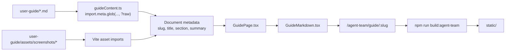

# User guide and in-app reader

Last updated: 2026-07-31 · [↩ index](../index.md)

Agent Team has a Vietnamese user guide for people who need to **understand,
configure, or use the product**, including BA, Product Owner, QA, developer,
operator, and administrator roles. Its Markdown source lives in `user-guide/`;
the React application compiles that same source into the in-app **Guide** reader.

## Why this is separate from the technical wiki

The technical wiki and the user guide answer different questions:

| Documentation layer | Path | Primary audience | Main question |
|---|---|---|---|
| Design briefs | `docs/plans/` | architects and implementers | Why was a feature proposed, and what alternatives were considered? |
| Technical wiki | `docs/wiki/` | maintainers and coding agents | What does the current code do, and where is it implemented? |
| User guide | `user-guide/` | any Agent Team user | What is this concept, what must I configure, and what do I click or verify? |

The user guide is intentionally more explanatory than this wiki. It introduces
ACP, MCP, OpenSandbox, `project-harness`, the engineering loop, notifications,
and verification evidence before asking the reader to configure them. It also
treats **Direct CLI chat in task detail as the primary daily workflow**, while
presenting the engineering loop as the higher-control option for work that needs
planning, independent evaluation, and auditable evidence.

These layers are related but are **not generated from each other**. Code remains
the source of truth. When behaviour changes, update both the relevant wiki page
and the affected user-guide chapter at the appropriate level of detail.

## Source and build pipeline

The browser does not fetch Markdown from the filesystem at request time. Vite
bundles the guide when the frontend is built:



The important consequence is: **editing `user-guide/*.md` requires a frontend
rebuild before the deployed UI changes**.

The main modules are:

| Module | Responsibility |
|---|---|
| `web-ui/src/features/guide/guideContent.ts` | Imports Markdown and screenshots, defines document order and route metadata, resolves internal links/images, creates heading anchors, and estimates reading time. |
| `web-ui/src/features/guide/GuidePage.tsx` | Page layout: chapter navigation, title search, article header, table of contents, previous/next links, mobile chapter selector, and landing page. |
| `web-ui/src/features/guide/GuideMarkdown.tsx` | Renders GFM Markdown, syntax-highlighted code, internal SPA links, external links, screenshots, and heading anchors. |
| `web-ui/src/features/guide/MermaidDiagram.tsx` | Loads the built Mermaid asset only when a diagram is present, then renders it for the active light/dark theme. |
| `web-ui/src/features/guide/guideContent.test.ts` | Guards document count/route uniqueness, relative Markdown links, screenshot imports, and unique heading anchors. |

`App.tsx` owns `/guide/start` and `/guide/:slug`. `NavRail.tsx` exposes Guide as
a top-level destination. The plugin's existing SPA mount and session
authentication protect these routes; the guide adds no separate backend endpoint
or database model.

## Content model

`user-guide/README.md` is the landing document. The other Markdown files are
chapters, and `user-guide/assets/screenshots/` contains their images.

The reader deliberately keeps presentation metadata in the frontend:

- `filename` identifies the Markdown source;
- `slug` provides a stable UI route;
- `title` and `summary` drive navigation and search;
- `section` groups chapters in the sidebar;
- array order controls the previous/next sequence.

The import glob finds files, but it does **not** automatically publish a new
chapter. A new Markdown file must also receive an entry in `definitions` inside
`guideContent.ts`. This explicit registration prevents unfinished notes from
silently appearing in the product.

Internal `.md` links are converted to SPA routes by filename. Screenshots are
converted to hashed Vite assets. `##` and `###` headings become in-page anchors
and the right-hand table of contents; their normalized IDs must be unique within
a chapter.

## Reader behaviour

The desktop reader uses three levels of navigation:

1. the product navigation selects **Guide**;
2. the guide sidebar selects a chapter and can filter by title/summary;
3. the optional right rail jumps to headings within the current chapter.

On smaller screens the chapter sidebar becomes a native select control and the
right-hand table of contents is hidden. The content, screenshots, tables, code,
and diagrams remain horizontally contained.

The landing page offers three paths — understand the system, set it up, or chat
directly with an agent — instead of forcing every role through one long
sequence. The daily-use section then separates:

- **Direct CLI chat:** a human drives Claude/Codex turn by turn in task detail,
  while sharing the task workspace, repositories, skills, MCP, transcript,
  context usage, run stream, and artifacts;
- **Engineering loop:** the controller coordinates planning, generator,
  commands, evaluator, evidence, and guardrails.

The Direct CLI chapter includes a real task-detail screenshot and documents
conversation History, Stop, and Reset. Reset archives the active conversation
but intentionally keeps the shared workspace unchanged.

The small `From Kevin with love 💙` signature appears on the landing hero and
below the Guide sidebar title as a low-distraction authorship accent. The full
visible phrase links to `https://github.com/kevin-bk`; a compact GitHub mark
makes the destination recognisable without displaying the raw URL.

Current limitations:

- sidebar search covers metadata (`title` + `summary`), not full Markdown text;
- content changes are build-time, not hot-published from the server;
- only registered chapters are reachable through the guide navigation;
- Mermaid is a relatively large asset, so it is loaded only when needed.

## How to update the guide safely

1. Edit the relevant file under `user-guide/`.
2. Put new screenshots under `user-guide/assets/screenshots/` and use a relative
   Markdown image link whose target starts with
   `assets/screenshots/`.
3. If adding or renaming a chapter, update `definitions` in
   `guideContent.ts`. Keep existing slugs stable when possible so shared links do
   not break.
4. Use relative `.md` links for other guide chapters. Keep `##`/`###` headings
   unique within the document.
5. Run:

   ```bash
   cd web-ui
   npm run typecheck
   npm run test
   npm run build:agent-team
   ```

6. Commit both the source changes and the regenerated `static/` bundle.
7. For a material workflow change, visually check desktop, mobile, light/dark
   mode, at least one screenshot chapter, and at least one Mermaid chapter.

When adding a chapter, also update the expected document count in
`guideContent.test.ts`. A test failure there is intentional: it forces the
maintainer to confirm that the public guide structure changed.

## Related

- Start reading the actual guide → [`../../../user-guide/README.md`](../../../user-guide/README.md)
- Frontend and build architecture → [`../architecture.md`](../architecture.md)
- General development workflow → [`../guides/development.md`](../guides/development.md)
- How to maintain this technical wiki → [`../guides/maintaining-the-wiki.md`](../guides/maintaining-the-wiki.md)
