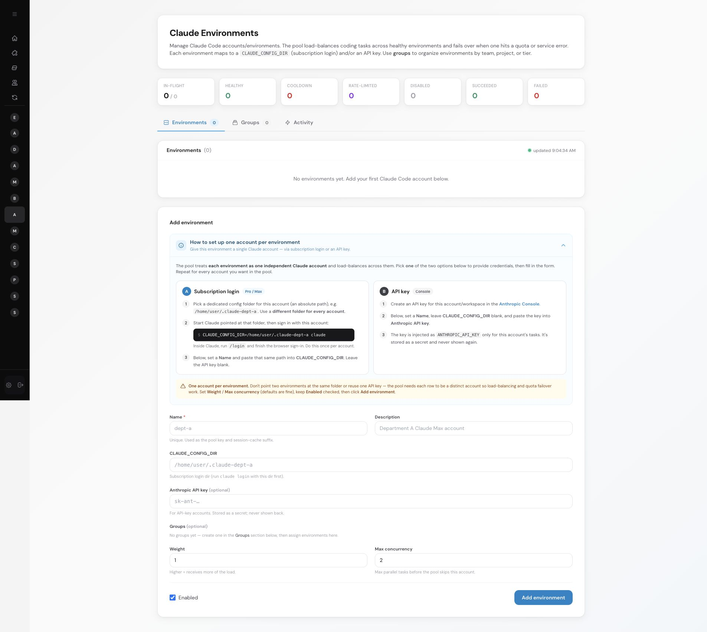
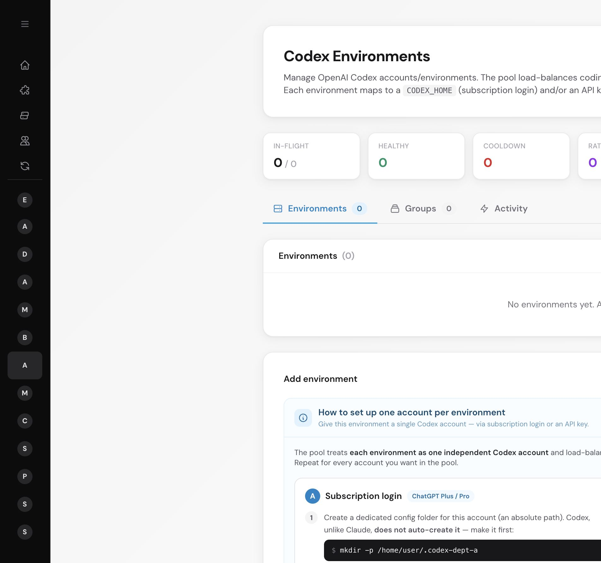
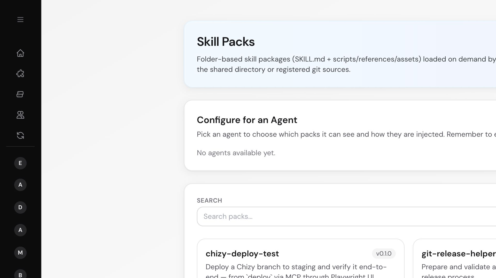
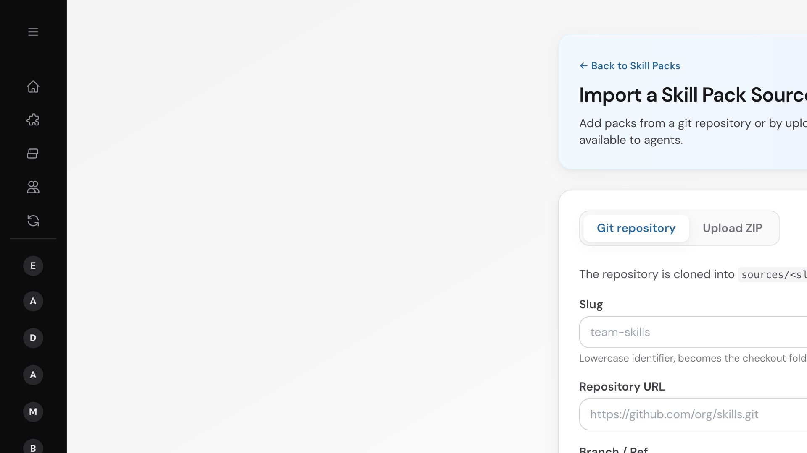

# Chuẩn bị trước task đầu tiên

> Dành cho: quản trị viên Agent Manager và trưởng nhóm kỹ thuật  
> Kết quả: hệ thống có agent lập trình, hướng dẫn kỹ thuật và môi trường đủ khả
> năng thực thi task.

## Bốn thành phần một task cần có

Có thể hình dung một tác vụ phát triển là một phòng làm việc đã được bố trí nhân
sự và công cụ:

| Thành phần | Cung cấp điều gì? | Cấu hình ở đâu? |
|---|---|---|
| Môi trường lập trình bằng AI | Tài khoản Claude Code hoặc Codex có thể suy luận, sửa file và chạy lệnh | Agent Manager → AI Code Factory |
| Skill pack | Hướng dẫn riêng của công ty như lập kế hoạch, triển khai và kiểm thử UI | Agent Manager → Skill Packs |
| Cấu hình board | Agent, skill, repository, MCP và quy tắc làm việc của dự án | Agent Team → Board |
| Môi trường thực thi | Máy hoặc môi trường chạy lệnh và công cụ lập trình | Máy chủ hoặc OpenSandbox |

Agent Team không khai báo hard dependency với AI Code hoặc Skill Packs trong
`PluginMeta`, vì vậy plugin vẫn có thể khởi động khi thiếu chúng. Tuy nhiên, trên
thực tế cả hai đều là điều kiện vận hành cần thiết cho luồng phát triển bằng
agent CLI trực tiếp được trình bày trong tài liệu này.

Nếu các khái niệm trong bảng còn mới, hãy đọc
[Agent Team theo cách dễ hiểu](02-agent-team-in-plain-language.md) trước khi làm
theo phần setup.

## 1. Bật các plugin cần thiết

Trong Agent Manager, mở **Plugins** và đảm bảo các plugin sau đã được bật:

- `agent_team`
- `ai_code`
- `skill_packs`

Sau khi cài plugin mới, hãy khởi động lại Agent Manager để hệ thống nhận diện
route, model và công cụ của plugin. Agent Manager tự chạy các database migration
của plugin khi khởi động.

Máy chạy Agent Manager cũng cần có lệnh tương ứng:

- Claude ACP mặc định: `npx -y @agentclientprotocol/claude-agent-acp`
- Codex ACP mặc định: `npx -y @agentclientprotocol/codex-acp`
- Cursor ACP mặc định: `cursor-agent acp`

UI Agent Team đánh dấu engine là không khả dụng khi không tìm thấy lệnh khởi chạy
trên máy chủ. Nếu chạy cách ly, image OpenSandbox cũng phải chứa CLI và dependency
ACP tương ứng.

## 2. Chuẩn bị môi trường Claude Code

Mở **AI Code Factory → Claude Environments**.



> **Khuyến nghị về chi phí:** ưu tiên đăng nhập bằng tài khoản Claude
> subscription thay vì sử dụng API key. Với khối lượng coding agent chạy thường
> xuyên, subscription thường tối ưu chi phí hơn rất nhiều so với API tính tiền
> theo token. Hãy sử dụng tài khoản và mức concurrency phù hợp với điều khoản,
> giới hạn của gói mà công ty đã đăng ký.

Với tài khoản subscription, sử dụng một thư mục riêng cho từng tài khoản:

```bash
mkdir -p /home/agent-manager/.claude-team-a
CLAUDE_CONFIG_DIR=/home/agent-manager/.claude-team-a claude
```

Trong Claude Code, chạy `/login` và hoàn tất đăng nhập trên trình duyệt. Sau đó
thêm môi trường trong Agent Manager:

- **Name:** tên vận hành duy nhất, ví dụ `team-a-claude`
- **CLAUDE_CONFIG_DIR:** đúng đường dẫn tuyệt đối đã dùng khi login
- **API key:** để trống nếu đăng nhập bằng gói thuê bao
- **Weight / Max concurrency:** ban đầu có thể giữ giá trị mặc định
- **Enabled:** bật

Không để hai bản ghi môi trường trỏ vào cùng một thư mục đăng nhập.

## 3. Chuẩn bị môi trường Codex

Mở **AI Code Factory → Codex Environments**.



Tương tự Claude, nên ưu tiên tài khoản ChatGPT/Codex subscription thay vì OpenAI
API key cho coding workload thường xuyên. API key phù hợp hơn khi công ty cần
billing theo mức sử dụng, quota API riêng hoặc một luồng không được subscription
hỗ trợ.

Codex không tự tạo custom `CODEX_HOME`, vì vậy cần tạo thư mục trước:

```bash
mkdir -p /home/agent-manager/.codex-team-a
CODEX_HOME=/home/agent-manager/.codex-team-a codex login
```

Sau khi hoàn tất đăng nhập trên trình duyệt, thêm môi trường:

- **Name:** ví dụ `team-a-codex`
- **CODEX_HOME:** đường dẫn tuyệt đối đã dùng khi login
- **OpenAI API key:** để trống nếu đăng nhập bằng gói thuê bao
- **Weight / Max concurrency:** ban đầu có thể giữ giá trị mặc định
- **Enabled:** bật

### Điểm khác nhau quan trọng giữa các môi trường thực thi

Khi Agent Team chạy task:

- **Môi trường cục bộ:** tiến trình con ACP chạy trên máy chủ Agent Manager và sử
  dụng thông tin đăng nhập/cấu hình hiện có của tiến trình trên máy chủ.
- **Môi trường OpenSandbox:** Agent Team đọc các môi trường Claude/Codex đang bật
  từ AI Code Factory và mount `config_dir` của chúng vào sandbox của task.

Cơ chế chuyển tiếp thông tin xác thực vào sandbox hiện dựa trên thư mục đăng
nhập, không dựa trên trường API key lưu trong môi trường AI Code. Vì vậy, với
OpenSandbox, khuyến nghị đăng nhập bằng gói subscription với
`CLAUDE_CONFIG_DIR` hoặc
`CODEX_HOME` hợp lệ. Môi trường dùng API key vẫn hữu ích cho pool riêng của
plugin AI Code, nhưng trong luồng OpenSandbox hiện tại không nên coi nó là
phương án thay thế cho thư mục đăng nhập được mount.

## 4. Import các skill pack cần thiết

Mở **Skill Packs**. Catalog cần có tất cả skill mà board dự kiến sử dụng.



Tối thiểu nên import:

- `project-harness`: hướng dẫn planner lựa chọn độ sâu nghiên cứu và cấu trúc
  `SPEC.md`, `PLAN.md`.
- Các pack riêng của dự án, ví dụ `chizy-deploy-test`, mô tả quy trình deploy và
  việc xác minh xuyên suốt.

Chọn **Import Source** để thêm Git repository hoặc file ZIP:



Mỗi folder có `SKILL.md` hợp lệ sẽ trở thành một pack. Git source có thể sync
lại; ZIP source phải được thay thế khi cập nhật. Git source private có thể sử
dụng HTTPS token hoặc SSH private key được Agent Manager lưu trữ.

`project-harness` là tên planning skill mặc định. Chỉ có source folder trong
`community_plugins/` là chưa đủ: pack phải xuất hiện trong catalog của Skill
Packs. Nếu pack bị thiếu, planning vẫn dùng hướng dẫn fallback tích hợp sẵn,
nhưng agent sẽ không có các chỉ dẫn chi tiết theo project.

Xem [`project-harness`: skill hay repository?](11-project-harness.md) để hiểu vì
sao phải import repository này qua Skill Packs thay vì chỉ gán nó vào board.

## 5. Kiểm tra trạng thái sẵn sàng

Trước khi tiếp tục, hãy xác nhận:

- Claude hoặc Codex chạy được trong môi trường thực thi dự kiến.
- Môi trường AI Code đang bật trỏ đến thư mục đăng nhập tồn tại nếu dùng
  OpenSandbox.
- `project-harness` xuất hiện trong catalog Skill Packs.
- Các pack riêng của dự án xuất hiện trong catalog.
- Agent Team mở thành công và hiển thị **Boards**, **Repositories**,
  **Channels** và **Sandboxes**.

Tiếp theo: [Thiết lập dành cho quản trị viên](03-administrator-setup.md).
