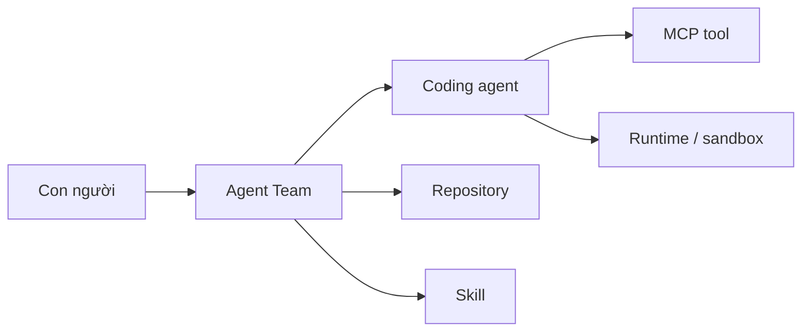
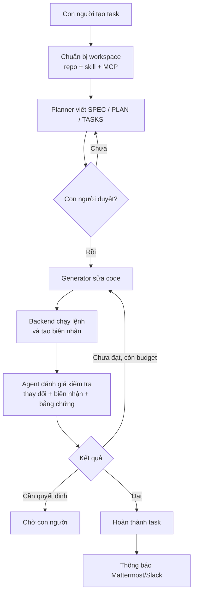

# Agent Team theo cách dễ hiểu

> Dành cho: người chưa từng sử dụng Agent Team  
> Kết quả: hiểu Agent Team giải quyết vấn đề gì và một task đi qua hệ thống ra
> sao, chưa cần biết chi tiết kỹ thuật.

## Bắt đầu bằng một ví dụ

Giả sử Chizy cần thêm một thiết lập mới trên trang quản trị Shopify.

Nếu chỉ mở Claude Code và gửi yêu cầu, coding agent có thể:

1. đọc repository;
2. sửa code;
3. chạy một vài test;
4. trả lời “đã hoàn thành”.

Nhưng với một công ty, vẫn còn nhiều câu hỏi:

- Agent đã làm đúng branch chưa?
- Nó đã đọc đủ repository liên quan chưa?
- Ai duyệt phạm vi trước khi code?
- Lệnh test nào thực sự đã chạy?
- UI có được mở trên trình duyệt thật không?
- Ảnh chụp màn hình có chứng minh đúng hành vi không?
- Nếu agent thất bại, ai yêu cầu nó sửa tiếp?
- Khi cần quyết định sản phẩm, ai được thông báo?
- Sau một tuần, có thể xem lại vì sao task được coi là hoàn thành không?

Agent Team là lớp quản trị giải quyết những câu hỏi đó.

## Agent Team không phải là coding agent

Agent Team không thay thế Claude Code hoặc Codex. Có thể hình dung một nhóm phát
triển như sau:

| Ngoài đời | Trong hệ thống |
|---|---|
| Văn phòng/công ty | Agent Manager |
| Phòng dự án và bảng công việc | Agent Team |
| Lập trình viên | Claude Code, Codex hoặc Cursor |
| Sổ tay quy trình | Skill pack |
| Repository Git | Mã nguồn sản phẩm |
| Máy làm việc riêng | OpenSandbox |
| Công cụ deploy/database/browser | MCP server |
| Kênh báo việc | Mattermost hoặc Slack |

Agent Team tổ chức những thành phần này thành một quy trình có thể theo dõi và
kiểm chứng.

## Hai cách làm việc chính

Phần lớn người dùng bắt đầu bằng **Direct CLI chat**: mở task detail, chọn Claude
hoặc Codex rồi gửi yêu cầu theo từng lượt. Agent làm việc trực tiếp trong
workspace của task; con người xem kết quả và quyết định bước tiếp theo.

Khi task có nhiều bước, rủi ro cao hoặc cần bằng chứng kiểm thử có thể audit,
người dùng có thể chạy **engineering loop**. Lúc đó controller điều phối plan,
generator, command test và evaluator theo quy tắc đã cấu hình.

```text
Direct CLI chat  = con người ở trong vòng phản hồi
Engineering loop = hệ thống tự chạy vòng phản hồi có guardrail
```

Hai chế độ dùng chung board, task, workspace, repository, skill và MCP. Xem
[Chat trực tiếp với Claude hoặc Codex](15-direct-cli-chat.md) để bắt đầu với
workflow phổ biến nhất.

## Sáu thành phần tối thiểu



### 1. Con người

Con người viết mục tiêu, duyệt kế hoạch và xử lý quyết định mà AI không nên tự
đoán. Ví dụ: có được thay đổi database schema hay không.

### 2. Agent Team

Agent Team lưu board, task, plan, lượt chạy, bằng chứng và trạng thái. Nó điều
phối ai làm bước nào.

### 3. Coding agent

Claude Code, Codex hoặc Cursor trực tiếp đọc file, sửa code và chạy tool.

### 4. Repository

Đây là mã nguồn thật. Agent Team tạo bản sao làm việc riêng cho mỗi task trên
branch `agent/<task-key>`.

### 5. Skill

Skill là bộ hướng dẫn. Ví dụ `project-harness` dạy agent cách phân loại rủi ro
và viết kế hoạch; skill deploy/test của Chizy dạy cách deploy và kiểm tra UI.

### 6. Runtime và MCP

Runtime là nơi agent chạy. MCP là công cụ cho agent đi ra ngoài runtime, chẳng
hạn gọi deploy API hoặc lấy browser session.

## Board khác task như thế nào?

### Board

Board là cấu hình lâu dài của một sản phẩm hoặc team:

- repository nào thường được dùng;
- agent nào được phép làm việc;
- skill nào áp dụng;
- MCP nào được cấp;
- quy tắc lập kế hoạch;
- kênh thông báo.

Ví dụ: board `Chizy Development`.

### Task

Task là một yêu cầu cụ thể nằm trên board:

> Thêm setting bật/tắt transcript email cho từng shop.

Task có không gian làm việc, branch, kế hoạch, lịch sử agent, biên nhận kiểm thử
và bằng chứng riêng.

```text
Board Chizy Development
├── cấu hình dùng lại
│   ├── repositories
│   ├── Claude/Codex
│   ├── skills
│   ├── MCP
│   └── notification channel
└── tasks
    ├── CHIZY-101
    ├── CHIZY-102
    └── CHIZY-103
```

## Một task đi qua hệ thống như thế nào?

### Bước 1: con người tạo task

Người dùng mô tả kết quả cần đạt, giới hạn và tiêu chí chấp nhận. Không cần chỉ
cho agent từng file phải sửa.

### Bước 2: Agent Team chuẩn bị phòng làm việc

Hệ thống tạo workspace riêng, clone repository, đưa skill vào và cấu hình MCP.
Nếu dùng OpenSandbox, hệ thống tạo hoặc resume sandbox của task.

### Bước 3: agent lập kế hoạch nghiên cứu và viết kế hoạch

Agent lập kế hoạch (planner) là một vai trò của coding agent. Nó đọc code/wiki,
viết:

- `SPEC.md`: thế nào được coi là đúng;
- `PLAN.md`: dự định làm ra sao;
- `TASKS.json`: các phần việc và lệnh kiểm tra.

### Bước 4: con người phê duyệt

Con người kiểm tra scope, rủi ro và cách xác minh. Nếu chưa đúng, yêu cầu planner
sửa lại.

### Bước 5: agent triển khai sửa code

Agent triển khai (generator) là coding agent ở vai trò thực thi. Nó sửa code
theo kế hoạch đã duyệt.

### Bước 6: backend chạy kiểm tra

Backend chạy đúng lệnh đã được duyệt và tạo biên nhận lệnh (command receipt).
Biên nhận có thông tin mã nguồn, môi trường chạy, mã thoát và thời điểm.

### Bước 7: agent đánh giá kiểm tra độc lập

Agent đánh giá (evaluator) là một lượt agent khác. Nó kiểm tra thay đổi mã nguồn
và bằng chứng, không chỉ tin phần tóm tắt của agent triển khai.

### Bước 8: hoàn thành, sửa tiếp hoặc chờ người

- Đủ bằng chứng: hoàn thành.
- Chưa đạt nhưng còn giới hạn cho phép: gửi phản hồi cho agent triển khai sửa
  tiếp.
- Cần quyết định hoặc hết giới hạn: dừng và thông báo cho con người.

## Sơ đồ luồng đầy đủ



## Ba mức kiểm soát khi sử dụng Agent Team

| Cách | Có duyệt kế hoạch? | Có vòng đánh giá? | Dùng khi |
|---|---:|---:|---|
| Direct CLI chat nhiều lượt | Không bắt buộc | Không | Hỏi đáp, nghiên cứu, pair-work và thay đổi nhỏ/vừa |
| Lập kế hoạch nghiêm ngặt | Có | Tùy cách chạy | Cần duyệt phạm vi trước khi code |
| Vòng lặp tự động | Có | Có | Muốn agent tự sửa theo phản hồi đến khi đạt hoặc chạm quy tắc an toàn |

Ba cách tồn tại song song. Board bật lập kế hoạch nghiêm ngặt không làm mất khả
năng chat thông thường.

## Những gì được lưu lại

Agent Team không chỉ lưu transcript:

```text
Task
├── yêu cầu và attachment
├── repository working copy
├── agent conversation và run events
├── .agent-team/
│   ├── INTAKE.json
│   ├── SPEC.md
│   ├── PLAN.md
│   ├── TASKS.json
│   ├── EVIDENCE.json
│   └── VERIFICATION_RECEIPTS.json
├── ảnh chụp màn hình / báo cáo / tệp bằng chứng
└── nhật ký: quyết định, câu hỏi, vấn đề quy trình, kết luận
```

Nhờ vậy, người khác có thể xem lại task dựa trên kế hoạch và bằng chứng, thay vì
đọc hàng nghìn dòng chat.

## Năm điều cần nhớ

1. Agent Team là lớp điều phối, không phải model AI.
2. Repository chứa code; skill chứa hướng dẫn.
3. ACP nối Agent Team với coding agent; MCP nối coding agent với tool ngoài.
4. Agent triển khai viết code nhưng không tự quyết định “hoàn thành”.
5. Backend chỉ hoàn thành task sau khi agent đánh giá và cổng kiểm soát bằng
   chứng chấp nhận.

Tiếp theo: [`project-harness`: skill hay repository?](11-project-harness.md).
