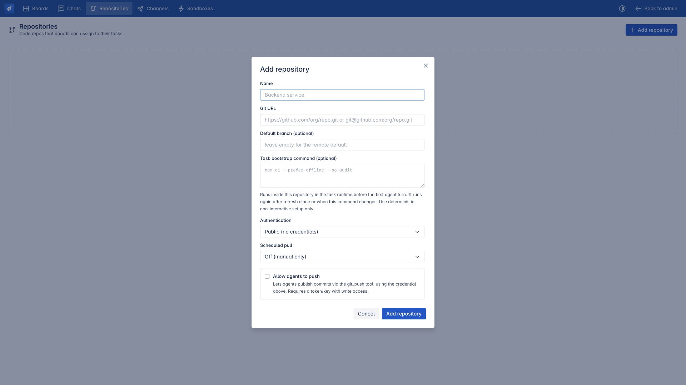

# Thiết lập dành cho quản trị viên

> Dành cho: quản trị viên Agent Manager  
> Kết quả: cấu hình các tài nguyên có thể tái sử dụng mà board và task phụ thuộc.

Hãy hoàn thành [Chuẩn bị trước task đầu tiên](01-before-the-first-task.md) trước
khi đọc trang này.

## Thứ tự thiết lập

Nên làm theo thứ tự dưới đây vì mỗi bước sau tham chiếu đến tài nguyên được tạo ở
bước trước:

```text
Bật plugin
    ↓
Chuẩn bị môi trường đăng nhập Claude/Codex
    ↓
Import và sync skill pack
    ↓
Cấu hình OpenSandbox nếu cần
    ↓
Đăng ký code repository
    ↓
Tạo notification connection nếu cần
    ↓
Tạo board
    ↓
Gán CLI agent, skill và MCP cho board
```

## Đăng ký repository

Mở Agent Team → **Repositories** → **Add repository**.



Cấu hình:

- **Name:** tên dễ hiểu đối với người dùng.
- **Git URL:** HTTPS hoặc SSH clone URL.
- **Default branch:** để trống để sử dụng default branch của remote.
- **Task bootstrap command:** lệnh chuẩn bị có kết quả ổn định và không
  tương tác, ví dụ `npm ci --prefer-offline --no-audit`.
- **Authentication:** public, token hoặc SSH tùy repository.
- **Scheduled pull:** điều khiển việc refresh canonical clone.
- **Allow agents to push:** chỉ bật khi thông tin xác thực có quyền ghi và agent được
  phép publish task branch.

Agent Team duy trì một bản sao Git chuẩn và tạo một bản sao cục bộ riêng cho từng
task. Bản sao của task sử dụng branch `agent/<task-key>`. Quy tắc bảo vệ trước
khi push sẽ từ chối push vào branch mặc định.

Lệnh chuẩn bị chạy bên trong repository đó, trong môi trường thực thi của task,
sau khi tạo bản sao mới; nó cũng chạy lại khi lệnh bị thay đổi. Lệnh này nên cài
đặt dependency, không nên khởi động dịch vụ chạy lâu hoặc yêu cầu nhập liệu
tương tác.

## Cấu hình runtime

Provider mặc định là `local`, trong đó agent CLI trực tiếp chạy trên máy chủ của
Agent Manager. Để tăng mức cách ly, hãy cấu hình OpenSandbox ở cấp hệ thống và
ghi đè profile theo board nếu cần.

Cấu hình khuyến nghị cho môi trường production:

- provider: `opensandbox`
- strategy: `acp_sidecar` để có đầy đủ ACP streaming và MCP passthrough
- workspace mode: `mount`
- strict isolation: bật
- image có Claude/Codex, Node, Git, bộ công cụ kiểm thử và công cụ trình duyệt mà dự án
  yêu cầu

Xem [Môi trường thực thi và sandbox](08-runtime-and-sandbox.md) để hiểu vòng đời
và các biến môi trường.

## Phân biệt skill catalog và skill được chọn cho board

Import một pack chỉ làm cho pack đó **khả dụng**. Pack không tự động được gán cho
mọi board.

Khi chạy task, Agent Team:

1. đọc danh sách tên skill được chọn trên board;
2. luôn bổ sung planning skill của board, mặc định là `project-harness`;
3. tìm các tên đó trong danh mục Skill Packs;
4. sao chép từng pack vào `.claude/skills/` và `.cursor/skills/`;
5. quảng bá chúng trong task brief để Codex và các engine khác tìm được.

Pack bị thiếu sẽ được bỏ qua thay vì làm run crash. Cơ chế graceful này hữu ích
cho vận hành, nhưng đồng nghĩa quản trị viên phải kiểm tra catalog thay vì trông
chờ việc thiếu skill sẽ tự động chặn task.

Để hiểu đầy đủ đường đi từ Git repository tới task workspace, xem
[`project-harness`: skill hay repository?](11-project-harness.md).

## Tạo notification connection

Nếu team muốn nhận thông báo trong Mattermost hoặc Slack:

1. mở Agent Team → **Channels**;
2. tạo một connection dùng bot token;
3. cấu hình public deep-link URL của Agent Manager;
4. sau khi board được tạo, owner của board liên kết connection đó với Channel
   ID đích.

Connection là credential dùng chung; board channel là cấu hình gửi thông báo
riêng của từng board. Xem
[Cấu hình notification channels](14-notification-channels.md) để biết các scope,
event, mention và bước gửi thử.

## Ranh giới bảo mật

- Thư mục đăng nhập của công cụ AI và thông tin xác thực repository là tài
  nguyên do quản trị viên quản lý, không phải nội dung của task.
- Bí mật MCP được che khỏi đầu ra ACP trong phạm vi hệ thống có thể xử lý.
- Repository push vẫn bị kiểm soát bởi policy ở cả repository và board.
- Cơ chế cách ly nghiêm ngặt của OpenSandbox phải dừng an toàn, không được âm thầm chạy trên
  host.
- Biên nhận lệnh do backend/môi trường thực thi tạo, không phải phần tóm tắt do
  agent tự viết.

Tiếp theo: [Tạo board đầu tiên](04-create-your-first-board.md).
