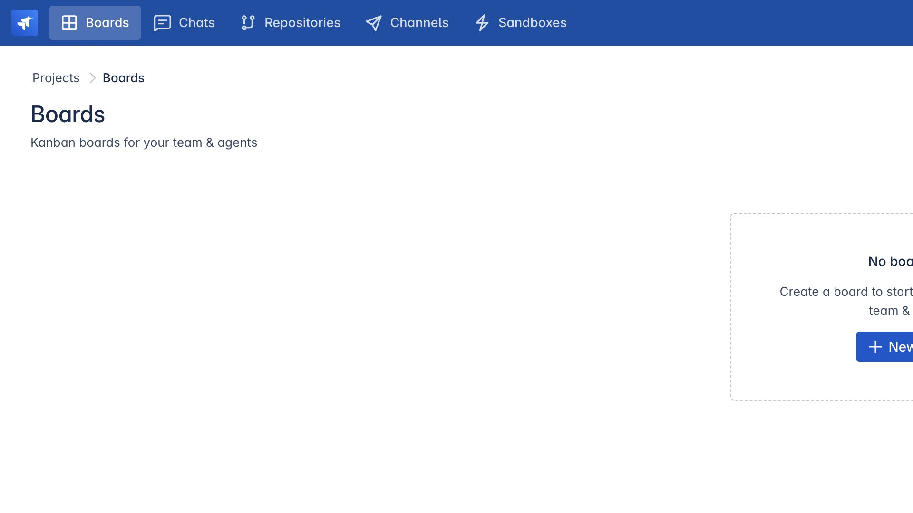
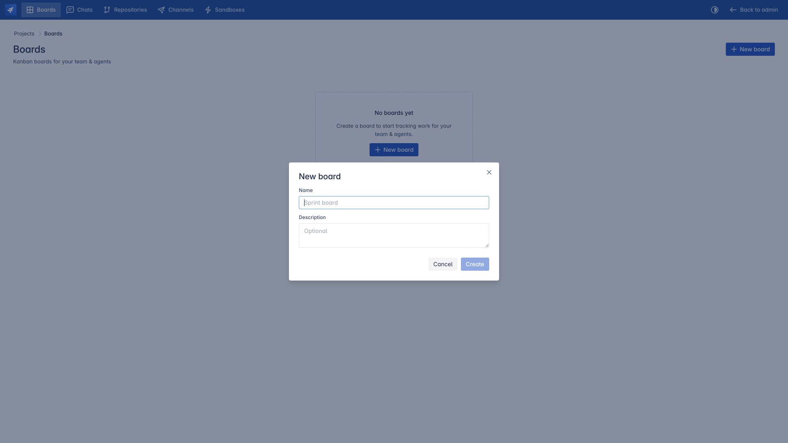

# Tạo board đầu tiên

> Dành cho: quản trị viên, Product Owner và trưởng nhóm  
> Kết quả: một board sẵn sàng tiếp nhận tác vụ phát triển.

## 1. Tạo board

Mở Agent Team → **Boards** → **New board**.

Đặt tên board theo một sản phẩm hoặc luồng công việc lâu dài, không nên đặt theo một
ticket đơn lẻ. Thêm mô tả ngắn để thành viên mới có thể hiểu phạm vi của board.

## 2. Gán repository

Mở phần repository settings của board và chọn những repository agent thường cần
để xử lý task. Chỉ gán repository có liên quan: mỗi repo được chọn sẽ được chuẩn
bị trong không gian làm việc của mọi task và trở thành một phần bối cảnh lập kế
hoạch.

Với sản phẩm có nhiều repository, có thể bao gồm ứng dụng chính, dịch vụ backend,
bộ khung kiểm thử, công cụ triển khai và repository kiến thức dự án khi agent
thực sự cần đến chúng.

## 3. Gán agent cho board

Mở **Board agents** và chọn một hoặc nhiều engine CLI trực tiếp:

- Claude
- Codex
- Cursor, khi đã cài đặt và được runtime hỗ trợ

Agent CLI trực tiếp được biểu diễn nội bộ bằng `cli:claude`, `cli:codex` và
`cli:cursor`. Chúng chạy không qua một LangGraph/LLM orchestrator riêng và duy
trì ACP conversation session của chính mình.

Bạn cũng có thể gán agent thông thường của Agent Manager. Agent thông thường
chạy qua môi trường LLM graph; hiện tại chỉ agent CLI trực tiếp đi qua worker
sandbox cách ly.

## 4. Chọn skill

Chọn các pack cần thiết cho sản phẩm. Một số lựa chọn phổ biến:

- `project-harness` cho độ sâu lập kế hoạch, phân loại rủi ro và tệp bền vững;
- pack triển khai/kiểm thử của ứng dụng;
- hướng dẫn kỹ thuật riêng cho repository hoặc nền tảng.

Skill lập kế hoạch vẫn được đưa vào workspace ngay cả khi không được chọn thêm
trong danh sách skill thông thường. Tuy nhiên, chọn rõ ràng vẫn hữu ích vì giúp
người vận hành dễ hiểu cấu hình của board.

## 5. Cấu hình MCP theo từng CLI agent

MCP cấp cho agent lập trình quyền truy cập có kiểm soát vào khả năng bên ngoài,
ví dụ:

- triển khai;
- đọc cơ sở dữ liệu bằng tài khoản chỉ đọc;
- tự động hóa trình duyệt;
- theo dõi vấn đề;
- công cụ vận hành riêng của dự án.

MCP được cấu hình theo từng agent CLI vì các engine có thể dùng phương thức kết
nối hoặc quyền khác nhau. Agent Team chấp nhận cấu trúc JSON `mcpServers` tiêu
chuẩn. Stdio server sử dụng `command` và `args`; remote server sử dụng `url` và
có thể kèm HTTP header dùng để xác thực.

Không đưa bí mật trực tiếp vào mô tả task. Nên dùng biến môi trường/header của MCP
server và cơ chế lưu thông tin xác thực của nền tảng.

## 6. Cấu hình quy tắc lập kế hoạch

Trong **Board settings → Planning**:

- thêm quy ước của nhóm mà agent lập kế hoạch, đánh giá, triển khai và xác minh
  đều phải tuân theo;
- chọn skill lập kế hoạch hoặc để mặc định là `project-harness`;
- giữ tính năng tự phê duyệt cho luồng nhanh ở trạng thái tắt cho đến khi nhóm đủ tin tưởng
  quy trình intake và review.

Quy ước của nhóm có thể nâng mức kiểm tra hoặc quy định cấu trúc tài liệu, nhưng
không thể đổi tên tệp do backend quản lý hoặc thay đổi JSON schema của chúng.

## 7. Cấu hình notification channel

Nếu muốn nhận thông báo khi task cần phê duyệt, cần trả lời hoặc đã hoàn thành:

1. chọn **Channel** trên board;
2. chọn connection do quản trị viên đã tạo;
3. nhập Channel ID;
4. chọn loại event, cách mention và chế độ gom thread;
5. lưu rồi chọn **Send test**.

Xem [Cấu hình notification channels](14-notification-channels.md) để phân biệt
connection dùng chung với channel riêng của board.

## Checklist sẵn sàng của board

Board sẵn sàng khi:

- có ít nhất một CLI agent khả dụng;
- các repository cần thiết đã được gán;
- các skill pack cần thiết đã được chọn và tồn tại trong catalog;
- có `project-harness` hoặc planning skill khác;
- các MCP cần thiết đã được cấu hình;
- môi trường thực thi và thông tin xác thực tương thích với nhau;
- thành viên biết ai có quyền phê duyệt kế hoạch.
- notification channel gửi thử thành công, nếu board sử dụng notification.

Tiếp theo: [Chạy task đầu tiên](05-run-your-first-task.md).
