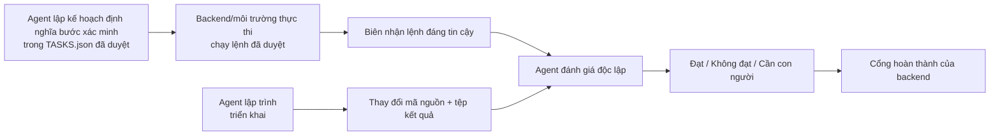

# Kiểm thử và xác minh

> Dành cho: QA, lập trình viên, trưởng nhóm và Product Owner  
> Kết quả: phân biệt được lời khẳng định của agent với bằng chứng đáng tin cậy.

## Chuỗi xác minh

## Ai định nghĩa các command?

Agent lập kế hoạch đề xuất các lệnh xác minh trong `TASKS.json`. Con người đánh
giá và phê duyệt kế hoạch đó. Trong chế độ thực thi nghiêm ngặt, backend chỉ tìm
và chạy các lệnh đã được phê duyệt.

Vì vậy:

- agent lập kế hoạch đề xuất;
- con người cấp quyền bằng cách phê duyệt kế hoạch;
- backend/môi trường thực thi chạy lệnh;
- agent đánh giá xem xét kết quả.

Agent lập trình không thể tự tạo ra một kết quả lệnh thành công sau khi lập trình xong
rồi coi đó là bằng chứng.

## Biên nhận lệnh (command receipt)

Biên nhận lệnh là bản ghi do backend tạo để chứng minh:

- lệnh nào đã được phê duyệt và thực thi;
- lệnh chạy trong repository và thư mục làm việc nào;
- mã thoát và kết quả;
- trạng thái mã nguồn nào đã được kiểm thử;
- môi trường thực thi/sandbox nào đã chạy lệnh.

Biên nhận được gắn với Git HEAD, dấu vân tay của mã nguồn chưa commit và dấu vân
tay môi trường thực thi. Nếu mã nguồn thay đổi sau khi lệnh chạy thành công,
biên nhận trở nên lỗi thời và
không thể hỗ trợ việc hoàn thành task.

`VERIFICATION_RECEIPTS.json` là bản trình bày thuận tiện cho agent đánh giá đọc.
Bản ghi biên nhận trong cơ sở dữ liệu vẫn là nguồn có thẩm quyền.

## Kiểm thử có kết quả ổn định

Đây là các lệnh kiểm thử có kết quả có thể tái hiện:

- kiểm thử đơn vị;
- kiểm thử tích hợp;
- kiểm tra kiểu dữ liệu;
- lint;
- lệnh build;
- kiểm tra schema;
- kiểm tra tập trung vào API.

Các lệnh này phải không yêu cầu tương tác và phải chạy từ repository được khai
báo trong kế hoạch task đã phê duyệt.

## Xác minh UI và E2E

Build thành công là chưa đủ đối với thay đổi UI. Hồ sơ xác minh UI nên bao gồm:

- kịch bản người dùng có tên rõ ràng;
- một lần chạy trên trình duyệt thật;
- ảnh chụp màn hình hoặc tệp khác trong workspace;
- khẳng định kiểm thử về hành vi nhìn thấy được;
- kiểm tra console/network phù hợp;
- liên kết rõ giữa kịch bản và tiêu chí chấp nhận.

Với Chizy, luồng phổ biến là:

1. triển khai branch của task bằng Chizy deployment MCP;
2. chuẩn bị phiên trình duyệt đã xác thực theo skill triển khai/kiểm thử;
3. mở embedded Shopify admin hoặc storefront;
4. thực hiện kịch bản chấp nhận;
5. lưu ảnh chụp màn hình và kết quả kiểm thử vào workspace của task;
6. tham chiếu các tệp đó trong `EVIDENCE.json`.

Phiên đã xác thực được công cụ của dự án chuẩn bị từ trạng thái lưu trữ do con
người ghi lại. Agent không nên tự động hóa trang đăng nhập Shopify có CAPTCHA
hoặc 2FA.

## Agent đánh giá và kết luận

Agent đánh giá phải giả định task vẫn còn lỗi cho đến khi bằng chứng chứng minh
điều ngược lại. Agent đánh giá kiểm tra:

- phạm vi và tiêu chí chấp nhận đã được phê duyệt;
- thay đổi mã nguồn;
- biên nhận lệnh còn hiệu lực;
- ánh xạ từ từng tiêu chí đến bằng chứng;
- kịch bản UI/AI khi được yêu cầu;
- tệp trong workspace được tham chiếu.

Một kết luận `pass` không có bằng chứng xác minh sẽ bị hạ xuống. Biên nhận lỗi
hoặc đã cũ, tiêu chí không được ánh xạ, thiếu kịch bản UI hoặc tệp không tồn
tại/không an toàn cũng có thể khiến kết luận đạt bị hạ xuống.

Khi không đạt, bản tóm tắt bằng chứng được gửi lại cho agent triển khai ở lần thử
tiếp theo. Khi hết số lần thử hoặc giới hạn tài nguyên, task chuyển sang chờ con
người đánh giá thay vì âm thầm kết thúc.

## Phân biệt nhật ký, biên nhận và kết luận

| Bản ghi | Ý nghĩa đơn giản | Nguồn có thẩm quyền |
|---|---|---|
| Nhật ký (journal) | Vì sao task đi theo một hướng nhất định | Lịch sử theo ngữ nghĩa do backend quản lý |
| Biên nhận lệnh | Bằng chứng lệnh đã phê duyệt thực sự được chạy | Backend/môi trường thực thi |
| Bằng chứng (evidence) | Ánh xạ có cấu trúc từ tiêu chí đến bằng chứng | Agent đánh giá viết, backend kiểm tra |
| Kết luận (verdict) | Kết luận của agent đánh giá | Đề xuất của agent đánh giá kết hợp cổng kiểm soát backend |

Tiếp theo: [Môi trường thực thi và sandbox](08-runtime-and-sandbox.md).

Để xem receipt/evidence nằm ở đâu trong toàn bộ vòng lặp, đọc
[Engineering loop trong Agent Team](13-engineering-loop.md).
