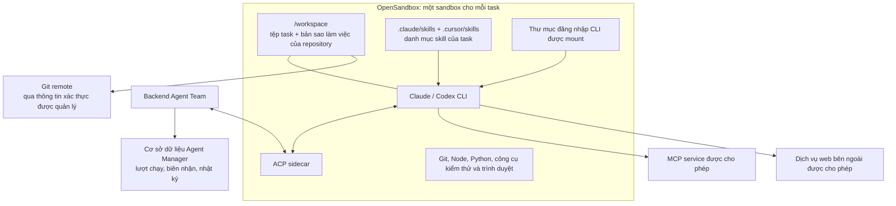

# Môi trường thực thi và sandbox

> Dành cho: quản trị viên, lập trình viên và người đánh giá bảo mật  
> Kết quả: hiểu agent chạy ở đâu và giao tiếp với hệ thống bên ngoài như thế nào.

Trang này tập trung vào cấu hình vận hành. Nếu cần phần giải thích nhập môn về
ACP, MCP, lý do chọn protocol và vai trò của OpenSandbox, hãy đọc
[ACP và OpenSandbox](12-acp-and-opensandbox.md) trước.

## Chạy cục bộ và OpenSandbox

| Môi trường | CLI chạy ở đâu? | Phù hợp với |
|---|---|---|
| `local` | Trên máy chủ Agent Manager | Phát triển và môi trường được tin cậy |
| `opensandbox` | Trong một sandbox cách ly riêng cho mỗi task | Production, mã nguồn không hoàn toàn tin cậy và nhu cầu phân tách mạnh hơn |

Chỉ agent CLI trực tiếp (`cli:claude`, `cli:codex`, `cli:cursor`) đi qua worker
cách ly. Agent LLM graph thông thường chạy trong tiến trình Agent Manager.

## Cách nhanh nhất: dùng image đã chuẩn bị sẵn

Trên Docker host chạy OpenSandbox, có thể pull trước image sau (OpenSandbox cũng
có thể tự pull khi tạo sandbox lần đầu):

```bash
docker pull k3v1nbk/agent-team-sandbox:latest
```

Image này đã chuẩn bị:

- Node.js và npm/npx;
- Python và các công cụ package phổ biến;
- Git cùng các command-line utility cần cho coding task;
- Claude Code và Codex CLI;
- ACP sidecar dùng cho strategy `acp_sidecar`;
- các thành phần hỗ trợ test và browser automation của runtime đầy đủ.

Đây là lựa chọn khuyến nghị để bắt đầu vì không cần tự lắp đặt lại toolchain.
Image không chứa tài khoản Claude/Codex của bạn: Agent Team vẫn mount thư mục
đăng nhập subscription được cấu hình trong AI Code Factory.

Nếu công ty cần thêm system package, pin phiên bản CLI hoặc áp dụng hardening
riêng, có thể build một image mới từ tài liệu tham khảo có sẵn:

```bash
# Chạy từ root của plugin agent_team
./scripts/build-runtime-images.sh full

# Build và push lên registry riêng
REGISTRY=<dockerhub-user> PUSH=1 ./scripts/build-runtime-images.sh full
```

Script sử dụng `infra/runtime/images/full.Dockerfile`, tạo cả tag versioned và
`:latest`. Nên giữ `BUILD_PLATFORM=linux/amd64` khi OpenSandbox server chạy trên
amd64.

## Bên trong một task sandbox có gì?



## Vòng đời của sandbox

Agent Team tái sử dụng một sandbox cho tất cả lượt làm việc của cùng một task:

```text
open → running → paused → resumed → paused
  └──────────── kill / idle GC / server TTL ────────────┘
```

- Sandbox được tạo ở lượt làm việc cách ly đầu tiên.
- Sau mỗi lượt, sandbox được tạm dừng và tiếp tục ở lượt tiếp theo.
- Không gian làm việc của task và trạng thái phiên được giữ lại.
- Cơ chế dọn dẹp khi rảnh sẽ đóng sandbox không còn được sử dụng.
- ID sandbox được lưu bền vững để có thể kết nối lại sau khi ứng dụng khởi động lại.
- Sandbox đã chết hoặc lỗi thời được tự động thay thế.

Cách ly nghiêm ngặt không được âm thầm chuyển sang chạy trên máy chủ. Nếu không
chuẩn bị được sandbox, lượt làm việc phải báo lỗi rõ ràng.

## Chiến lược thực thi

- **oneshot:** chạy một lệnh CLI không tương tác và chuyển đổi đầu ra.
- **acp_sidecar:** duy trì đầy đủ giao tiếp ACP trong sandbox và chuyển tiếp kế
  hoạch, suy luận, thẻ công cụ, lưu lượng MCP và mức sử dụng về cockpit Agent Team.

Nên dùng `acp_sidecar` khi cần khả năng quan sát đầy đủ và chuyển tiếp MCP theo
từng agent.

## Thông tin xác thực

Với OpenSandbox, Agent Team kiểm tra các CLI agent được gán cho board. Đối với
Claude và Codex, hệ thống chọn một môi trường AI Code Factory đang bật và mount
thư mục đăng nhập của nó vào sandbox:

- Claude: `CLAUDE_CONFIG_DIR`
- Codex: `CODEX_HOME`

Việc lựa chọn hiện hoạt động theo cơ chế cố gắng tối đa: sắp xếp các môi trường
đang bật theo trọng số rồi theo tên. Nếu không có thư mục đăng nhập phù hợp,
sandbox sử dụng thông tin xác thực có sẵn trong image nếu có; trong cấu hình
production nghiêm ngặt, đây nên được coi là lỗi cấu hình.

Thông tin xác thực repository được dịch vụ repository quản lý riêng. MCP server
có thể có bí mật trong header/biến môi trường và quy tắc cho phép mạng riêng.

## Các biến môi trường chính

```bash
AGENT_TEAM_RUNTIME_PROVIDER=opensandbox
AGENT_TEAM_RUNTIME_STRATEGY=acp_sidecar
AGENT_TEAM_RUNTIME_IMAGE=k3v1nbk/agent-team-sandbox:latest
AGENT_TEAM_RUNTIME_IDLE_MINUTES=30
AGENT_TEAM_RUNTIME_WORKSPACE_MODE=mount
AGENT_TEAM_RUNTIME_STRICT=1
OPEN_SANDBOX_DOMAIN=https://<opensandbox-server>
OPEN_SANDBOX_API_KEY=<key>
```

Image và thiết lập dung lượng cụ thể phụ thuộc vào cách triển khai. Có thể bắt
đầu bằng image dựng sẵn ở trên; hướng dẫn build image riêng và thiết lập server
nằm trong `infra/runtime/`.

Tiếp theo: [Ví dụ xuyên suốt của Chizy](09-chizy-end-to-end-example.md).
