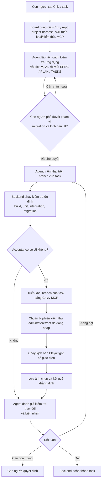

# Ví dụ xuyên suốt của Chizy

> Dành cho: nhóm sản phẩm, phát triển và QA của Chizy  
> Kết quả: hiểu cách các thành phần của nền tảng phối hợp trong một UI task thật.

## Yêu cầu ví dụ

> Thêm một thiết lập trong trang quản trị nhúng của Chizy để điều khiển hành vi
> của chatbot trên storefront. Thiết lập phải được lưu bền vững, shop hiện tại
> vẫn tương thích ngược, branch của task được triển khai lên staging, và thiết
> lập được xác minh trong cả Shopify admin lẫn cửa sổ chat trên storefront.

## Tài nguyên của board

Một Chizy board có thể sử dụng các repository và gói hỗ trợ sau:

| Tài nguyên | Vai trò trong task |
|---|---|
| `chizy-chat-bot` | Ứng dụng Shopify, trang quản trị nhúng và extension chat trên storefront |
| `shopify-ai-agent` | Dịch vụ AI được chatbot sử dụng |
| `chizy-portal` | Portal super-admin của nhóm Chizy |
| `chizy-knowledge-base-agent` | Kiến thức về sản phẩm và vận hành |
| `chizy-toolkit` | Công cụ MCP cho triển khai, truy cập cơ sở dữ liệu và chuẩn bị kiểm thử |
| `chizy-deploy-test-skill` | Bộ hướng dẫn triển khai và xác minh bằng trình duyệt |
| `project-harness` | Hướng dẫn lập kế hoạch, rủi ro, bằng chứng và vòng lặp phát triển |

Không phải task nào cũng cần mọi repository. Agent lập kế hoạch nên nhận tập
repository nhỏ nhất nhưng vẫn đủ để xử lý hành vi được yêu cầu.

## Luồng xuyên suốt

## Quy ước xác minh mẫu

JSON schema chính xác do backend sở hữu, nhưng về mặt nội dung, kế hoạch đã duyệt nên
yêu cầu:

- build ứng dụng và kiểm thử tập trung trong `chizy-chat-bot`;
- kiểm thử dịch vụ AI khi có thay đổi trong `shopify-ai-agent`;
- chạy Prisma generate/kiểm tra migration khi thay đổi schema;
- bước triển khai được thực hiện qua Chizy MCP đã phê duyệt;
- kịch bản Shopify admin đã xác thực cho thiết lập mới;
- kịch bản storefront chứng minh hành vi của chat;
- ảnh chụp màn hình được lưu trong workspace;
- bằng chứng hồi quy cho shop hiện tại hoặc hành vi mặc định.

## Deploy/test skill đóng góp gì?

Skill hướng dẫn agent về trình tự và quy tắc an toàn riêng của dự án, ví dụ:

- phải gọi MCP deployment tool nào;
- chuẩn bị môi trường kiểm thử đã xác thực như thế nào;
- sử dụng bề mặt trình duyệt nào;
- vì sao không được tự động hóa login;
- lưu bằng chứng ở đâu;
- điều gì được coi là một Chizy UI check có ý nghĩa.

Skill không tạo biên nhận lệnh và không phê duyệt kế hoạch. Skill chỉ cung cấp
hướng dẫn; Agent Team vẫn sở hữu cơ chế điều phối và cổng kiểm soát bằng chứng.

## Người đánh giá nên kiểm tra gì?

- Agent lập kế hoạch đã xác định task có thay đổi cả ứng dụng Shopify lẫn dịch vụ AI không?
- Database hoặc Prisma migration có an toàn và tương thích ngược không?
- Branch của task đã được triển khai thay vì branch mặc định chưa?
- Biên nhận có tương ứng với trạng thái mã nguồn cuối cùng không?
- Ảnh chụp có thể hiện hành vi được yêu cầu, thay vì chỉ chứng minh trang tải
  thành công không?
- Kịch bản storefront có chứng minh hành vi thực tế không?
- Agent đánh giá đã ánh xạ từng tiêu chí chấp nhận tới bằng chứng chưa?

Tiếp theo: [Xử lý sự cố](10-troubleshooting.md).
