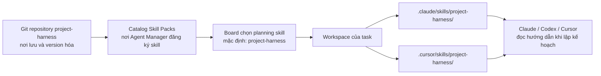
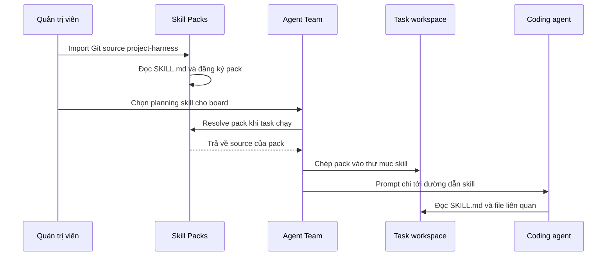

# `project-harness`: skill hay repository?

> Dành cho: tất cả mọi người, đặc biệt là người mới làm quen với Agent Team  
> Kết quả: hiểu `project-harness` nằm ở đâu, được đưa vào task như thế nào và
> phần việc nào thuộc về Agent Team.

## Trả lời ngắn gọn

`project-harness` là một **skill pack được lưu và phân phối bằng Git
repository**.

Hai khái niệm này không loại trừ nhau:

- **Về nội dung:** nó là một skill, tức bộ hướng dẫn cho coding agent.
- **Về cách lưu trữ:** nó nằm trong một Git repository để có version, review,
  branch và lịch sử thay đổi.
- **Về cách Agent Team sử dụng:** quản trị viên import repository đó vào catalog
  của plugin **Skill Packs**. Khi task chạy, Agent Team chép nội dung skill vào
  workspace của task.

Chỉ gán repository `project-harness` vào board như một repository mã nguồn là
không đủ. Agent sẽ nhìn thấy các file, nhưng Agent Team không coi nó là skill và
không tự đưa nó vào thư mục skill.

## Mô hình ba lớp



| Lớp | Có tác dụng gì? | Ai quản lý? |
|---|---|---|
| Git repository | Lưu `SKILL.md`, script, template và tài liệu tham khảo | Người phát triển skill |
| Catalog Skill Packs | Cho Agent Manager biết skill nào đang khả dụng | Quản trị viên |
| Task workspace | Cung cấp bản copy của skill cho agent đang xử lý task | Agent Team tự động |

## Bên trong repository có gì?

Phiên bản đang áp dụng cho Chizy gồm:

```text
project-harness/
├── SKILL.md                 # hướng dẫn chính mà agent đọc
├── CONTEXT.md               # thứ tự đọc wiki, journal, plan và code
├── LANES.md                 # yêu cầu chi tiết cho quick / normal / risk
├── CHIZY_VERIFICATION.md    # quy ước test riêng của Chizy
├── scripts/
│   └── classify.py          # phân loại rủi ro có kết quả ổn định
└── templates/               # mẫu INTAKE và decision
```

File quan trọng nhất là `SKILL.md`. Đây là entry point của skill pack. Các file
còn lại là tài liệu hoặc công cụ mà `SKILL.md` yêu cầu agent sử dụng.

## Nó giải quyết vấn đề gì?

Không phải task nào cũng cần cùng một mức quy trình. Sửa một nhãn UI không nên
tốn lượng review tương đương thay đổi authentication hoặc migration dữ liệu.

`project-harness` yêu cầu agent:

1. đọc bối cảnh trước khi code;
2. xác định loại task;
3. đánh dấu các yếu tố rủi ro;
4. ghi `.agent-team/INTAKE.json`;
5. phân loại task vào một trong ba lane;
6. viết kế hoạch và bằng chứng với độ sâu phù hợp.

| Lane | Ví dụ | Mức quy trình |
|---|---|---|
| `quick` | sửa copy, đổi tên hẹp, thay đổi ít rủi ro | Kế hoạch ngắn, kiểm tra nhanh có ý nghĩa |
| `normal` | feature có phạm vi rõ, bugfix thông thường | SPEC/PLAN ở mức story, test và bằng chứng theo tiêu chí |
| `risk` | auth, phân quyền, schema, secret, hệ thống ngoài | Thiết kế sâu, rollback, xác nhận của con người và bằng chứng chặt |

Một hard gate như authentication, authorization, data model, secret, security
hoặc external system sẽ đưa task vào lane `risk`, kể cả khi thay đổi có ít file.

## Phân chia trách nhiệm giữa skill và Agent Team

Đây là phần quan trọng nhất để tránh hiểu sai kiến trúc:

| `project-harness` hướng dẫn | Agent Team thực thi và cưỡng chế |
|---|---|
| Nên đọc context nào trước | Chuẩn bị repository, wiki, journal và workspace |
| Nên viết SPEC/PLAN sâu đến đâu | Kiểm tra artifact bắt buộc có tồn tại |
| Cách khai báo risk flag | Tự tính lại lane từ các flag trong `INTAKE.json` |
| Nên đề xuất test nào | Parse command trong `TASKS.json` đã duyệt |
| Khi nào nên hỏi con người | Chuyển task sang trạng thái chờ câu trả lời |
| Cách ghi friction/decision | Nhập journal note vào lịch sử bền vững |
| Bằng chứng nào có ý nghĩa | Chạy lệnh, tạo receipt và áp dụng evidence gate |

Nói cách khác:

> Skill là “sổ tay quy trình”; Agent Team là “hệ thống điều phối và kiểm soát”.

Skill không tự chạy command, không tự tạo command receipt, không phê duyệt plan
và không có quyền đánh dấu task hoàn thành.

## Luồng đưa skill vào task



Nội dung `SKILL.md` không được chèn toàn bộ vào prompt. Prompt chỉ nói cho agent
biết skill nào cần sử dụng và nó nằm ở đâu. Cách này giúp prompt gọn hơn và cho
phép skill có nhiều file tham khảo.

## Cách cấu hình

### Bước 1: import skill

Mở **Agent Manager → Skill Packs → Import Source**:

1. chọn Git source;
2. nhập URL repository `project-harness`;
3. thêm credential nếu repository là private;
4. import và chờ pack xuất hiện trong catalog;
5. mở pack để xác nhận hệ thống nhận được `SKILL.md`.

### Bước 2: chọn làm planning skill

Mở board → **Planning**:

1. chọn `project-harness` tại trường **Planning skill**;
2. thêm team conventions nếu công ty có quy tắc riêng;
3. lưu board.

Agent Team luôn cố materialize planning skill, kể cả khi nó không được tick
trong danh sách skill thông thường của board.

### Bước 3: kiểm tra trong một task

Sau khi chạy planning, workspace nên có:

```text
.claude/skills/project-harness/SKILL.md
.cursor/skills/project-harness/SKILL.md
.agent-team/INTAKE.json
.agent-team/SPEC.md
.agent-team/PLAN.md
.agent-team/TASKS.json
```

Nếu skill không tồn tại, planner vẫn nhận hướng dẫn dự phòng tối thiểu từ
backend. Task có thể chạy nhưng không có toàn bộ quy tắc chi tiết của
`project-harness`.

## Vai trò riêng trong Chizy

Ngoài quy tắc chung, repository hiện chứa `CHIZY_VERIFICATION.md`. File này giúp
planner hiểu:

- UI admin, storefront và portal được kiểm thử ở repository nào;
- `chizy-e2e` sở hữu Playwright test;
- repository sản phẩm nào được deploy tới target nào;
- coding agent phải hoàn thành bước deploy/discovery nào trước backend
  verification;
- evaluator cần receipt, scenario và artifact gì.

Đây là ví dụ về việc một skill chung có thể mang thêm quy ước cho một sản phẩm.
Nếu sau này nhiều dự án dùng `project-harness`, nên cân nhắc tách quy tắc Chizy
thành skill riêng để tránh coupling không cần thiết.

## Các nhầm lẫn thường gặp

### “Repository đã nằm trong `external_repos/`, vậy agent tự dùng được chưa?”

Chưa. `external_repos/` chỉ là checkout trên máy phát triển. Production Agent
Manager cần import nó vào catalog Skill Packs.

### “Có cần gán repository này vào mọi board không?”

Không, nếu mục đích chỉ là sử dụng nó như skill. Hãy import vào Skill Packs và
chọn làm planning skill. Chỉ gán như repository khi task thực sự cần sửa chính
`project-harness`.

### “Ai quyết định lane?”

Agent điền risk flag. Backend tự tính lại lane theo cùng quy tắc; backend không
tin một trường `lane` do agent tự ghi.

### “Sửa `SKILL.md` có làm thay đổi backend contract không?”

Không. Skill có thể tăng độ sâu và chất lượng hướng dẫn, nhưng không được đổi tên
artifact hoặc JSON schema mà Agent Team sở hữu.

Tiếp theo: [ACP và OpenSandbox](12-acp-and-opensandbox.md).
