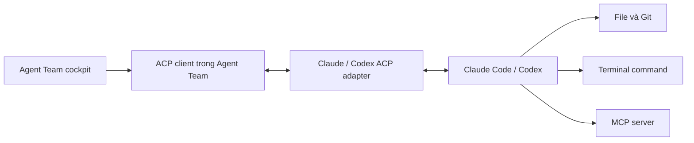
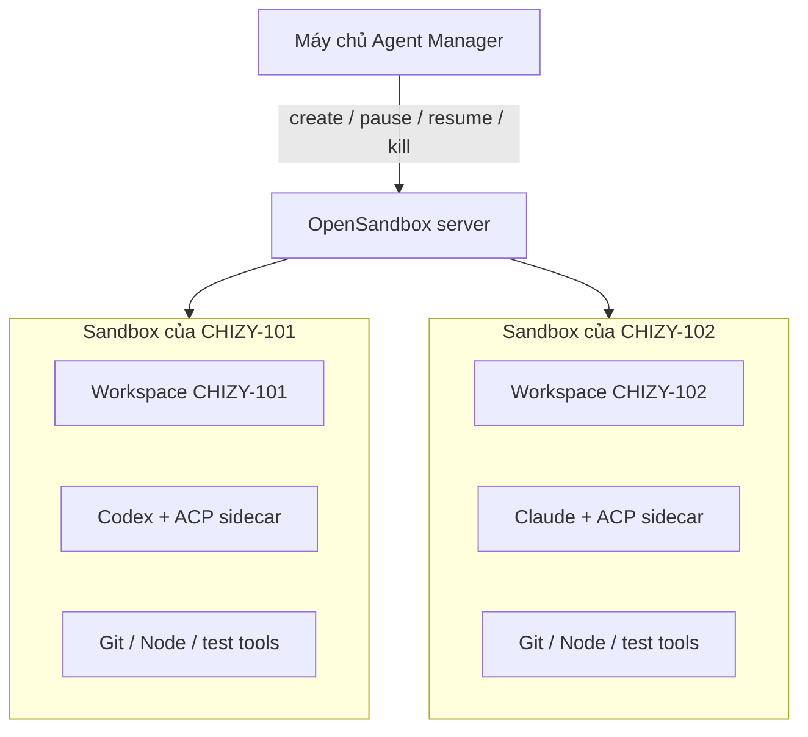
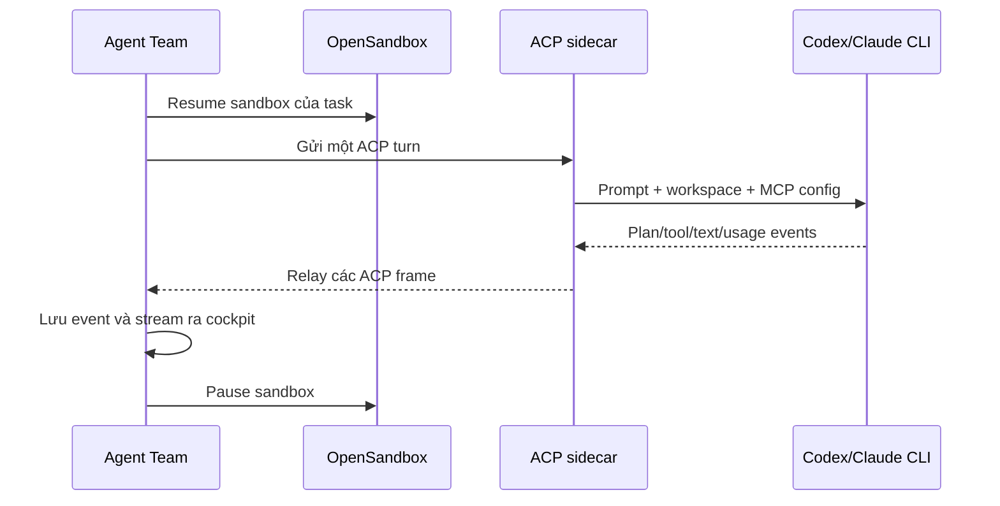

# ACP và OpenSandbox

> Dành cho: người mới, lập trình viên, quản trị viên và người đánh giá bảo mật  
> Kết quả: hiểu Agent Team giao tiếp với coding agent bằng cách nào và agent
> thực sự chạy ở đâu.

ACP và OpenSandbox giải quyết hai vấn đề khác nhau:

- **ACP** trả lời: “Agent Team nói chuyện với Claude/Codex như thế nào?”
- **OpenSandbox** trả lời: “Claude/Codex và command của nó chạy ở máy nào, được
  cách ly ra sao?”

## ACP là gì?

ACP là viết tắt của **Agent Client Protocol**. Đây là giao thức chuẩn hóa kết nối
giữa một ứng dụng điều khiển và coding agent.

Trong Agent Team:

- Agent Team đóng vai trò **ACP client**;
- adapter Claude/Codex/Cursor đóng vai trò **ACP agent/server**;
- hai bên trao đổi message có cấu trúc thay vì Agent Team chỉ đọc text từ
  terminal.

Có thể hình dung ACP giống vai trò của LSP đối với IDE, nhưng dành cho coding
agent: ứng dụng điều khiển không cần viết một UI và protocol riêng cho từng
engine.



## ACP truyền được những gì?

Một HTTP API kiểu “gửi prompt, nhận chuỗi text” chỉ biểu diễn tốt đầu vào và câu
trả lời cuối. Coding agent cần nhiều tín hiệu hơn:

| Tín hiệu | Agent Team dùng để làm gì? |
|---|---|
| Text và thinking stream | Hiển thị tiến trình trực tiếp |
| Plan update | Hiển thị checklist/kế hoạch đang thay đổi |
| Tool start/progress/result | Hiển thị command, đọc file và MCP activity |
| Permission request | Cho phép backend áp dụng chính sách quyền |
| File/diff information | Hiển thị thay đổi mã nguồn |
| Token usage | Tính budget của loop |
| Session ID | Tiếp tục hội thoại qua nhiều turn hoặc sau restart |
| MCP configuration | Cấp đúng tool ngoài cho từng CLI agent |
| Cancel | Dừng lượt chạy đang hoạt động |

ACP sử dụng message hai chiều. Agent có thể chủ động yêu cầu permission hoặc gửi
progress; client không phải polling liên tục để đoán agent đang làm gì.

## Vì sao không dùng API thông thường?

“API thông thường” có thể mang nhiều nghĩa. So sánh dưới đây là với một REST
endpoint đơn giản như `POST /run`:

| Nhu cầu | REST request/response đơn giản | ACP |
|---|---|---|
| Gửi prompt và nhận final text | Làm tốt | Làm tốt |
| Stream nhiều loại event | Phải tự thiết kế SSE/WebSocket schema | Có message chuẩn |
| Agent xin quyền giữa chừng | Khó, thường phải thêm callback riêng | Luồng hai chiều có cấu trúc |
| Giữ/resume session | Tự xây session contract cho từng engine | Có session lifecycle |
| Biểu diễn tool, plan, diff | Thường trả log text không đồng nhất | Có kiểu dữ liệu dành cho agent UX |
| Hỗ trợ Claude, Codex, Cursor | Viết adapter API riêng cho từng engine | Dùng chung client contract |
| Chuyển MCP config cho agent | Tự thiết kế | ACP tái sử dụng kiểu MCP phù hợp |

Không phải REST là “không làm được”. Agent Team có thể tự xây tất cả các phần
trên bằng REST, SSE và WebSocket. ACP được chọn để tránh sở hữu một protocol tùy
biến và để các engine cùng phát ra một dạng event mà cockpit hiểu được.

### ACP không thay thế API của model

ACP không phải API gọi LLM như Anthropic Messages API hay OpenAI Responses API.
Claude Code/Codex vẫn tự gọi model bằng credential của chúng. ACP điều khiển
**coding agent hoàn chỉnh**, tức lớp đã biết đọc file, chạy tool, quản lý session
và sửa code.

## ACP khác MCP như thế nào?

Đây là hai giao thức thường bị nhầm:

| | ACP | MCP |
|---|---|---|
| Mục đích | Ứng dụng điều khiển coding agent | Agent gọi công cụ và dữ liệu bên ngoài |
| Ví dụ | Agent Team ↔ Codex | Codex ↔ Chizy Toolkit |
| Mang prompt/hội thoại | Có | Không phải mục tiêu chính |
| Mang tool | Theo dõi và chuyển cấu hình | Định nghĩa/cung cấp tool |
| Ai là client? | Agent Team | Coding agent |

Luồng đầy đủ có thể là:

```text
Người dùng
  → Agent Team
  → ACP
  → Codex
  → MCP
  → Chizy Toolkit
  → deploy / database / test environment
```

## OpenSandbox là gì?

OpenSandbox là dịch vụ quản lý vòng đời các môi trường chạy code cách ly. Nó có
thể tạo sandbox trên Docker hoặc Kubernetes và cung cấp API để:

- tạo, mở, pause, resume và xóa sandbox;
- chạy command và thao tác file;
- giới hạn CPU/RAM;
- kiểm soát network;
- gắn workspace và credential;
- dọn sandbox bằng TTL.

Trong Agent Team, mục tiêu chính là **một sandbox cho mỗi task**. Hai task không
chia sẻ workspace.



## Tại sao cần sandbox?

Coding agent có thể chạy shell command, cài dependency và sửa file. Chạy trực
tiếp trên máy chủ Agent Manager tạo các rủi ro:

- hai task làm bẩn dependency hoặc file của nhau;
- command lỗi ảnh hưởng host;
- credential và network access quá rộng;
- khó giới hạn tài nguyên;
- khó biết chính xác runtime nào đã tạo ra kết quả test.

Sandbox tạo ranh giới rõ hơn. Tuy nhiên, container isolation không tự động đồng
nghĩa an toàn tuyệt đối. Image, volume mount, secret, network policy và Docker
host vẫn phải được cấu hình đúng.

## Agent Team dùng OpenSandbox như thế nào?

### Một sandbox cho mỗi task

Sandbox được tạo ở lượt chạy cách ly đầu tiên và được dùng lại cho các lượt sau
của cùng task. Workspace, dependency đã cài và session state vì thế có thể tiếp
tục.

### Pause sau mỗi lượt

Sau khi agent kết thúc một turn, Agent Team pause sandbox. Lượt tiếp theo resume
nó. Sandbox rảnh quá lâu sẽ bị garbage collection hoặc server TTL xóa.

### Không âm thầm bỏ cách ly

Khi bật strict isolation, lỗi tạo sandbox phải hiện ra. Hệ thống không được âm
thầm chuyển sang chạy command trên host.

### Cấu hình được cố định lúc tạo

Image, mount và network policy được áp dụng khi sandbox được tạo. Nếu quản trị
viên đổi credential hoặc runtime profile, cần kill sandbox cũ để lượt tiếp theo
tạo sandbox mới.

## Hai cách chạy agent bên trong sandbox

| Strategy | Cách hoạt động | Khi nên dùng |
|---|---|---|
| `oneshot` | Chạy CLI không tương tác và chuyển log thành event | Run tự động đơn giản |
| `acp_sidecar` | Một server nhỏ trong sandbox giữ ACP subprocess và relay event qua WebSocket | Cần plan/tool/thinking stream và MCP đầy đủ |

`acp_sidecar` giữ ACP ở gần workspace nhưng cockpit vẫn nhận cùng event contract
như khi CLI chạy trên host.



## Local runtime có còn giá trị không?

Có. `local` đơn giản hơn, khởi động nhanh và phù hợp:

- phát triển plugin;
- chạy test;
- máy đơn đã được tin cậy;
- chẩn đoán lỗi image/sandbox.

OpenSandbox phù hợp hơn khi nhiều task chạy đồng thời, code chưa được tin cậy
hoặc công ty cần tách tài nguyên và credential rõ ràng.

## Tóm tắt lựa chọn

| Câu hỏi | Thành phần trả lời |
|---|---|
| Ai lập trình? | Claude Code, Codex hoặc Cursor |
| Agent Team điều khiển agent bằng gì? | ACP |
| Agent gọi deploy/database/browser bằng gì? | MCP |
| Agent và command chạy ở đâu? | Local runtime hoặc OpenSandbox |
| Kết quả hiển thị trực tiếp bằng gì? | ACP frame → event store → SSE → cockpit |

## Tài liệu tham khảo

- [ACP Introduction](https://agentclientprotocol.com/get-started/introduction)
- [ACP Architecture](https://agentclientprotocol.com/get-started/architecture)
- [OpenSandbox](https://github.com/opensandbox-group/OpenSandbox)
- [Môi trường thực thi và sandbox](08-runtime-and-sandbox.md)

Tiếp theo: [Engineering loop trong Agent Team](13-engineering-loop.md).
