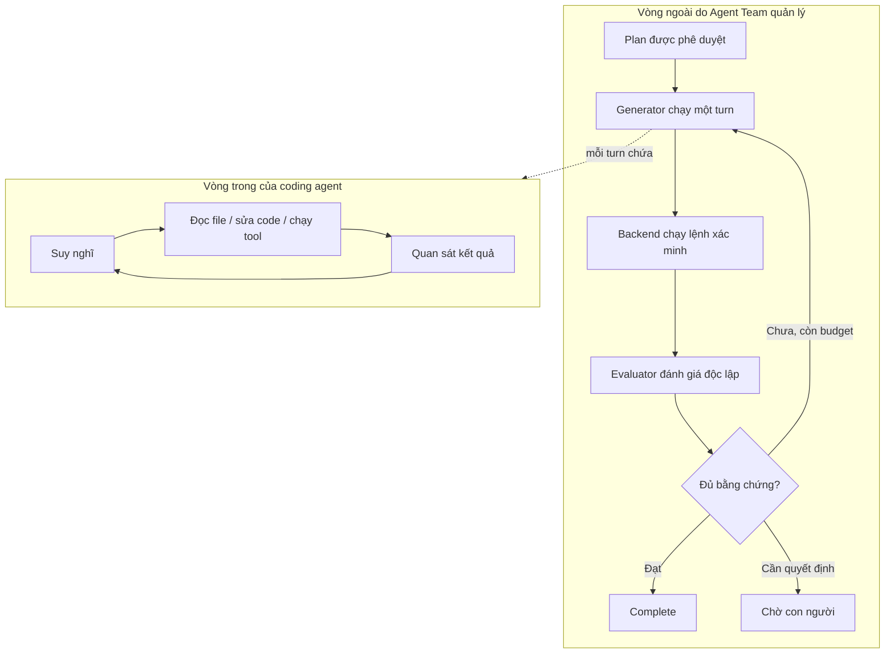
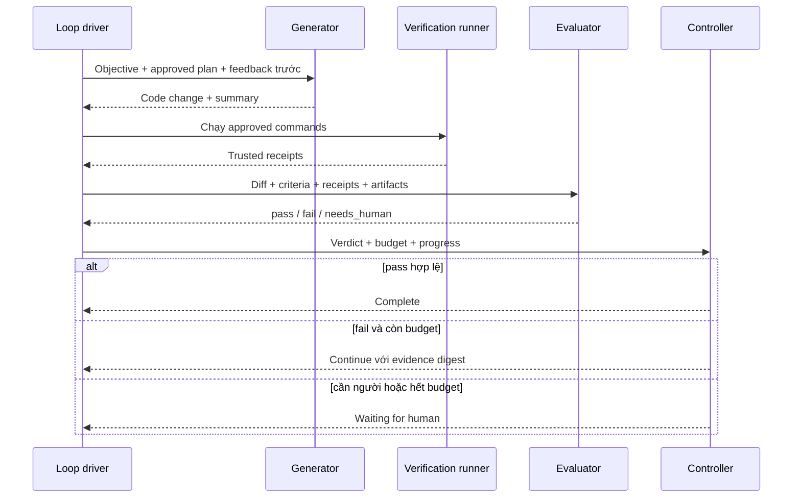

# Engineering loop trong Agent Team

> Dành cho: tất cả mọi người  
> Kết quả: hiểu vì sao Agent Team không dừng ngay khi coding agent nói “đã xong”
> và cách hệ thống lặp lại cho đến khi có bằng chứng.

## Engineering loop là gì?

Engineering loop là vòng lặp:

```text
hiểu vấn đề → thay đổi sản phẩm → kiểm tra → nhận phản hồi → sửa tiếp
```

Một lập trình viên cũng làm như vậy:

1. đọc ticket và code;
2. viết kế hoạch;
3. sửa code;
4. chạy test;
5. xem lỗi;
6. sửa lại;
7. nhờ người khác review;
8. hoàn thành khi đủ bằng chứng.

Các tên kỹ thuật xuất hiện trong UI/code:

| Tên | Cách hiểu trong tài liệu này |
|---|---|
| Generator | Agent triển khai và sửa code |
| Evaluator | Agent đánh giá độc lập |
| Controller | Logic quyết định tiếp tục hay dừng |
| Attempt | Một lần triển khai rồi đánh giá |
| Budget | Giới hạn lần thử, token, chi phí hoặc thời gian |

Coding agent bản thân nó đã có một vòng lặp nhỏ bên trong: suy nghĩ → gọi tool →
đọc kết quả → tiếp tục. Agent Team không thay thế vòng lặp đó. Agent Team thêm
một **vòng điều phối bên ngoài** để quản lý kế hoạch, phê duyệt, kiểm thử độc lập,
ngân sách và trạng thái task.

## Hai vòng lặp lồng nhau



### Vòng trong

Claude/Codex sở hữu vòng trong. ACP chỉ truyền các event của nó về Agent Team.
Agent Team không tự viết lại cách Codex suy luận hoặc sử dụng terminal.

### Vòng ngoài

Agent Team sở hữu vòng ngoài:

- task đang ở trạng thái nào;
- agent nào làm generator/evaluator;
- được thử tối đa bao nhiêu lần;
- command nào đã được phê duyệt;
- bằng chứng có còn khớp với source hiện tại không;
- khi nào phải dừng và hỏi con người.

## Các vai trò trong loop

| Vai trò | Trách nhiệm | Không được tự quyết |
|---|---|---|
| Planner | Nghiên cứu và đề xuất SPEC/PLAN/TASKS | Không tự phê duyệt kế hoạch rủi ro |
| Plan reviewer | Phản biện thiếu sót trước khi code | Không triển khai thay generator |
| Human | Sở hữu ý định sản phẩm và phê duyệt | Không cần tự chạy mọi command |
| Generator | Sửa code và tạo product delta | Không tự đánh dấu task complete |
| Backend/runtime | Chạy command đã duyệt và tạo receipt | Không tự diễn giải chất lượng sản phẩm |
| Evaluator | Cố gắng bác bỏ việc “đã xong” bằng diff và evidence | Không được bịa command result |
| Loop controller | Quyết định tiếp tục, hoàn tất hay dừng | Không thay đổi product intent |

Generator và evaluator nên là hai worker độc lập. Chúng có thể dùng cùng loại
model, nhưng evaluator dùng session riêng để giảm việc tự bảo vệ quyết định đã
làm ở lượt code.

## Agent Team đang áp dụng những cơ chế nào?

### 1. Strict planning

Trước khi code, planner tạo:

- `SPEC.md`: kết quả đúng cần trông như thế nào;
- `PLAN.md`: dự định thay đổi và kiểm tra ra sao;
- `TASKS.json`: task graph và lệnh xác minh máy có thể đọc;
- `INTAKE.json`: yếu tố rủi ro;
- `PLAN_REVIEW.json`: kết quả review nếu có.

Planning là một job riêng. Nó kết thúc và giải phóng worker trong lúc chờ con
người phê duyệt.

### 2. Approval pinning

Khi phê duyệt, backend ghi checksum/fingerprint của plan. Nếu command, scope,
repository hoặc acceptance criteria thay đổi, approval mất hiệu lực.

Điều này ngăn việc con người duyệt một kế hoạch, sau đó agent âm thầm chạy một
kế hoạch khác.

### 3. Generator/evaluator độc lập

Generator triển khai. Evaluator được yêu cầu giả định task vẫn lỗi cho đến khi
bằng chứng chứng minh ngược lại.

Evaluator đọc:

- SPEC và acceptance criteria;
- diff cuối;
- command receipt;
- scenario và screenshot;
- journal và plan change nếu có.

### 4. Backend-owned verification

Planner đề xuất command, con người phê duyệt, backend chạy command. Receipt được
gắn với:

- repository và working directory;
- Git HEAD;
- fingerprint của file chưa commit;
- runtime/sandbox;
- exit code và thời điểm.

Nếu source thay đổi sau khi test, receipt cũ không còn đủ để chứng minh source
mới đã được kiểm thử.

### 5. Evidence gate

Evaluator có thể đề xuất `pass`, nhưng backend vẫn hạ kết luận xuống nếu:

- không có command receipt hợp lệ;
- receipt fail hoặc đã cũ;
- tiêu chí chấp nhận chưa được map tới bằng chứng;
- task UI thiếu scenario/artifact;
- file bằng chứng không tồn tại hoặc trỏ ra ngoài workspace.

### 6. Budget và guardrail

Loop có thể giới hạn:

- số lần thử;
- token;
- chi phí;
- thời gian chạy.

Chi phí evaluator cũng được tính. Khi chạm giới hạn mà chưa pass, task chuyển
sang chờ con người; hệ thống không được báo thành công hoặc thất bại một cách âm
thầm.

### 7. Durable journal

Các quyết định, giả định, câu hỏi, friction và verdict quan trọng được lưu bền
vững. Lần thử sau và người tiếp quản task không chỉ dựa vào transcript dài.

## Một attempt diễn ra như thế nào?



Một attempt gồm lượt generator và lượt evaluator. Với strict task, verification
runner chạy command giữa hai lượt đó.

## Feedback quay lại generator gồm gì?

Khi evaluator trả `fail`, Agent Team tạo một evidence digest ngắn thay vì gửi
toàn bộ log. Digest tập trung vào:

- tiêu chí nào chưa đạt;
- command nào lỗi;
- evidence nào thiếu;
- scenario nào không chứng minh được hành vi;
- thay đổi nào evaluator cho rằng chưa đúng.

Generator tiếp tục trong cùng thread của vai trò generator để giữ context. Mỗi
lượt evaluator dùng session mới để duy trì tính độc lập.

## Whole-objective và task-graph

Agent Team có hai cách chạy approved plan:

| Chế độ | Cách chạy | Phù hợp |
|---|---|---|
| Whole-objective | Một generator xử lý toàn bộ SPEC, evaluator chấm toàn bộ | Task vừa và nhỏ |
| Task-graph | Chạy từng node trong `TASKS.json` theo dependency, rồi kiểm tra toàn SPEC | Task có nhiều phần độc lập rõ ràng |

Task-graph là opt-in. `TASKS.json` tồn tại không đồng nghĩa hệ thống luôn chạy
từng node.

## Khi nào loop dừng?

| Tình huống | Trạng thái |
|---|---|
| Pass có evidence hợp lệ | `complete` |
| Fail nhưng còn budget | Chạy attempt tiếp theo |
| Evaluator cần quyết định sản phẩm | `waiting_for_human` |
| Agent đưa câu hỏi chặn | `waiting_answers` |
| Plan đã duyệt hóa ra sai/nguy hiểm | `plan_change_requested` |
| Hết attempt/token/cost/time | `waiting_for_human` |
| Người dùng hủy | `cancelled` |
| Runtime lỗi không phục hồi được | `failed` |

## Ví dụ dễ hiểu: thêm nút bật/tắt trên Chizy

1. Planner đọc `chizy-chat-bot`, `chizy-e2e` và skill Chizy.
2. Planner ghi tiêu chí: setting lưu theo shop; storefront giữ hành vi tương
   thích; UI admin có scenario.
3. Con người duyệt plan và command.
4. Generator sửa UI/API, cập nhật Playwright test và deploy branch khi plan yêu
   cầu staging.
5. Backend chạy build và Playwright command đã duyệt.
6. Backend tạo receipt gắn với commit hiện tại.
7. Evaluator kiểm tra diff, receipt, screenshot và mapping tiêu chí.
8. Nếu screenshot chỉ là trang login, evaluator trả fail.
9. Digest yêu cầu generator chuẩn bị lại authenticated session và chạy đúng
   scenario.
10. Attempt sau tạo đủ evidence; evaluator trả pass; backend mới hoàn thành task.

## Loop không giải quyết được điều gì?

- Task mơ hồ về ý định sản phẩm: cần con người làm rõ.
- Test sai hoặc không phản ánh hành vi: loop có thể lặp theo một oracle sai.
- Credential hết hạn: cần vận hành sửa môi trường.
- Thiếu deployment/test path: cần bổ sung tooling hoặc skill.
- Model không đủ khả năng cho task: nhiều attempt không đảm bảo thành công.

Loop giúp quá trình có kiểm soát và có bằng chứng; nó không biến yêu cầu mơ hồ
hoặc môi trường hỏng thành kết quả đúng.

Tiếp theo: [Cấu hình notification channels](14-notification-channels.md).
