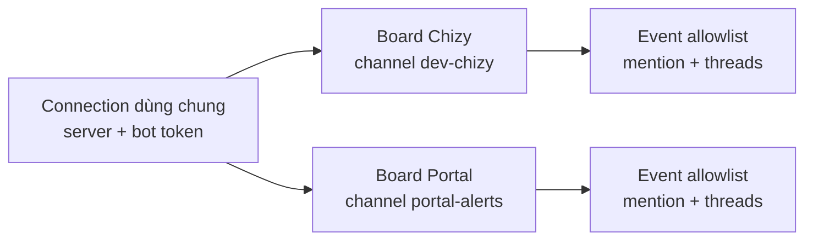
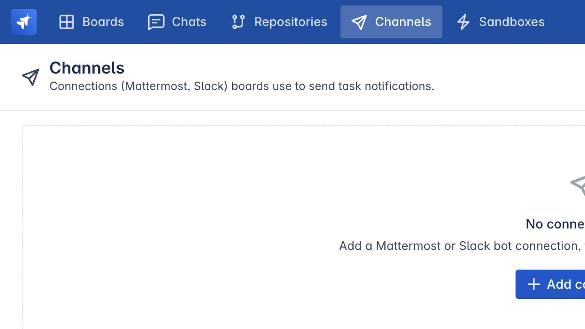
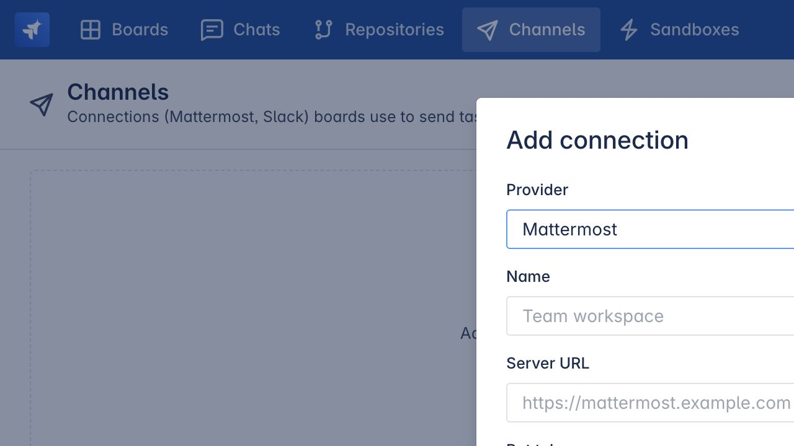

# Cấu hình notification channels

> Dành cho: quản trị viên và owner của board  
> Kết quả: gửi đúng thông báo vòng đời task tới Mattermost hoặc Slack mà không
> phải theo dõi cockpit liên tục.

## Channels dùng để làm gì?

Agent Team có cockpit riêng, nhưng con người thường làm việc trong Mattermost
hoặc Slack. Notification channel gửi thông báo khi task:

- cần phê duyệt plan;
- cần trả lời câu hỏi;
- yêu cầu đổi plan;
- cần con người review;
- hoàn thành;
- thất bại;
- bị hủy.

Các trạng thái đang chạy bình thường như `planning` hoặc `running` không gửi
notification mặc định, tránh spam.

## Mô hình hai tầng



### Tầng 1: Connection

Connection đại diện cho bot account và credential dùng lại được:

- provider: Mattermost hoặc Slack;
- server URL nếu là Mattermost;
- bot token;
- public URL của Agent Manager để tạo link **Open task**.

Chỉ quản trị viên tạo và quản lý connection. Token là write-only: UI chỉ cho biết
đã có token, không đọc token trở lại.

### Tầng 2: Board channel

Mỗi board liên kết tối đa một channel:

- dùng connection nào;
- gửi vào channel ID nào;
- gửi loại event nào;
- mention assignee, creator hay không mention;
- gom cập nhật của cùng task vào thread hay đăng rời;
- bật/tắt notification.

Owner của board cấu hình tầng này.

### Giới hạn owner-scope hiện tại

Connection hiện được lọc theo người sở hữu. Danh sách connection trong dialog
của board chỉ hiển thị connection thuộc tài khoản đang thao tác. Vì vậy, cách
setup ít lỗi nhất hiện tại là dùng cùng một tài khoản admin/board owner để tạo
connection và liên kết channel.

Nếu một admin khác tạo connection, board owner có thể thấy danh sách trống dù
connection tồn tại. Đây là giới hạn của implementation hiện tại, không phải lỗi
bot token.

## Luồng cấu hình tổng thể

```text
Tạo bot ở Mattermost/Slack
        ↓
Thêm bot vào channel đích
        ↓
Admin tạo Connection trong Agent Team
        ↓
Board owner liên kết board với Channel ID
        ↓
Chọn event + mention + thread
        ↓
Save → Send test → kiểm tra Recent deliveries
```

## 1. Chuẩn bị bot

### Mattermost

1. Vào **Integrations → Bot Accounts**.
2. Tạo bot và lấy access token.
3. Thêm bot làm thành viên của channel đích.
4. Lấy **Channel ID**, không chỉ channel name.
5. Ghi lại URL Mattermost, ví dụ `https://mattermost.example.com`.

Nếu bot không phải thành viên channel, Mattermost thường trả `403`.

### Slack

1. Tạo Slack app có bot user.
2. Cấp tối thiểu các scope:
   - `chat:write`;
   - `channels:read`;
   - `users:read.email`.
3. Install app vào workspace.
4. Lấy **Bot User OAuth Token** dạng `xoxb-...`.
5. Invite bot vào channel.
6. Copy **Channel ID** từ channel details.

Không đưa token vào tài liệu, task description hoặc screenshot.

## 2. Tạo connection dùng chung

Mở Agent Team → **Channels**.



Chọn **Add connection**:



### Trường chung

| Trường | Ý nghĩa |
|---|---|
| Provider | Mattermost hoặc Slack |
| Name | Tên nội bộ dễ hiểu, ví dụ `BSS Mattermost Bot` |
| Bot token | Credential của bot; chỉ được gửi vào backend khi lưu |
| Deep-link base URL | URL public của Agent Manager, ví dụ `https://agents.example.com` |

### Trường riêng của Mattermost

| Trường | Giá trị |
|---|---|
| Server URL | Origin của Mattermost, không thêm `/api/v4` |
| Bot token | Access token của bot account |

Slack không cần server URL vì provider sử dụng Slack public API.

## 3. Liên kết connection với board

Mở board cần cấu hình và chọn **Channel** trên thanh công cụ.

Nếu danh sách connection trống, quản trị viên cần tạo connection trước. Board
owner chỉ có thể chọn connection mà API cho phép hiển thị với họ.

Điền:

| Trường | Cách chọn |
|---|---|
| Connection | Bot connection đã tạo |
| Channel ID | ID kỹ thuật, không phải tên hiển thị |
| Channel name | Tùy chọn, chỉ để dễ nhận biết trong UI |
| Mentions | Mention assignee, creator hoặc không ai |
| Events | Chọn rõ từng event cần gửi |
| Group updates into one thread | Nên bật để mỗi task có một thread |
| Notifications enabled | Tắt tạm mà không xóa cấu hình |

## 4. Chọn event nào nên gửi

| Event | Khi phát sinh | Khuyến nghị |
|---|---|---|
| `plan_approval_required` | Plan đã sẵn sàng chờ duyệt | Bật |
| `answers_required` | Agent có câu hỏi chặn | Bật |
| `plan_change_requested` | Plan đã duyệt không còn đúng/an toàn | Bật |
| `human_review_required` | Hết budget hoặc evaluator cần người | Bật |
| `goal_complete` | Task hoàn thành có xác minh | Bật |
| `goal_failed` | Task lỗi | Tùy quy trình vận hành |
| `goal_cancelled` | Task bị hủy | Tùy quy trình vận hành |

Với board sản xuất, nên bắt đầu bằng bốn event cần con người và
`goal_complete`. Sau đó thêm failure/cancel nếu channel không quá ồn.

> **Lưu ý implementation hiện tại:** UI đang hiển thị rằng danh sách Events
> trống sẽ gửi tất cả, nhưng backend hiện yêu cầu event phải nằm trong allowlist.
> Vì vậy, hãy tick rõ các event cần gửi. Nếu không chọn event nào, notification
> vòng đời sẽ không được gửi.

## 5. Mention thành viên

Agent Team cần ánh xạ user nội bộ sang tài khoản Mattermost/Slack.

Trong connection:

- **Auto-match by email** tìm user provider có email trùng;
- mapping thủ công dùng username/user ID khi email không trùng;
- mapping phục vụ việc tag đúng assignee hoặc creator.

Auto-match không ghi đè mapping thủ công.

Nếu notification gửi được nhưng không mention đúng người, hãy kiểm tra mapping
trước khi kiểm tra bot token.

## 6. Gửi thử và đọc delivery

Sau khi lưu board channel, chọn **Send test**.

Kết quả nên được kiểm tra ở hai nơi:

1. message xuất hiện trong channel thật;
2. mục **Recent deliveries** trong dialog hiển thị trạng thái `sent`.

Delivery lưu:

- event type;
- provider;
- task/board;
- message ID và thread ID của provider;
- trạng thái và lỗi;
- thời điểm gửi.

Mỗi event có dedupe key. Việc publish lặp cùng trạng thái/attempt không tạo hàng
loạt message trùng.

## Thread hoạt động như thế nào?

Khi bật **Group a task's updates into one thread**:

1. notification đầu tạo post gốc;
2. Agent Team lưu post ID/thread root ID;
3. các cập nhật sau của cùng task được gửi vào thread đó.

Cơ chế này cũng là nền móng cho inbound action sau này.

## Outbound và inbound hiện hỗ trợ đến đâu?

### Đã hoạt động

- gửi notification ra Mattermost và Slack;
- lọc event theo board;
- mention;
- thread;
- delivery history và dedupe;
- backend foundation cho approve/answer/ack từ chat.

### Chưa nên quảng bá như tính năng hoàn chỉnh

Worker transport lắng nghe reply/event từ Mattermost/Slack chưa được nối hoàn
chỉnh vào runtime. Vì vậy, tài liệu người dùng hiện nên coi channel là
**outbound notification**.

Người dùng vẫn mở deep link về Agent Team để phê duyệt plan, trả lời câu hỏi hoặc
acknowledge task. Không nên hứa rằng reply trực tiếp trong Slack/Mattermost luôn
điều khiển được task.

## Xử lý lỗi

### Mattermost trả `401`

- kiểm tra server URL;
- kiểm tra token có thừa khoảng trắng hoặc đã bị thu hồi;
- xác nhận token thuộc đúng Mattermost instance.

Provider đã gửi header cần thiết cho Mattermost CSRF guard; nếu vẫn `401`, ưu
tiên kiểm tra token và server.

### Mattermost trả `403`

- bot chưa được thêm vào channel;
- Channel ID thuộc server khác với Server URL;
- bot thiếu quyền đăng bài.

### Slack không gửi được

- token không bắt đầu bằng `xoxb-` hoặc đã bị rotate;
- app thiếu `chat:write`;
- bot chưa được invite vào channel;
- dùng channel name thay vì Channel ID.

### Message có nhưng không có link mở task

Kiểm tra **Deep-link base URL** có phải URL public truy cập được của Agent Manager
hay không.

### Không có event nào được gửi

- board channel đang disabled;
- event không nằm trong allowlist; không để allowlist trống;
- task chưa chuyển sang một lifecycle state có notification;
- connection đã archived hoặc thiếu token;
- xem **Recent deliveries** để lấy lỗi provider.

### Không xóa được connection

Connection đang được board sử dụng. Gỡ liên kết channel khỏi các board trước,
sau đó mới xóa connection.

## Checklist hoàn tất

- Bot tồn tại và đã tham gia channel.
- Connection có token và server URL đúng.
- Deep-link base URL trỏ tới Agent Manager public.
- Board đã chọn đúng Channel ID.
- Các event cần thiết đã được tick rõ ràng trong allowlist.
- User mapping đúng nếu dùng mention.
- Send test thành công.
- Recent deliveries có bản ghi `sent`.

Tiếp theo: [Bảng thuật ngữ](glossary.md).
