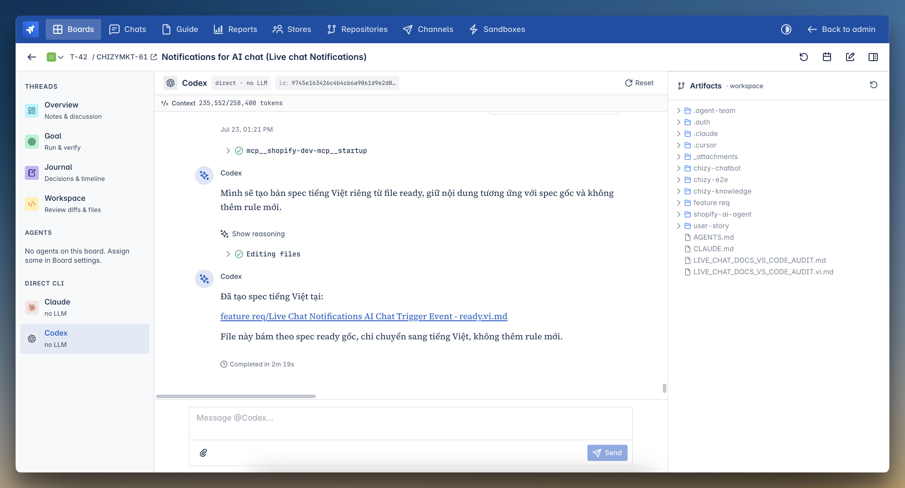
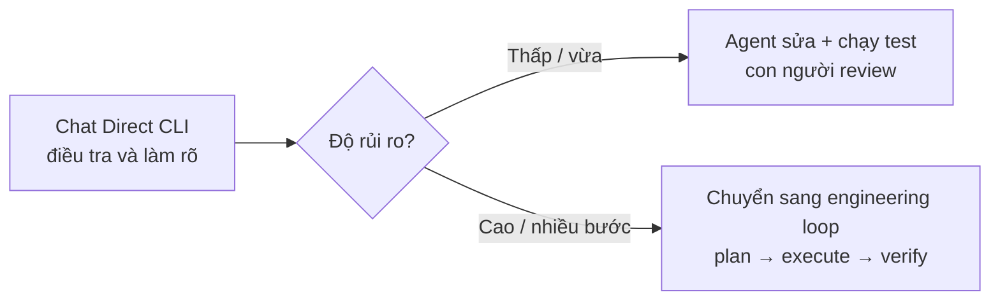

# Chat trực tiếp với Claude hoặc Codex

> Dành cho: BA, Product Owner, developer, QA và bất kỳ ai cần làm việc trực tiếp
> với coding agent  
> Kết quả: biết cách dùng **Direct CLI** trong task detail và phân biệt khi nào
> nên chat trực tiếp, khi nào nên chạy engineering loop.

## Đây là cách làm việc phổ biến nhất

Bạn không bắt buộc phải khởi động engineering loop cho mọi task. Với phần lớn
công việc hằng ngày, có thể mở một task, chọn **Claude** hoặc **Codex** ở mục
**Direct CLI**, rồi trao đổi với agent theo từng lượt giống như đang pair-work
với một đồng nghiệp.

Ví dụ:

- nhờ agent đọc code và giải thích một luồng;
- điều tra nguyên nhân lỗi;
- viết hoặc chỉnh sửa tài liệu;
- triển khai một thay đổi nhỏ rồi chạy test;
- xem kết quả, bổ sung yêu cầu và yêu cầu agent sửa tiếp.

Direct CLI vẫn làm việc trong workspace của task, vẫn có repository, skill và MCP
mà board đã cấp. Điểm khác biệt là **con người chủ động gửi từng yêu cầu và quyết
định khi nào công việc đủ tốt**, thay vì giao cho controller tự chạy vòng
generator → test → evaluator.

## Mở cuộc trò chuyện

1. Mở **Agent Team → Boards** và chọn board.
2. Tạo một task mới hoặc mở task đang có.
3. Trong thanh bên trái của task detail, tìm mục **Direct CLI**.
4. Chọn **Claude** hoặc **Codex**.
5. Nhập yêu cầu ở ô `Message @Claude…` hoặc `Message @Codex…`, sau đó chọn
   **Send**.

Nếu không thấy Claude/Codex, quản trị viên cần bật engine đó trong
**Board settings → Agents → Direct CLI** và bảo đảm account/runtime tương ứng
đang khả dụng. Xem [Tạo board đầu tiên](04-create-your-first-board.md) và
[Chuẩn bị trước task đầu tiên](01-before-the-first-task.md).



Trong màn hình trên:

1. **Thanh bên trái** chọn Overview, Goal, Journal, Workspace hoặc cuộc trò
   chuyện riêng với Claude/Codex.
2. **Vùng giữa** hiển thị câu trả lời, reasoning khi engine cung cấp, hoạt động
   tool, thời gian chạy và ô gửi tin nhắn tiếp theo.
3. **Context** cho biết lượng context CLI đang sử dụng. Khi context trở nên quá
   lớn, nên yêu cầu agent tóm tắt trạng thái vào file trước khi mở thread mới.
4. **Artifacts** bên phải cho phép xem cây file trong workspace ngay khi agent
   đang làm việc.

Nhãn `direct · no LLM` không có nghĩa là Claude/Codex không dùng AI. Nó có nghĩa
là Agent Team nói chuyện thẳng với CLI qua ACP, không đặt thêm một LLM
orchestrator ở giữa.

## Viết yêu cầu đầu tiên như thế nào?

Một lời nhắn hữu ích nên có bốn phần:

```text
Mục tiêu:
Điều cần giữ nguyên:
Repository hoặc khu vực cần xem:
Cách tôi muốn kiểm tra kết quả:
```

Ví dụ:

> Hãy kiểm tra vì sao notification live chat không được gửi. Chỉ điều tra và
> báo nguyên nhân trước, chưa sửa code. Đọc cả `chizy-chat-bot` và
> `shopify-ai-agent`; trích file liên quan và đề xuất cách verify.

Sau khi đọc kết quả, bạn có thể gửi tiếp:

> Đồng ý với hướng đó. Hãy triển khai, chạy unit test liên quan và mở diff để tôi
> review. Nếu thay đổi UI thì dừng lại trước bước deploy.

Cách chia thành nhiều lượt giúp BA hoặc developer kiểm soát quyết định quan trọng
mà không cần viết một prompt rất dài từ đầu.

## Agent có thể làm gì trong Direct CLI?

Tùy quyền của board và runtime, agent có thể:

- đọc và sửa file trong workspace dùng chung của task;
- chạy command và test;
- đọc ảnh hoặc file bạn đính kèm;
- sử dụng skill đã được đưa vào workspace;
- gọi MCP đã cấu hình, ví dụ browser, database chỉ đọc hoặc deploy;
- tiếp tục ngữ cảnh từ các lượt chat trước;
- hiển thị thay đổi để bạn review trong **Workspace** và **Artifacts**.

Bạn vẫn nên nói rõ khi chỉ muốn agent **điều tra**, vì một coding agent có thể
hiểu yêu cầu mơ hồ là cho phép sửa code.

## Transcript, History và Reset

Mỗi cặp **task–agent** có một cuộc trò chuyện riêng. Claude không tự động nhìn
thấy transcript của Codex; cả hai chỉ cùng nhìn thấy những file đang nằm trong
workspace.

- Reload trang không làm mất cuộc trò chuyện hoặc lượt đang chạy.
- **Stop** yêu cầu dừng lượt hiện tại.
- **History** cho phép xem lại các thread đã lưu trữ.
- **Reset** lưu trữ thread hiện tại rồi mở một thread mới cho agent đó.
- Reset **không xóa workspace, repository hoặc code đã sửa**.

Trước khi Reset một thread dài, nên yêu cầu agent ghi trạng thái, quyết định và
việc còn lại vào một file trong workspace. Thread mới có thể đọc file này để
tiếp tục mà không phải mang toàn bộ transcript cũ vào context.

## Direct CLI và engineering loop khác nhau thế nào?

| | Direct CLI chat | Engineering loop |
|---|---|---|
| Ai điều khiển bước tiếp theo? | Con người gửi từng lượt | Controller tự điều phối các vai trò |
| Có bắt buộc duyệt plan? | Không | Có khi strict planning được bật |
| Agent có thể sửa code và chạy test? | Có | Có |
| Có evaluator độc lập và evidence gate tự động? | Không bắt buộc | Có |
| Khi nào được coi là xong? | Con người review và quyết định | Evaluator verdict cùng quy tắc backend chấp nhận |
| Phù hợp nhất | Hỏi đáp, khám phá, pair-work, thay đổi nhỏ/vừa | Thay đổi nhiều bước, rủi ro cao, cần audit và verify lặp lại |

Hai chế độ không loại trừ nhau. Một workflow thực tế có thể là:



Direct CLI phù hợp khi con người muốn ngồi trong vòng phản hồi. Engineering loop
phù hợp khi cần một hợp đồng kế hoạch, command receipt, evidence và đánh giá độc
lập trước khi hệ thống chấp nhận hoàn thành.

## Checklist trước khi kết thúc một phiên chat

- Đã xem file thay đổi trong **Workspace** chưa?
- Agent đã chạy command/test nào và kết quả ra sao?
- Với thay đổi UI, đã có kiểm tra trên trình duyệt thật hoặc ảnh bằng chứng chưa?
- Có thay đổi ngoài phạm vi ban đầu không?
- Quyết định quan trọng có cần ghi vào Journal hoặc tài liệu dự án không?
- Task có đủ rủi ro để chuyển sang engineering loop không?

Nếu cần quy trình xác minh nghiêm ngặt, tiếp tục với
[Chạy task qua engineering loop](05-run-your-first-task.md). Nếu muốn hiểu cơ chế
bên dưới, đọc [ACP và OpenSandbox](12-acp-and-opensandbox.md).
