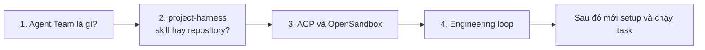
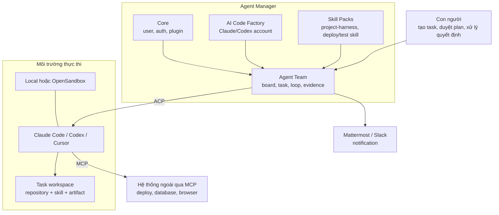

# Hướng dẫn sử dụng Agent Team

Bộ tài liệu này giải thích Agent Team từ con số 0, sau đó mới đi tới phần cài
đặt và vận hành. Người đọc không cần biết trước ACP, MCP, sandbox, skill pack hay
engineering loop.

Tài liệu dành cho Product Owner, BA, lập trình viên, QA, trưởng nhóm, người vận
hành và quản trị viên hệ thống.

## Nếu bạn mới hoàn toàn, hãy đọc theo đường này

Không nên bắt đầu bằng trang cấu hình. Hãy đọc bốn trang dưới đây trước:

1. [Agent Team theo cách dễ hiểu](02-agent-team-in-plain-language.md)
2. [`project-harness`: skill hay repository?](11-project-harness.md)
3. [ACP và OpenSandbox](12-acp-and-opensandbox.md)
4. [Engineering loop trong Agent Team](13-engineering-loop.md)

Sau bốn trang này, người đọc nên trả lời được:

- Agent Manager khác Agent Team ở đâu?
- Claude/Codex nằm ở đâu trong hệ thống?
- Skill khác repository như thế nào?
- ACP khác MCP như thế nào?
- Vì sao cần sandbox?
- Vì sao coding agent nói “xong” vẫn chưa đủ?

## Bức tranh toàn hệ thống

Ý nghĩa ngắn gọn:

- **Agent Manager** là ứng dụng chủ và nơi quản trị plugin/tài khoản.
- **Agent Team** là plugin quản lý vòng đời công việc phát triển.
- **AI Code Factory** cung cấp môi trường đăng nhập Claude/Codex.
- **Skill Packs** cung cấp hướng dẫn kỹ thuật có thể tái sử dụng.
- **ACP** là đường giao tiếp giữa Agent Team và coding agent.
- **MCP** là đường coding agent dùng công cụ bên ngoài.
- **OpenSandbox** là nơi chạy agent và command cách ly theo task.
- **Engineering loop** là cơ chế lập trình → kiểm tra → phản hồi → sửa tiếp.
- **Notification channel** báo cho con người khi task cần hành động hoặc đã xong.

## Lộ trình theo mục tiêu

### Tôi chỉ muốn hiểu hệ thống

1. [Tổng quan dễ hiểu](02-agent-team-in-plain-language.md)
2. [`project-harness`](11-project-harness.md)
3. [ACP và OpenSandbox](12-acp-and-opensandbox.md)
4. [Engineering loop](13-engineering-loop.md)
5. [Ví dụ xuyên suốt của Chizy](09-chizy-end-to-end-example.md)

### Tôi cần cài đặt một instance mới

1. [Chuẩn bị trước task đầu tiên](01-before-the-first-task.md)
2. [Thiết lập dành cho quản trị viên](03-administrator-setup.md)
3. [Môi trường thực thi và sandbox](08-runtime-and-sandbox.md)
4. [Cấu hình notification channels](14-notification-channels.md)
5. [Xử lý sự cố](10-troubleshooting.md)

### Tôi cần tạo board và chạy task

1. [Tạo board đầu tiên](04-create-your-first-board.md)
2. [Chạy task đầu tiên](05-run-your-first-task.md)
3. [Lập kế hoạch và phê duyệt](06-planning-and-approval.md)
4. [Kiểm thử và xác minh](07-testing-and-verification.md)

### Tôi là BA hoặc Product Owner

1. [Tổng quan dễ hiểu](02-agent-team-in-plain-language.md)
2. [Engineering loop](13-engineering-loop.md)
3. [Chạy task đầu tiên](05-run-your-first-task.md)
4. [Lập kế hoạch và phê duyệt](06-planning-and-approval.md)

### Tôi là QA hoặc trưởng nhóm

1. [Engineering loop](13-engineering-loop.md)
2. [Kiểm thử và xác minh](07-testing-and-verification.md)
3. [Ví dụ Chizy](09-chizy-end-to-end-example.md)

## Toàn bộ nội dung

### Phần A — Hiểu hệ thống

- [Agent Team theo cách dễ hiểu](02-agent-team-in-plain-language.md)
- [`project-harness`: skill hay repository?](11-project-harness.md)
- [ACP và OpenSandbox](12-acp-and-opensandbox.md)
- [Engineering loop trong Agent Team](13-engineering-loop.md)
- [Bảng thuật ngữ](glossary.md)

### Phần B — Cài đặt và cấu hình

- [Chuẩn bị trước task đầu tiên](01-before-the-first-task.md)
- [Thiết lập dành cho quản trị viên](03-administrator-setup.md)
- [Môi trường thực thi và sandbox](08-runtime-and-sandbox.md)
- [Cấu hình notification channels](14-notification-channels.md)

### Phần C — Sử dụng hằng ngày

- [Tạo board đầu tiên](04-create-your-first-board.md)
- [Chạy task đầu tiên](05-run-your-first-task.md)
- [Lập kế hoạch và phê duyệt](06-planning-and-approval.md)
- [Kiểm thử và xác minh](07-testing-and-verification.md)

### Phần D — Ví dụ và xử lý sự cố

- [Ví dụ xuyên suốt của Chizy](09-chizy-end-to-end-example.md)
- [Xử lý sự cố](10-troubleshooting.md)

## Cách đọc thuật ngữ trong tài liệu

Tài liệu giữ một số từ tiếng Anh vì chúng là tên hiển thị trong UI, tên file hoặc
khái niệm kỹ thuật phải đối chiếu với code:

- `board`, `task`, `workspace`;
- `planner`, `generator`, `evaluator`;
- `receipt`, `evidence`, `verdict`;
- `runtime`, `sandbox`, `skill`, `repository`.

Mỗi thuật ngữ được giải thích ở lần sử dụng đầu tiên hoặc trong
[Bảng thuật ngữ](glossary.md). Nếu một đoạn yêu cầu hiểu ba thuật ngữ mới cùng
lúc mà không có ví dụ, đó là lỗi tài liệu và nên được sửa.

## Độ chính xác của tài liệu

Nội dung đã được đối chiếu với:

- code hiện tại của plugin Agent Team;
- wiki kiến trúc trong `docs/wiki/`;
- `external_repos/project-harness`;
- UI Agent Team đang chạy local;
- tài liệu chính thức của ACP và OpenSandbox.

Ảnh chụp màn hình lấy từ Agent Manager local. Tên hoặc vị trí nút có thể thay đổi
khi UI được cập nhật; quy trình và ranh giới trách nhiệm phải tiếp tục được đối
chiếu với code.
